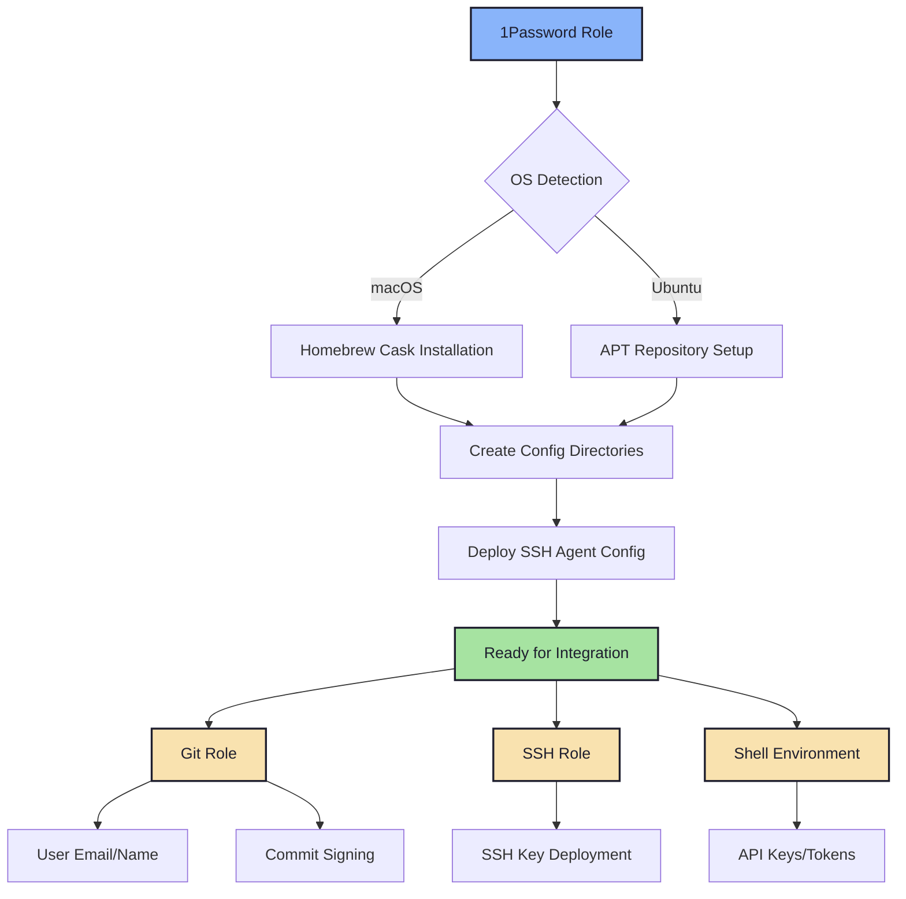

# 🔐 1Password

> Secure secret management and SSH agent configuration for seamless credential handling across the dotfiles ecosystem.

## Overview

The 1Password role serves as the **security foundation** for the entire dotfiles system. It installs the 1Password CLI, configures the SSH agent for multi-vault key management, and enables seamless integration with other roles that require secure credentials.

## Features

- **Cross-Platform Installation**: Automated installation on macOS and Ubuntu/Debian
- **SSH Agent Configuration**: Multi-vault SSH key management without storing keys on disk
- **Secret Management**: Centralized credential access using `op://` URL references
- **Secure Directory Structure**: Proper permissions (755/644) for configuration directories
- **Graceful Degradation**: System works without 1Password using fallback values
- **Clean Uninstallation**: Safe removal with user confirmation and data warnings

## Supported Platforms

| Platform | Installation Method | GUI App | CLI |
|----------|-------------------|---------|-----|
| macOS | Homebrew Cask | ✓ | ✓ |
| Ubuntu/Debian | APT with GPG verification | ✗ | ✓ |

## What Gets Installed

### macOS
- **1Password GUI Application** (`1password` cask)
- **1Password CLI** (`1password-cli` cask)

### Ubuntu/Debian
- **1Password CLI** (`1password-cli` package)
- **GPG Key** (package signature verification)
- **APT Repository** (official 1Password repository)
- **debsig-verify Policy** (enhanced package security)

## What Gets Configured

### Directory Structure
```
~/.config/
└── 1Password/
    └── ssh/
        └── agent.toml        # SSH agent configuration
```

### SSH Agent Configuration

The `agent.toml` file configures which vaults provide SSH keys to the agent:

```toml
[[ssh-keys]]
vault = "Personal"

[[ssh-keys]]
vault = "Raft"

[[ssh-keys]]
vault = "StarSage"
```

**Key Benefits:**
- No SSH private keys stored on disk
- Automatic key availability when 1Password is running
- Multi-vault support for different organizational contexts
- Zero manual key management

## Architecture



## Integration with Other Roles

### Git Role Integration
```yaml
# Retrieves git user email from 1Password
- name: "Git | Get user email from 1Password"
  ansible.builtin.command: "op --account my.1password.com read 'op://Personal/GitHub/email'"
  register: git_user_email_op
  when: op_installed
  failed_when: false
  no_log: true
```

### SSH Role Integration
```yaml
# Deploys SSH keys from 1Password vaults
- name: "SSH | Deploy private key"
  ansible.builtin.command: "op read '{{ vault_path }}/private_key?ssh-format=openssh'"
  register: private_key
  no_log: true
  when: op_installed
```

### Shell Environment Integration
```bash
# Runtime environment variables from secrets
export GITHUB_TOKEN=$(op read "op://Personal/GitHub/token")
export OPENAI_API_KEY=$(op read "op://Personal/Openai/Project Key")
```

## Usage

### Installation
```bash
# Install 1Password role
dotfiles -t 1password

# Verify installation
which op
op --version
```

### Authentication
```bash
# Sign in to your 1Password account
op signin my.1password.com

# Verify authentication
op whoami

# List accessible vaults
op vault list
```

### Testing SSH Agent
```bash
# Check SSH agent socket (macOS)
echo $SSH_AUTH_SOCK

# List available SSH keys
ssh-add -l

# Test SSH connection
ssh -T git@github.com
```

### Reading Secrets
```bash
# Read a secret value
op read "op://Personal/GitHub/email"

# Read SSH private key
op read "op://Personal/SSH Key/private_key?ssh-format=openssh"

# Read with specific account
op --account my.1password.com read "op://vault/item/field"
```

## Configuration

### Secret Reference Format

The system uses `op://` URL format for secret references in `group_vars/all.yml`:

```yaml
op:
  git:
    user:
      email: "op://Personal/GitHub/email"
    allowed_signers: "op://Personal/TechDufus SSH/allowed_signers"
  ssh:
    github:
      techdufus:
        - name: id_ed25519
          vault_path: "op://Personal/TechDufus SSH"
        - name: raft-infra
          vault_path: "op://Raft/Raft-SSH"
```

**URL Format:** `op://vault_name/item_name/field_name`

### Adding New Vaults to SSH Agent

Edit `files/agent.toml`:

```toml
[[ssh-keys]]
vault = "YourNewVault"
```

Then re-run the role:
```bash
dotfiles -t 1password
```

## Security Features

### Ubuntu/Debian Security
- **GPG Key Verification**: Package authenticity verification
- **Isolated Keyring**: Dedicated keyring at `/usr/share/keyrings/1password-archive-keyring.gpg`
- **Package Signature Verification**: debsig-verify policy for enhanced security
- **Architecture-Specific Repos**: Correct repository URLs for your architecture

### General Security
- **No Secrets in Repository**: All secrets stored in 1Password vaults
- **Proper Permissions**: Config directories (755), files (644), SSH keys (600)
- **No Logging**: All secret operations use `no_log: true`
- **Graceful Degradation**: System continues without 1Password using fallbacks

## Dependencies

### Role Dependencies
- None (this is a foundational role)

### System Dependencies
- **macOS**: Homebrew
- **Ubuntu/Debian**: APT, sudo access for repository setup

### Optional Dependencies
Other roles that integrate with 1Password:
- `git` - User configuration and commit signing
- `ssh` - SSH key deployment
- `zsh` / `bash` - Runtime environment variables

## Troubleshooting

### CLI Not Found After Installation

**Symptom:** `which op` returns nothing

**Solutions:**
- **macOS**: Ensure Homebrew is in PATH, restart terminal
- **Ubuntu**: Check APT installation completed: `dpkg -l | grep 1password`
- Re-run role: `dotfiles -t 1password`

### Authentication Required

**Symptom:** `op read` commands fail with auth errors

**Solutions:**
```bash
# Check authentication status
op account list

# Sign in
op signin my.1password.com

# Verify
op whoami
```

### SSH Agent Not Working

**Symptom:** SSH keys not available

**Solutions:**
- **Check environment variable:**
  ```bash
  echo $SSH_AUTH_SOCK
  # Should show: ~/Library/Group Containers/2BUA8C4S2C.com.1password/t/agent.sock (macOS)
  ```
- **Verify agent configuration:**
  ```bash
  cat ~/.config/1Password/ssh/agent.toml
  ```
- **Test agent:**
  ```bash
  ssh-add -l
  ```
- **Restart 1Password application**

### Vault Access Issues

**Symptom:** Cannot read from specific vaults

**Solutions:**
- Verify vault names match exactly (case-sensitive)
- Check vault permissions in 1Password
- Confirm item and field names are correct
- Test access manually: `op item list --vault "VaultName"`

## Uninstallation

The role provides a safe uninstallation script:

```bash
# Navigate to role directory
cd ~/.dotfiles/roles/1password

# Run uninstall script
./uninstall.sh
```

**Safety Features:**
- User confirmation required before removal
- Warning about losing vault access
- Graceful handling of missing components
- Preserves vault data (only removes local config)

## Related Documentation

- [1Password CLI Documentation](https://developer.1password.com/docs/cli/)
- [1Password SSH Agent Guide](https://developer.1password.com/docs/ssh/agent/)
- [1Password Agent Configuration](https://developer.1password.com/docs/ssh/agent/config)
- [1Password Secret References](https://developer.1password.com/docs/cli/secret-references/)

## Development

### Adding New Secret References

1. **Add to `group_vars/all.yml`:**
   ```yaml
   op:
     new_role:
       secret_name: "op://Vault/Item/field"
   ```

2. **Use in role tasks:**
   ```yaml
   - name: "role | Get secret from 1Password"
     ansible.builtin.command: "op read '{{ op.new_role.secret_name }}'"
     register: secret_value
     no_log: true
     when: op_installed
     failed_when: false
   ```

3. **Handle unavailability:**
   ```yaml
   - name: "role | Use secret or fallback"
     ansible.builtin.set_fact:
       value: "{{ secret_value.stdout if (op_installed and secret_value.rc == 0) else 'fallback' }}"
   ```

### Testing Changes

```bash
# Test role in isolation
dotfiles -t 1password

# Test with dependent roles
dotfiles -t 1password,git,ssh

# Dry run
dotfiles --check -t 1password

# Verbose output
dotfiles -vvv -t 1password
```

## Current Status

The 1Password role is currently **commented out** in `group_vars/all.yml` (`# - 1password`), meaning:

- Available but not deployed by default
- Other roles gracefully handle its absence via `op_installed` checks
- Can be manually activated: `dotfiles -t 1password`
- Users opt into secret management integration

This allows the dotfiles system to work for users without 1Password accounts while providing seamless integration for those who use it.

---

**Note:** This role is the security foundation of the dotfiles ecosystem, providing enterprise-grade secret management with graceful degradation for users who prefer alternative approaches.
