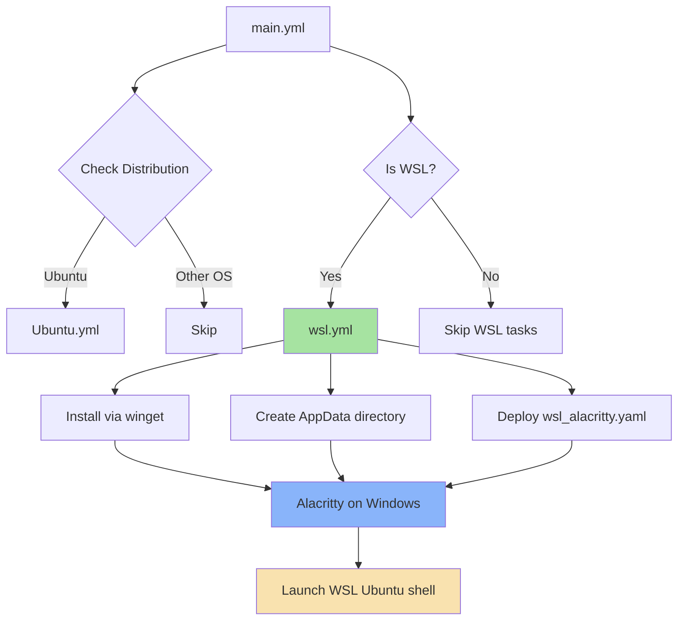

# 🚀 Alacritty

A cross-platform, GPU-accelerated terminal emulator with modern defaults and custom theming.

## Overview

This Ansible role installs and configures [Alacritty](https://alacritty.org/), a blazing fast terminal emulator written in Rust that leverages GPU acceleration for smooth rendering. The role provides special handling for WSL environments, automatically configuring Alacritty on Windows to connect to your WSL Ubuntu instance.

## Supported Platforms

| Platform | Installation Method | Status |
|----------|-------------------|--------|
| **WSL (Ubuntu)** | winget → Windows | ✅ Full support |
| **Ubuntu** | - | 🚧 Placeholder (empty task file) |
| **macOS** | Homebrew Cask | ✅ Supported (uninstall script) |
| **Fedora** | dnf / cargo | ✅ Supported (uninstall script) |
| **Arch Linux** | pacman / cargo | ✅ Supported (uninstall script) |

## What Gets Installed

### WSL Environment
- **Package**: `Alacritty.Alacritty` (via winget on Windows host)
- **Configuration**: Custom WSL-optimized config deployed to Windows AppData

### Other Platforms
Installation methods vary by platform:
- **macOS**: Homebrew Cask
- **Linux**: System package manager (apt/dnf/pacman) or cargo fallback

## What Gets Configured

### WSL Configuration
The role deploys a pre-configured `alacritty.yml` to:
```
C:\Users\<username>\AppData\Roaming\alacritty\alacritty.yml
```

**Key Features**:
- 🐧 **Shell Integration**: Automatically launches WSL Ubuntu on startup
- 🎨 **Blood Moon Theme**: Custom dark theme with vibrant accent colors
- 🔤 **BerkeleyMono Nerd Font**: Powerline and icon support
- 📋 **Clipboard Integration**: Save selections to clipboard
- 🔄 **Live Config Reload**: Changes apply without restart

**Color Scheme** (Blood Moon):
```yaml
Background: #000000 (Pure black)
Foreground: #C6C6C4 (Light gray)
Accents: Vibrant reds, greens, blues with carefully chosen bright variants
```

## Architecture



## Dependencies

### Required Roles
- **winget** (WSL only): Used to install Alacritty on the Windows host

### System Requirements
- **WSL environments**: PowerShell with `winget` available
- **Font**: BerkeleyMono Nerd Font (for WSL config)
- **WSL**: Ubuntu distribution configured

## Usage

### Install Alacritty
```bash
# Install with all dotfiles
dotfiles

# Install only Alacritty role
dotfiles -t alacritty
```

### Uninstall
```bash
# Complete removal (packages + config)
dotfiles --delete alacritty

# Or use the uninstall script directly
~/.dotfiles/roles/alacritty/uninstall.sh
```

The uninstall script automatically:
- Detects your OS and uses the appropriate package manager
- Removes Homebrew/apt/dnf/pacman installations
- Cleans up cargo-installed binaries
- Removes `~/.config/alacritty` configuration directory

## Customization

### WSL Configuration
To modify the WSL Alacritty configuration:

1. Edit the config template:
   ```bash
   vim ~/.dotfiles/roles/alacritty/files/wsl_alacritty.yaml
   ```

2. Apply changes:
   ```bash
   dotfiles -t alacritty
   ```

**Common customizations**:
```yaml
# Change WSL distribution
shell:
  program: wsl -d debian  # Instead of ubuntu

# Adjust window padding
window:
  padding:
    x: 50
    y: 50

# Change opacity
window:
  opacity: 0.95
```

## File Structure

```
roles/alacritty/
├── tasks/
│   ├── main.yml          # OS detection and WSL routing
│   ├── Ubuntu.yml        # Ubuntu-specific tasks (placeholder)
│   └── wsl.yml           # WSL-specific installation and config
├── files/
│   └── wsl_alacritty.yaml  # WSL-optimized Alacritty configuration
└── uninstall.sh          # Cross-platform uninstallation script
```

## Known Limitations

- **Ubuntu Support**: Currently a placeholder - no native Ubuntu installation implemented
- **macOS/Fedora/Arch**: Uninstall scripts exist but no installation tasks defined in role
- **WSL Only**: Full automation only works for WSL environments
- **Font Dependency**: BerkeleyMono Nerd Font must be installed on Windows for proper rendering

## Links

- [Official Alacritty Documentation](https://alacritty.org/)
- [Alacritty GitHub Repository](https://github.com/alacritty/alacritty)
- [Alacritty Configuration Guide](https://github.com/alacritty/alacritty/blob/master/alacritty.yml)
- [Nerd Fonts](https://www.nerdfonts.com/) (for BerkeleyMono)

## Notes

This role is part of a larger dotfiles management system. It follows the standard OS detection pattern and integrates with the automated bootstrap process for WSL environments.

> 💡 **Tip**: For non-WSL platforms, consider manually installing Alacritty through your package manager and symlinking your own configuration to maintain version control.
