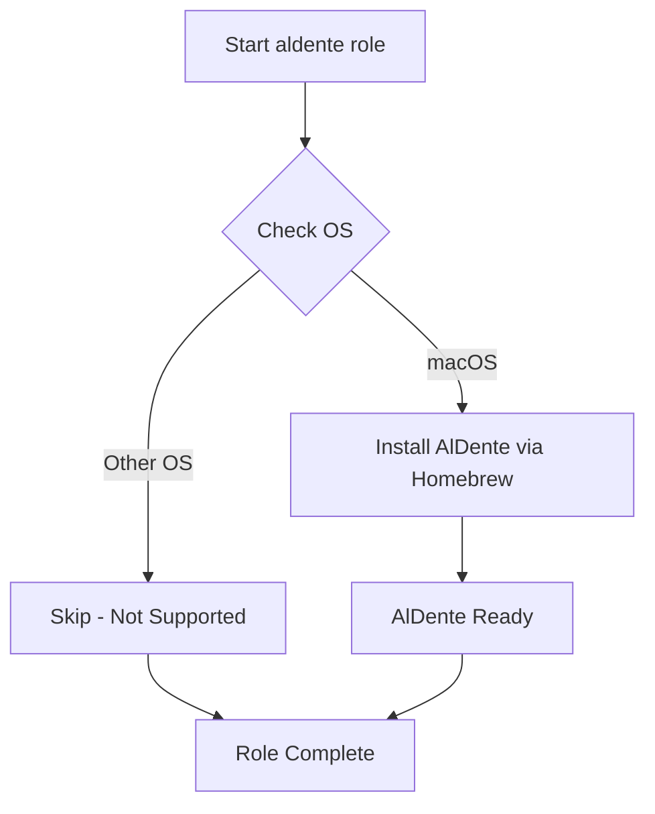

# 🔋 AlDente

> Ansible role to install AlDente - macOS battery charge limiter for prolonged battery health

## Overview

This role installs [AlDente](https://apphousekitchen.com/), a macOS utility that allows you to limit the maximum charging percentage of your MacBook's battery. By keeping your battery charged between 20-80%, you can significantly extend its lifespan and health, especially if you frequently work plugged in.

## Supported Platforms

- **macOS** ✅

This role is macOS-exclusive as AlDente is a Mac-only application that integrates with macOS battery management.

## What Gets Installed

### Applications
- **AlDente** - Battery charge limiting utility installed via Homebrew

## Features

- **Simple Installation** - One-step installation via Homebrew
- **Battery Health Optimization** - Prevents battery degradation from constant full charging
- **macOS Native** - Deep integration with macOS power management
- **Automatic Detection** - Only runs on macOS systems

## Installation Flow



## Usage

### Install AlDente
```bash
# Install as part of full dotfiles
dotfiles

# Install only AlDente role
dotfiles -t aldente
```

### Configuration

After installation, launch AlDente from your Applications folder or menu bar to configure:
- Maximum charge percentage (recommended: 80%)
- Sailing mode (discharge to target when plugged in)
- Heat protection settings
- Calibration reminders

> **Note**: This role only handles installation. AlDente configuration is managed through its GUI preferences.

## How It Works

1. **OS Detection** - Verifies the system is running macOS
2. **Homebrew Installation** - Installs AlDente using the Homebrew package manager
3. **Manual Setup** - User configures AlDente preferences after first launch

## Dependencies

### Required
- **Homebrew** - macOS package manager (typically installed by the `homebrew` role)

### Recommended Roles
- `homebrew` - Ensures Homebrew is installed and configured

## Why AlDente?

Modern MacBooks are often used as desktop replacements, staying plugged in for extended periods. Lithium-ion batteries degrade faster when kept at 100% charge. AlDente helps by:

- **Extending Battery Lifespan** - Limiting charge to 80% can double battery longevity
- **Reducing Heat** - Less charging means less heat generation
- **Smart Calibration** - Reminds you to calibrate battery periodically
- **Sailing Mode** - Intelligently manages charge levels while plugged in

## Additional Resources

- [Official Website](https://apphousekitchen.com/)
- [AlDente Documentation](https://apphousekitchen.com/aldente-faq/)
- [Battery University - Charge Limits](https://batteryuniversity.com/article/bu-808-how-to-prolong-lithium-based-batteries)

## Related Roles

- [`homebrew`](../homebrew/) - macOS package manager
- [`mas`](../mas/) - Mac App Store CLI (for App Store version of AlDente Pro)

---

**Platform**: macOS Only
**Installation Method**: Homebrew
**Configuration**: GUI-based (manual setup required)
