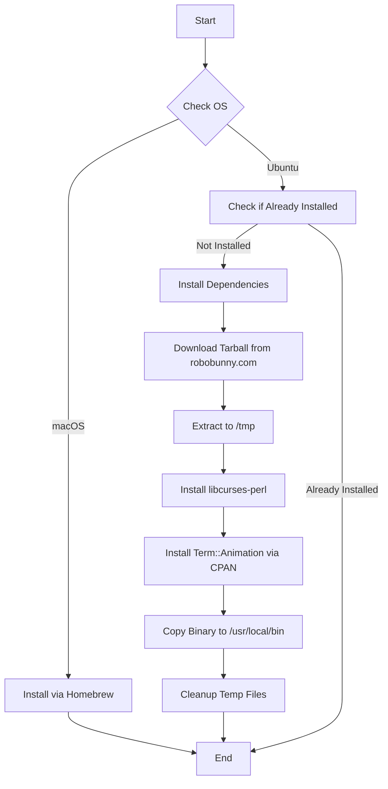

# 🐠 Asciiquarium

An Ansible role that installs **Asciiquarium**, a delightful ASCII art aquarium/sea animation in your terminal. Watch fish swim, whales dive, and submarines cruise across your terminal in beautiful ASCII art.

## 📋 Description

This role automates the installation of Asciiquarium across different operating systems. On macOS, it uses Homebrew for a simple installation. On Ubuntu/Debian systems, it performs a more complex installation by downloading the source tarball, installing Perl dependencies, and deploying the binary to `/usr/local/bin/`.

## 🖥️ Supported Platforms

- **macOS** - Installed via Homebrew
- **Ubuntu/Debian** - Installed from source with CPAN dependencies

## 📦 What Gets Installed

### macOS
- `asciiquarium` package via Homebrew

### Ubuntu/Debian
- **Build Dependencies:**
  - `make`
  - `cpanminus`
  - `libcurses-perl`

- **Perl Modules:**
  - `Term::Animation` (via CPAN)

- **Binary:**
  - `/usr/local/bin/asciiquarium` (executable, mode 0755)

## 🔄 Installation Flow



## 🎯 Key Features

- **OS-Specific Installation**: Automatically detects and uses the appropriate installation method
- **Idempotent**: On Ubuntu, checks if asciiquarium is already installed before proceeding
- **Automatic Cleanup**: Handlers remove temporary tarball and extracted files after installation
- **Proper Permissions**: Binary installed with correct ownership and execute permissions

## 🚀 Usage

After installation, simply run:

```bash
asciiquarium
```

Press `q` to quit the animation.

## 🗑️ Uninstallation

The role includes an `uninstall.sh` script that:
- Removes the package via the appropriate package manager
- Cleans up any configuration files in `~/.config/asciiquarium`

Run the dotfiles uninstall command:

```bash
dotfiles --uninstall asciiquarium
```

## 🔗 Dependencies

- **macOS**: Requires Homebrew
- **Ubuntu**: Requires `apt`, `cpanminus`, and internet access to download from robobunny.com

## 📚 Official Documentation

- [Asciiquarium Official Site](https://robobunny.com/projects/asciiquarium/)
- Perl Module: [Term::Animation on CPAN](https://metacpan.org/pod/Term::Animation)

## 🎨 Screenshots

While this is an ASCII art animation, you can expect to see:
- Swimming fish in various ASCII styles
- Whales that periodically surface
- Submarines cruising across the screen
- Bubbles rising from the ocean floor
- Aquatic plants swaying in the current

---

**Note**: This role is part of a larger Ansible-based dotfiles management system. It follows the standard OS detection pattern and integrates with the dotfiles bootstrap infrastructure.
