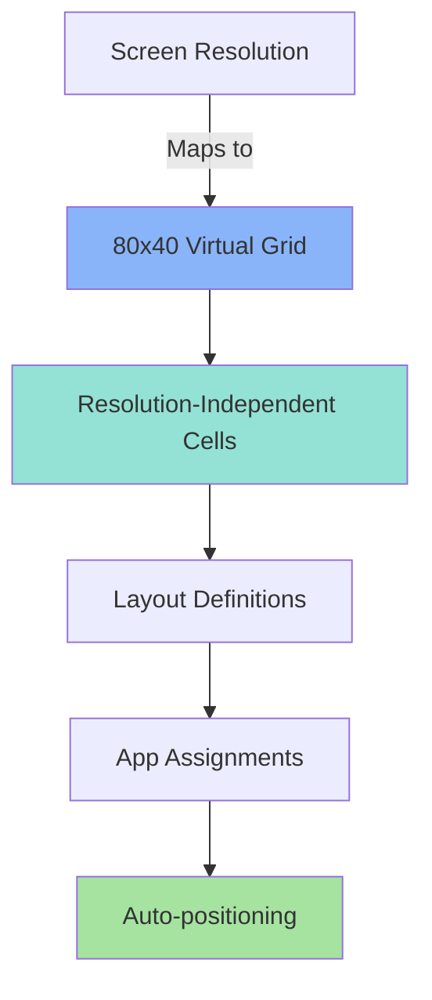
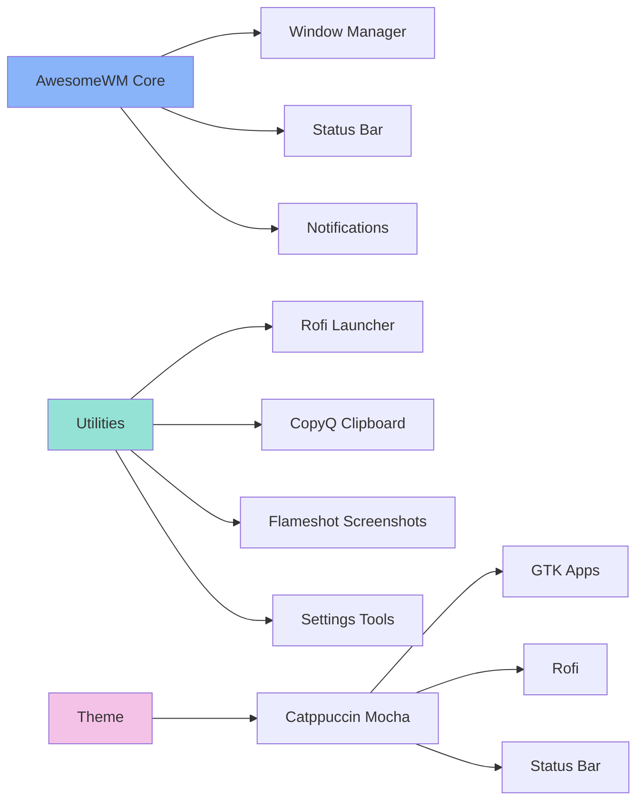
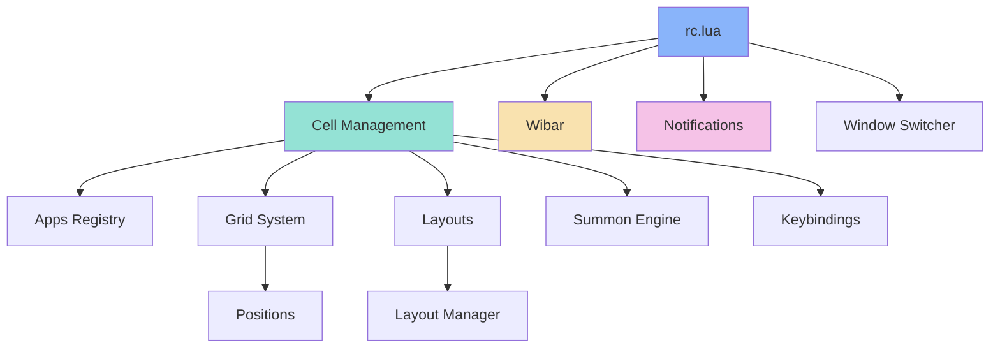
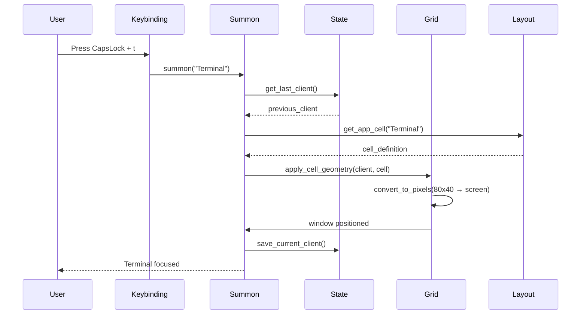

# 🪟 AwesomeWM Cell-Based Window Management

A sophisticated Ansible role that transforms AwesomeWM into a Hammerspoon-inspired window management system for Ubuntu. Features cell-based layouts, modal application summoning, and a complete desktop environment with Catppuccin theming.

## Overview

This role provides a fully-configured AwesomeWM desktop environment with:

- **Cell-based window management** using an 80x40 virtual grid
- **Modal application summoning** (F13/CapsLock + letter key)
- **Intelligent app positioning** with multi-resolution support
- **Catppuccin Mocha theme** across all UI components
- **Standalone settings tools** (no GNOME dependencies)
- **Complete desktop utilities** (launcher, clipboard, screenshots, notifications)

Perfect for developers migrating from macOS Hammerspoon or seeking advanced tiling functionality on Ubuntu.

## Supported Platforms

| Platform | Supported | Notes |
|----------|-----------|-------|
| Ubuntu   | ✅        | Primary target (tested on 22.04+) |
| macOS    | ❌        | Use [hammerspoon](../hammerspoon/) role instead |
| Fedora   | ❌        | Not implemented |
| Arch     | ❌        | Not implemented |

## Features

### Cell Management System



**Grid System:**
- Virtual 80x40 grid that scales to any screen resolution
- Define cells like `"0,0 52x40"` (x,y width×height)
- Example: `"0,0 40x40"` = left half, `"40,0 40x40"` = right half

**Layout Management:**
- Pre-configured layouts for different workflows
- Assign apps to specific cells
- Optional auto-launch on layout activation
- Interactive layout picker (Hyper+p)

### Modal Application Summoning

| Keyboard Type | Summon Modal | Macro Modal |
|---------------|--------------|-------------|
| Laptop (no F13) | CapsLock | Double-tap CapsLock (150ms) |
| External (with F13/F16) | F13 | F16 |

**Default Summon Keys:**
- `t` → Ghostty Terminal
- `b` → Brave Browser
- `d` → Discord
- `s` → Spotify
- `n` → Obsidian
- `o` → 1Password
- `f` → Thunar File Manager

**Toggle Behavior:** Summoning the same app twice returns to the previous app.

### Window Navigation

**Hyper Key** = Shift + Super + Alt + Ctrl

- `Hyper + h/j/k/l` → Focus window (left/down/up/right)
- `Hyper + p` → Layout picker
- `Hyper + ;` → Cycle to next layout
- `Hyper + u` → Bind focused window to cell

### Complete Desktop Environment



## What Gets Installed

### Core Packages

**Window Management:**
- `awesome` - AwesomeWM window manager
- `xdotool` - Window manipulation tool
- `rofi` - Application launcher and layout picker
- `i3lock` - Screen locker

**Desktop Utilities:**
- `flameshot` - Screenshot tool
- `copyq` - Clipboard manager
- `thunar` - Lightweight file manager
- `ristretto` - Image viewer
- `rofimoji` - Emoji picker (via pipx)
- Flare launcher (AppImage)

**Media & System:**
- `playerctl` - Media key controls
- `brightnessctl` - Brightness control
- `pulseaudio-utils` - Audio controls

**Settings Tools (No GNOME):**
- `pavucontrol` - Audio/mic/speaker settings
- `arandr` - Display/monitor layout
- `lxappearance` - GTK themes/fonts/icons
- `blueman` - Bluetooth manager
- `xfce4-power-manager` - Power settings

### Lua Libraries & Widgets

**External Modules:**
- [awesome-wm-widgets](https://github.com/streetturtle/awesome-wm-widgets) - Status bar widgets
- [awesome-cyclefocus](https://github.com/blueyed/awesome-cyclefocus) - Window switching

**Built-in Lua Modules:**
- `luarocks` - Lua package manager
- `lua-json` - JSON support for widgets

## What Gets Configured

### File Structure

```
~/.config/awesome/
├── rc.lua                          # Main AwesomeWM config
├── wibar.lua                       # Status bar configuration
├── window-switcher.lua             # Alt-Tab functionality
├── cell-management/
│   ├── init.lua                    # Module initialization
│   ├── apps.lua                    # App registry (WM_CLASS, summon keys)
│   ├── config.lua                  # Shared constants
│   ├── grid.lua                    # 80x40 grid system
│   ├── positions.lua               # Cell definitions
│   ├── layouts.lua                 # Layout definitions
│   ├── layout-manager.lua          # Layout switching logic
│   ├── summon.lua                  # App summoning engine
│   ├── keybindings.lua             # Keyboard shortcuts
│   ├── state.lua                   # State management
│   └── helpers.lua                 # Utility functions
├── notifications/
│   ├── init.lua                    # Notification system
│   ├── rules.lua                   # App-specific rules
│   ├── dnd.lua                     # Do Not Disturb mode
│   └── display.lua                 # Notification styling
├── themes/
│   └── catppuccin-mocha/
│       └── theme.lua               # Catppuccin theme
├── awesome-wm-widgets/             # Cloned from GitHub
└── cyclefocus/                     # Cloned from GitHub

~/.config/rofi/
├── config.rasi                     # Rofi configuration
└── catppuccin-mocha.rasi          # Catppuccin theme

~/.config/gtk-3.0/
└── settings.ini                    # GTK3 dark theme

~/.config/gtk-4.0/
├── assets/                         # Symlinked from theme
├── gtk.css                         # Symlinked from theme
└── gtk-dark.css                    # Symlinked from theme

~/.config/flameshot/
└── flameshot.ini                   # Screenshot tool config

~/.config/copyq/
├── copyq.conf                      # Clipboard manager config
└── copyq-commands.ini              # Custom commands

~/.themes/
└── catppuccin-mocha-blue-standard+default/  # GTK theme

~/.local/bin/
├── flare                           # Application launcher
└── rofimoji                        # Emoji picker
```

### Theming

**Catppuccin Mocha** applied consistently across:
- AwesomeWM (status bar, window borders, notifications)
- GTK3/GTK4 applications
- Rofi launcher
- Papirus-Dark icon theme

**Theme Colors:**
- Background: `#1e1e2e`
- Foreground: `#cdd6f4`
- Accent (Blue): `#89b4fa`
- Selection: `#313244`

## Installation

```bash
# Install complete AwesomeWM environment
dotfiles -t awesomewm

# Test without making changes
dotfiles -t awesomewm --check

# Install with verbose output
dotfiles -t awesomewm -vvv
```

### Post-Installation

1. **Log out** of your current session
2. At the login screen, click the **gear icon** (session selector)
3. Select **"AwesomeWM"** from the list
4. Log in with your password

### Initial Setup

After first login:

1. **Configure displays:** `arandr` (if multi-monitor)
2. **Set audio devices:** `pavucontrol`
3. **Test CapsLock → F13:** Press CapsLock + `t` → Ghostty should launch
4. **Try layout picker:** Press Hyper + `p` → Select a layout

## Usage

### Quick Start

```bash
# Summon terminal (laptop keyboard)
CapsLock + t

# Summon browser
CapsLock + b

# Open layout picker
Hyper + p  # (Shift+Super+Alt+Ctrl + p)

# Focus window to the right
Hyper + l
```

### Configuration

#### Add a New Application

1. **Find WM_CLASS:**
   ```bash
   xprop WM_CLASS  # Click on app window
   ```

2. **Edit `~/.config/awesome/cell-management/apps.lua`:**
   ```lua
   MyApp = {
     class = "myapp",     -- From xprop (usually lowercase)
     summon = "m",        -- CapsLock/F13 + m
     exec = "myapp-cmd",  -- Launch command
   },
   ```

3. **Reload AwesomeWM:** Super + Ctrl + r

#### Create a Custom Layout

Edit `~/.config/awesome/cell-management/layouts.lua`:

```lua
{
  name = "My Custom Layout",
  cells = {
    { positions.halves.left, positions.full },   -- Cell 1: Left half
    { positions.halves.right, positions.full },  -- Cell 2: Right half
  },
  apps = {
    Terminal = { cell = 1, open = true },  -- Auto-launch in cell 1
    Browser  = { cell = 2, open = true },  -- Auto-launch in cell 2
  },
},
```

#### Define Custom Cells

Edit `~/.config/awesome/cell-management/positions.lua`:

```lua
custom = {
  left_third = "0,0 27x40",     -- Left 33% (columns 0-26)
  center_third = "27,0 26x40",  -- Center 33% (columns 27-52)
  right_third = "53,0 27x40",   -- Right 33% (columns 53-79)
}
```

**Grid Format:** `"x,y wxh"` where:
- `x,y` = Starting position (0-79, 0-39)
- `w,h` = Width and height in grid units

## Keyboard Reference

### Application Summoning

| Laptop Keyboard | External Keyboard | Action |
|----------------|-------------------|--------|
| CapsLock + `t` | F13 + `t` | Summon Terminal |
| CapsLock + `b` | F13 + `b` | Summon Browser |
| CapsLock + `d` | F13 + `d` | Summon Discord |
| CapsLock + `s` | F13 + `s` | Summon Spotify |
| CapsLock + `n` | F13 + `n` | Summon Obsidian |
| CapsLock + `o` | F13 + `o` | Summon 1Password |
| CapsLock + `f` | F13 + `f` | Summon File Manager |

### Window Management

| Shortcut | Action |
|----------|--------|
| Hyper + `h` | Focus window left |
| Hyper + `j` | Focus window down |
| Hyper + `k` | Focus window up |
| Hyper + `l` | Focus window right |
| Hyper + `p` | Open layout picker |
| Hyper + `;` | Cycle to next layout |
| Hyper + `u` | Bind window to cell |

### Standard AwesomeWM

| Shortcut | Action |
|----------|--------|
| Super + Enter | Open terminal |
| Super + `r` | Run prompt |
| Super + Ctrl + `r` | Reload AwesomeWM |
| Super + Shift + `q` | Quit AwesomeWM |
| Super + `1-9` | Switch to workspace 1-9 |
| Super + Shift + `1-9` | Move window to workspace |

## Dependencies

### Ansible Role Dependencies

None. This role is self-contained.

### System Dependencies

**Automatically installed:**
- Flatpak (for Discord, Spotify, Obsidian)
- Python 3 + pipx (for rofimoji)
- Git (for cloning widget repositories)

**Not installed by this role:**
- Ghostty terminal (install via [ghostty](../ghostty/) role)
- 1Password (install via [1password](../1password/) role)

## Troubleshooting

### AwesomeWM session doesn't appear at login

**Verify installation:**
```bash
which awesome
awesome --version
ls /usr/share/xsessions/awesome.desktop
```

### Configuration errors on startup

**Check syntax:**
```bash
awesome -k ~/.config/awesome/rc.lua
# Should output: "Configuration file syntax OK"
```

**View error log:**
```bash
tail -f ~/.xsession-errors
```

### CapsLock not working as F13

**Verify remapping:**
```bash
xmodmap -pke | grep "keycode  66"
# Should show: keycode  66 = F13
```

**Manually apply:**
```bash
setxkbmap -option caps:none && xmodmap -e 'keycode 66 = F13'
```

**Adjust double-tap timing:**

Edit `~/.config/awesome/cell-management/keybindings.lua`:
```lua
local double_tap = {
  timeout = 0.15,  -- Increase to 0.2 for more forgiving timing
  -- ...
}
```

### App doesn't position correctly

**Verify WM_CLASS:**
```bash
xprop WM_CLASS
# Click on the app window
# Use the lowercase value in apps.lua
```

**Common WM_CLASS values:**
- Ghostty: `com.mitchellh.ghostty`
- Brave: `brave-browser`
- Discord: `discord`
- Spotify: `Spotify` (capital S!)
- Obsidian: `obsidian`
- 1Password: `1Password` (capital P!)

### Hyper key too hard to press

Edit `~/.config/awesome/cell-management/config.lua`:
```lua
-- Change from 4-key combo to 2-key combo
M.hyper = { 'Mod4', 'Shift' }  -- Super+Shift (easier)
```

## Uninstallation

**Remove configuration only:**
```bash
./roles/awesomewm/uninstall.sh
```

**Complete removal:**
```bash
sudo apt remove awesome xdotool flameshot rofi i3lock copyq
rm -rf ~/.config/awesome
rm -rf ~/.themes/catppuccin-mocha-*
```

## Architecture

### Component Overview



### Cell Management Flow



## Known Limitations

**Version 1 Constraints:**
- No layout persistence (state resets on restart)
- No visual modal feedback
- No cell overlay for manual positioning
- Single monitor only
- Fixed 80x40 grid (not runtime configurable)
- First window only (multi-window apps not fully supported)

## References

### Internal Documentation

- **CLAUDE.md:** [roles/awesomewm/CLAUDE.md](CLAUDE.md)
- **Hammerspoon Role:** [roles/hammerspoon](../hammerspoon/) (macOS inspiration)

### External Resources

- **AwesomeWM API:** <https://awesomewm.org/doc/api/>
- **AwesomeWM Wiki:** <https://wiki.archlinux.org/title/Awesome>
- **awesome-wm-widgets:** <https://github.com/streetturtle/awesome-wm-widgets>
- **Catppuccin Theme:** <https://github.com/catppuccin/gtk>
- **Lua 5.3 Reference:** <http://www.lua.org/manual/5.3/>

## Contributing

When modifying this role:

1. Test on Ubuntu 22.04+ before committing
2. Verify configuration syntax: `awesome -k ~/.config/awesome/rc.lua`
3. Document new features in this README
4. Update CLAUDE.md with implementation details
5. Follow [conventional commit](https://www.conventionalcommits.org/) format

## License

Part of the [dotfiles](https://github.com/username/dotfiles) repository. See repository LICENSE for details.

---

**Workflow Philosophy:** Muscle memory from macOS Hammerspoon transfers directly to Ubuntu AwesomeWM. Same shortcuts, same cell system, same mental model.
