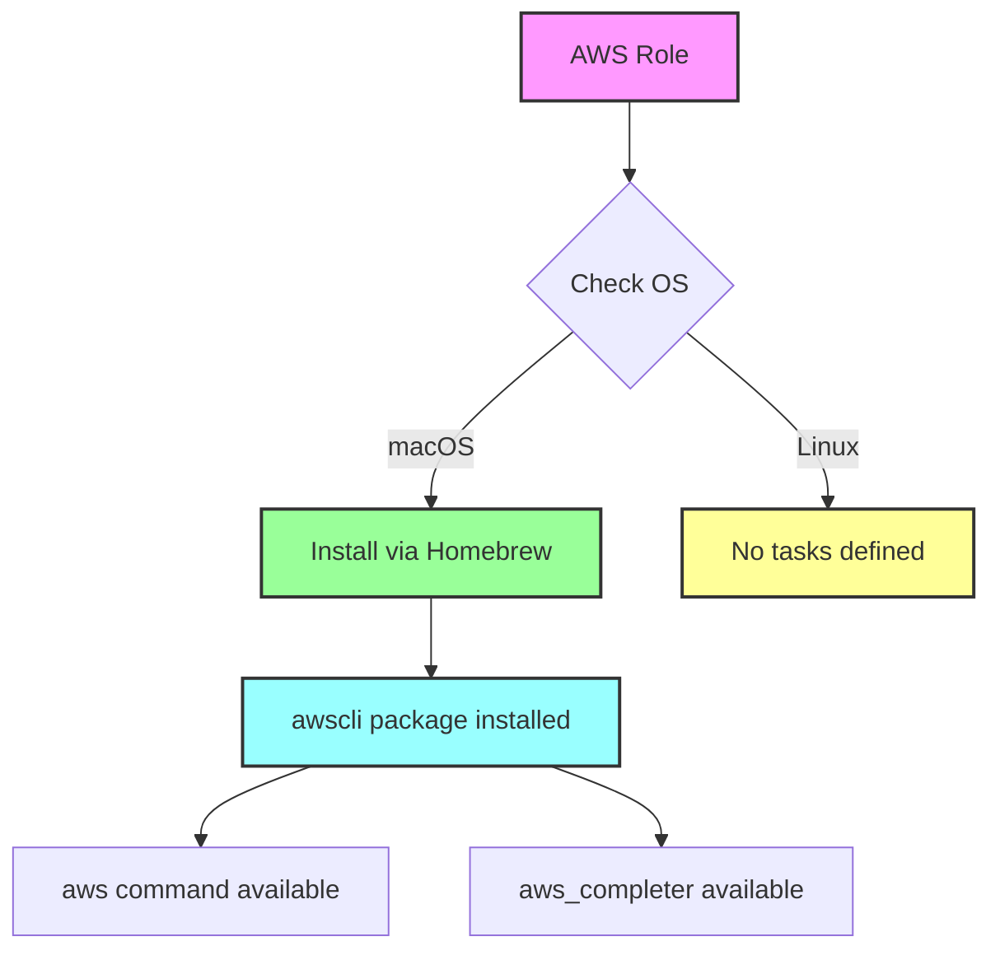

# ☁️ AWS CLI

Ansible role for installing and managing the AWS Command Line Interface (CLI) - the unified tool to manage AWS services from the command line.

## Overview

This role installs the AWS CLI on macOS systems, providing access to all AWS services through a consistent command-line interface. The AWS CLI is essential for managing AWS resources, automating deployments, and integrating AWS services into development workflows.

## Supported Platforms

| Platform | Status | Installation Method |
|----------|--------|---------------------|
| macOS    | ✅     | Homebrew            |
| Ubuntu   | ⚠️     | Not configured      |
| Fedora   | ⚠️     | Not configured      |
| Arch     | ⚠️     | Not configured      |

> **Note**: Currently only macOS is supported. Linux support can be added by creating OS-specific task files.

## What Gets Installed

### Packages

- **awscli** - AWS Command Line Interface
  - Provides the `aws` command
  - Includes `aws_completer` for shell completion
  - Official AWS CLI maintained by Amazon

### Binaries

After installation, the following commands become available:

```bash
aws              # Main AWS CLI command
aws_completer    # Shell completion helper
```

## What Gets Configured

This role focuses on installation only. AWS configuration is managed separately through:

- `~/.aws/config` - AWS CLI configuration file (regions, output format)
- `~/.aws/credentials` - AWS access credentials (created by user)

> **Security Note**: This role does not manage AWS credentials. Users should configure credentials separately using `aws configure` or through environment variables/IAM roles.

## Installation

### Enable in Dotfiles

Uncomment the AWS role in `group_vars/all.yml`:

```yaml
default_roles:
  # - aws          # Amazon Web Services CLI  <-- Remove the '#'
```

### Install Role

```bash
# Install all dotfiles (includes AWS if enabled)
dotfiles

# Install only AWS CLI
dotfiles -t aws
```

## Uninstallation

This role includes a comprehensive uninstall script that handles:

- AWS CLI v2 installations
- Homebrew-managed installations
- pip-managed installations (Linux)
- apt-managed installations (Debian/Ubuntu)

### Uninstall Command

```bash
# Uninstall AWS CLI (keeps configuration)
dotfiles --uninstall aws

# Complete removal (prompts for config deletion)
dotfiles --delete aws
```

The uninstall script will prompt before removing AWS configuration and credentials:

```
 [?]  Remove AWS configuration and credentials?
      This includes ~/.aws/config and ~/.aws/credentials
Remove AWS config? (y/N)
```

## Usage

### Initial Configuration

After installation, configure your AWS credentials:

```bash
# Interactive configuration
aws configure

# Set credentials manually
aws configure set aws_access_key_id YOUR_ACCESS_KEY
aws configure set aws_secret_access_key YOUR_SECRET_KEY
aws configure set region us-east-1
aws configure set output json
```

### Common Commands

```bash
# List S3 buckets
aws s3 ls

# Describe EC2 instances
aws ec2 describe-instances

# Get caller identity
aws sts get-caller-identity

# Use named profiles
aws s3 ls --profile production

# Get help for any command
aws ec2 help
```

## Architecture



## Dependencies

### Role Dependencies

- None - this role is self-contained

### System Dependencies

- **macOS**: Homebrew (installed by bootstrap)

## Key Features

- **Simple Installation**: One-command install via Homebrew
- **Official Package**: Uses the official AWS CLI from Homebrew
- **Clean Uninstall**: Comprehensive removal script
- **Safe Configuration**: Prompts before removing credentials
- **Multi-method Detection**: Uninstall script handles various installation methods

## Configuration Options

This role uses default Homebrew installation with no customization options. AWS CLI behavior is controlled through:

- `~/.aws/config` - CLI configuration
- `~/.aws/credentials` - Access credentials
- Environment variables (`AWS_PROFILE`, `AWS_REGION`, etc.)

## Notes

- **No Auto-configuration**: This role does not configure AWS credentials for security reasons
- **Shell Completion**: Shell completion is available through `aws_completer`
- **Multiple Profiles**: AWS CLI supports multiple named profiles for different accounts
- **IAM Roles**: When running on EC2, IAM roles can provide credentials automatically
- **Credential Management**: Consider using AWS Vault or similar tools for credential security
- **Version**: Homebrew installs AWS CLI v2 (the latest major version)

## Links

- [AWS CLI Official Documentation](https://docs.aws.amazon.com/cli/)
- [AWS CLI Command Reference](https://awscli.amazonaws.com/v2/documentation/api/latest/index.html)
- [AWS CLI GitHub Repository](https://github.com/aws/aws-cli)
- [AWS CLI Configuration Guide](https://docs.aws.amazon.com/cli/latest/userguide/cli-configure-files.html)
- [Homebrew AWS CLI Formula](https://formulae.brew.sh/formula/awscli)

## Contributing

When extending this role:

1. Add OS-specific task files (e.g., `tasks/Ubuntu.yml`, `tasks/Fedora.yml`)
2. Follow the installation pattern from `tasks/MacOSX.yml`
3. Update the uninstall script to handle new installation methods
4. Test on target platform before submitting
5. Update the "Supported Platforms" table in this README

## License

Part of the personal dotfiles repository. Use freely.
