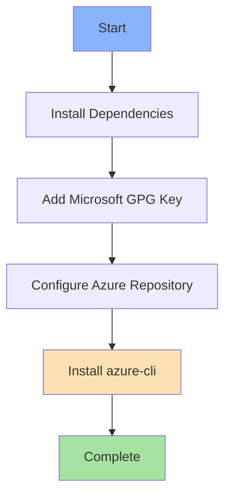

# ☁️ Azure CLI

Ansible role for installing and configuring the [Azure CLI](https://learn.microsoft.com/en-us/cli/azure/) - Microsoft's cross-platform command-line tool for managing Azure resources.

## 📋 Description

This role automates the installation of Azure CLI by adding the official Microsoft package repository and installing the `azure-cli` package. It handles all prerequisite dependencies and repository configuration, providing a clean installation of the latest Azure CLI tools.

## 🖥️ Supported Platforms

- **Ubuntu** ✅ (all active releases)

## 📦 What Gets Installed

### Package Dependencies
- `ca-certificates` - SSL certificate authorities for secure downloads
- `curl` - Command-line HTTP client
- `apt-transport-https` - HTTPS support for apt repositories
- `lsb-release` - Linux Standard Base version reporting
- `gnupg` - GNU Privacy Guard for key verification

### Main Package
- `azure-cli` - Official Azure Command-Line Interface

## ⚙️ Installation Process

The role follows Microsoft's official installation method:



1. **Dependencies**: Installs required system packages for repository management
2. **GPG Key**: Downloads and adds Microsoft's signing key to apt's trusted keyring
3. **Repository**: Configures the Azure CLI repository for your Ubuntu release
4. **Installation**: Installs the latest `azure-cli` package from Microsoft's repository

## 🔧 Configuration

This role performs a clean installation with no additional configuration. After installation, you can:

```bash
# Login to Azure
az login

# Check version
az version

# Configure defaults (optional)
az configure
```

## 📚 Official Documentation

- [Azure CLI Documentation](https://learn.microsoft.com/en-us/cli/azure/)
- [Azure CLI Installation Guide](https://learn.microsoft.com/en-us/cli/azure/install-azure-cli-linux)
- [Azure CLI Command Reference](https://learn.microsoft.com/en-us/cli/azure/reference-index)
- [Azure CLI GitHub Repository](https://github.com/Azure/azure-cli)

## 🎯 Use Cases

- Managing Azure virtual machines, storage, and networks from the command line
- Automating Azure resource deployments with scripts
- CI/CD pipelines interacting with Azure services
- DevOps workflows for Azure infrastructure management
- Quick Azure resource queries and status checks

## 🔐 Authentication

After installation, authenticate using one of these methods:

- **Interactive**: `az login` (opens browser for authentication)
- **Service Principal**: `az login --service-principal -u <app-id> -p <password> --tenant <tenant-id>`
- **Managed Identity**: `az login --identity` (on Azure VMs)

## 🚀 Getting Started

```bash
# Run this role
dotfiles -t azure

# Verify installation
az --version

# Login to Azure
az login

# List your subscriptions
az account list --output table

# Set default subscription
az account set --subscription "Your Subscription Name"
```

## 🏗️ Architecture Notes

- Uses official Microsoft packages (not Ubuntu universe packages)
- Auto-detects Ubuntu release for appropriate repository selection
- Supports both `amd64` and `arm64` architectures
- GPG key stored in `/etc/apt/trusted.gpg.d/microsoft.gpg`
- Repository added to `/etc/apt/sources.list.d/`

---

*Part of the [dotfiles](https://github.com/TechDufus/.dotfiles) automated environment setup*
