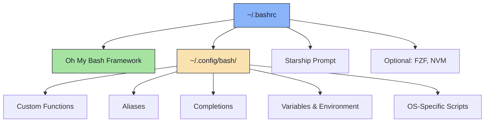
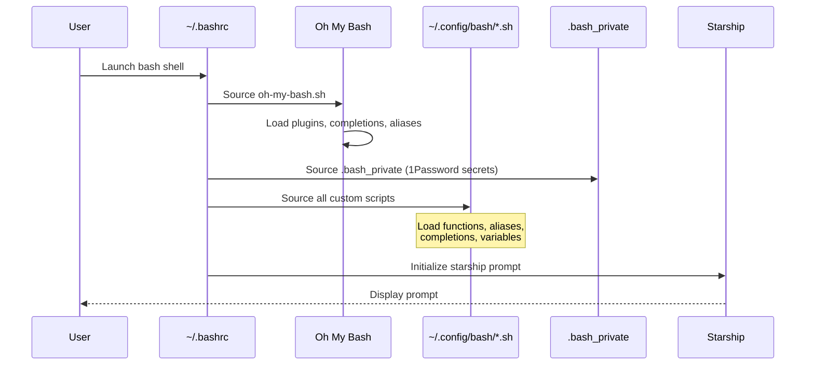

# 🐚 Bash

> Modern Bash shell environment powered by Oh My Bash with extensive customizations, aliases, and developer-focused utilities

## Overview

This role configures a feature-rich Bash shell environment with [Oh My Bash](https://github.com/ohmybash/oh-my-bash) as the framework, [Starship](https://starship.rs/) prompt, and over 1,100 lines of custom shell functions, aliases, and completions. It provides a consistent, powerful command-line experience across multiple platforms with specialized tooling for git, Docker, Kubernetes, and more.

## Supported Platforms

- ✅ **macOS** (Darwin)
- ✅ **Ubuntu** (Debian/Ubuntu family)
- ✅ **Arch Linux**

Platform-specific configurations are automatically applied based on the detected OS.

## What Gets Installed

### Core Components

- **[Oh My Bash](https://github.com/ohmybash/oh-my-bash)** - Bash framework for managing configuration
- **Custom Axin Theme** - Custom shell theme in `~/.oh-my-bash/custom/themes/`
- **[Starship Prompt](https://starship.rs/)** - Fast, customizable cross-shell prompt (initialized at the end of `.bashrc`)

### Oh My Bash Plugins

```bash
plugins=(
  ansible
  bashmarks      # Directory bookmarking
  git
  goenv
  golang
  kubectl
  progress
  xterm
  zoxide         # Smart directory jumping
)
```

### Completions

Tab completion support for:
- Docker, Docker Compose
- Git, GitHub CLI
- Go, Helm, Kubectl
- SSH, System utilities
- Terraform, Vault, Tmux

## What Gets Configured

### File Structure



### Configuration Files

| File | Purpose |
|------|---------|
| `~/.bashrc` | Main Bash configuration, sources Oh My Bash and custom scripts |
| `~/.profile` | Login shell profile |
| `~/.config/bash/*.sh` | Custom aliases, functions, completions (25+ files) |
| `~/.config/bash/.bash_private` | Private environment variables from 1Password |
| `~/.oh-my-bash/` | Oh My Bash installation directory |
| `~/.oh-my-bash/custom/themes/axin/` | Custom Axin theme |

### Custom Script Categories

The role deploys an extensive collection of bash scripts (~1,100 lines total):

#### Aliases
- **Git** - Quick shortcuts (`g`, `gs`, `gc`, `gp`, `gpf`, etc.)
- **Docker** - Container management (`dprune`, `dsysprune`)
- **Kubernetes** - Context switching (`kctx`, `k` alias with completions)
- **LSD** - Modern `ls` replacement shortcuts
- **Neovim** - Editor shortcuts
- **Misc** - General productivity aliases

#### Functions
- **Git Operations** - `gacp()`, `gacpgh()` (commit + push + PR workflow)
- **Git Bisect** - Automated bisection helpers
- **Neovim Remote** - `nisshfs()` (mount and edit remote files via SSHFS)
- **Docker** - Container management utilities
- **Kubernetes** - Cluster operations and debugging
- **Terraform** - Infrastructure helpers
- **Package Management** - OS-specific package utilities
- **Path Management** - Dynamic PATH manipulation
- **GPT** - AI assistance integrations
- **Speedtest** - Network testing utilities
- **Bat** - Enhanced file viewer functions

#### Completions
- Custom completions for `dotfiles` command
- JJ version control completions
- Kwctl (Kubernetes WebAssembly) completions
- Taskfile completions

#### Variables
- **Color Codes** - Full ANSI color palette with semantic names
- **Emoji Codes** - Symbols for CLI output (✔, ✖, 📌, ⏛, etc.)
- **Environment Setup** - `EDITOR`, history control, locale settings

### OS-Specific Enhancements

Each supported platform receives custom utility functions:

- **macOS**: macOS-specific system utilities in `zz_os_functions.sh`
- **Ubuntu**: Ubuntu/Debian package management helpers
- **Arch Linux**: Pacman and AUR integration utilities

## Features

### 🔐 Secret Management

Integrates with **1Password** to securely inject environment variables:

```bash
# Variables from 1Password are exported in ~/.config/bash/.bash_private
# Automatically sourced in .bashrc
```

### 🎨 Visual Enhancements

- **Starship Prompt** - Beautiful, fast, minimal prompt
- **Color Variables** - Consistent color theming across scripts
- **Greeting Display** - Shows `neofetch` or `nerdfetch` on new terminal (outside tmux)

### ⚡ Performance

- **Conditional Loading** - NVM, FZF only load if installed
- **Lazy Evaluation** - Functions load on-demand
- **Completion Optimization** - Only essential completions enabled by default

### 🔄 Integration Support

Automatically detects and integrates with:
- **NVM** (Node Version Manager)
- **FZF** (Fuzzy finder)
- **Zoxide** (Smart cd replacement)
- **Starship** (Cross-shell prompt)

## Dependencies

### Required Roles
- None (standalone role)

### Optional Integrations
- `starship` - For the Starship prompt (highly recommended)
- `neovim` - For the `nisshfs` remote editing function
- `fzf` - For interactive Kubernetes context switching
- `1password` - For secret management via `.bash_private`

## Installation

```bash
# Install only this role
dotfiles -t bash

# Include in your main playbook
dotfiles
```

## Usage Examples

### Git Workflow Shortcuts

```bash
# Quick commit, push to current branch
gacp "feat: add new feature"

# Full GitHub PR workflow (commit + push + create PR + approve + merge)
gacpgh "fix: resolve bug"

# Pretty git log
ggl

# Force push safely
gpf
```

### Kubernetes Operations

```bash
# Switch context interactively with FZF
kctx

# Use 'k' as kubectl alias with full completions
k get pods
k logs -f deployment/app
```

### Docker Cleanup

```bash
# Remove dangling images
dprune

# Complete system cleanup
dsysprune
```

### Remote Editing via SSHFS

```bash
# Mount remote directory, open in Neovim, auto-unmount on exit
nisshfs -s myserver -d /var/www/html
```

## Uninstallation

```bash
# Remove Oh My Bash and restore original .bashrc
dotfiles --uninstall bash

# Or manually
~/.dotfiles/roles/bash/uninstall.sh
```

The uninstall script:
1. Removes `~/.oh-my-bash/`
2. Restores `~/.bashrc.pre-oh-my-bash` if it exists
3. Removes `~/.config/bash/` custom configurations
4. Cleans up `.profile` if created by the role

## Customization

### Adding Custom Scripts

Place new scripts in `roles/bash/files/bash/`:

```bash
# Example: roles/bash/files/bash/my_custom.sh
#!/usr/bin/env bash

my_function() {
    echo "Hello from custom function"
}
```

Scripts are automatically sourced by `.bashrc`.

### Modifying Oh My Bash

Edit the plugins, completions, or aliases arrays in `files/.bashrc`:

```bash
plugins+=(
  my-new-plugin
)

completions+=(
  my-new-completion
)
```

### OS-Specific Customizations

Add platform-specific scripts to:
- `roles/bash/files/os/MacOSX/`
- `roles/bash/files/os/Ubuntu/`
- `roles/bash/files/os/Archlinux/`

## Configuration Flow



## Notable Features

### Auto-Signing Commits with Fallback

The `gacp()` function attempts GPG signing but gracefully falls back:

```bash
gacp "my commit message"
# Tries: git commit -S
# Falls back to: git commit (if signing fails)
```

### Smart Greeting System

Shows system info only in non-tmux sessions:

```bash
# Tries neofetch, then nerdfetch
# Skips if inside tmux to avoid repetition
```

### History Control

Configured for optimal command history:

```bash
export HISTCONTROL=ignoredups  # No duplicate entries
COMPLETION_WAITING_DOTS="true" # Visual feedback during completion
```

## Advanced Configuration

### Disable Auto-Updates

Oh My Bash auto-updates are disabled by default:

```bash
DISABLE_UPDATE_PROMPT=true
```

### Sudo Integration

Oh My Bash has sudo support enabled:

```bash
OMB_USE_SUDO=true
```

### Editor Configuration

Neovim is set as the default editor for all contexts:

```bash
export EDITOR='nvim'  # Both local and SSH sessions
```

## Links

- [Oh My Bash](https://github.com/ohmybash/oh-my-bash)
- [Starship Prompt](https://starship.rs/)
- [Zoxide](https://github.com/ajeetdsouza/zoxide)
- [Bashmarks](https://github.com/huyng/bashmarks)

## Troubleshooting

### Completions Not Working

Ensure Oh My Bash is fully loaded:

```bash
source ~/.bashrc
```

### Slow Shell Startup

Reduce enabled plugins and completions in `.bashrc`:

```bash
# Comment out unused items
plugins=(
  # ansible  # Disabled
  git
)
```

### Private Variables Not Loading

Verify 1Password CLI is authenticated:

```bash
op whoami
```

### Theme Not Applying

Check that Starship is installed and in PATH:

```bash
which starship
starship --version
```

---

**Part of the [dotfiles](../../) collection** - Automated development environment setup
