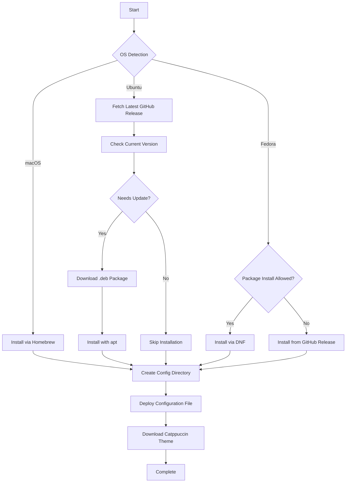

# 🦇 bat

> A modern replacement for `cat` with syntax highlighting and Git integration

This Ansible role installs and configures [bat](https://github.com/sharkdp/bat), a cat clone with wings. It provides beautiful syntax highlighting, automatic paging, and seamless Git integration for enhanced file viewing in your terminal.

## ✨ Features

- **Syntax Highlighting**: Automatic syntax detection for 200+ languages and file types
- **Git Integration**: Shows file modifications (added/modified/deleted lines) in-line
- **Smart Paging**: Automatic pager integration for large files
- **Line Numbers**: Optional line numbering for easy reference
- **Theme Support**: Pre-configured with Catppuccin Mocha theme for consistent aesthetics
- **Custom Syntax Mappings**: Support for specialized file types and extensions

## 🖥️ Supported Platforms

| Platform | Support | Installation Method |
|----------|---------|-------------------|
| **macOS** | ✅ | Homebrew |
| **Ubuntu/Debian** | ✅ | GitHub Release (.deb) |
| **Fedora** | ✅ | DNF / GitHub Release |
| **Arch Linux** | ⚠️ | Not configured (use AUR) |

> **Note**: Ubuntu installation excludes aarch64 architecture due to binary availability

## 📦 What Gets Installed

### Packages
- `bat` - The main binary and supporting tools

### Configuration Files
```
~/.config/bat/
├── config                           # Main configuration
└── themes/
    └── Catppuccino Mocha.tmTheme   # Catppuccin theme
```

### Default Configuration
The role configures bat with:
- **Theme**: Catppuccin Mocha (dark theme)
- **Display Style**: Line numbers + Git changes + file header
- **Paging**: Automatic (disabled for small files)
- **Syntax Mappings**: Commented examples for Arduino, ignore files, etc.

## 🔧 Installation Flow



## 🎨 Theme Integration

The role automatically downloads and configures the Catppuccin Mocha theme:

```bash
# Theme is automatically downloaded from:
https://github.com/catppuccin/bat

# Installed to:
~/.config/bat/themes/Catppuccino Mocha.tmTheme
```

To use a different theme:
1. List available themes: `bat --list-themes`
2. Edit `~/.config/bat/config`
3. Change the `--theme` value

## 🔗 Dependencies

### Optional Role Dependencies
- **github_release**: Used on Fedora when package installation is restricted

### System Dependencies
- `curl` - For downloading themes and releases
- `git` - For Git integration features (optional)

## 📝 Configuration Customization

### Key Configuration Options

The deployed configuration file includes these commonly used options:

```bash
# Choose your theme
--theme="Catppuccino Mocha"

# Display settings (uncomment to customize)
--style="numbers,changes,header"

# Enable italic text (terminal support required)
#--italic-text=always

# Disable paging for all files
#--paging=never

# Advanced paging with mouse support
#--pager="less --RAW-CONTROL-CHARS --quit-if-one-screen --mouse"

# Map custom file extensions to languages
#--map-syntax "*.ino:C++"
#--map-syntax ".ignore:Git Ignore"
```

### Common Customizations

**Disable Git integration:**
```bash
--style="numbers,header"
```

**Plain output (no decorations):**
```bash
--style="plain"
```

**Always use paging:**
```bash
--paging=always
```

## 🚀 Usage Examples

After installation, bat is available as a drop-in `cat` replacement:

```bash
# View a file with syntax highlighting
bat README.md

# View multiple files
bat src/*.js

# View with line numbers only
bat -n file.txt

# View with specific theme
bat --theme="TwoDark" file.py

# List all available themes
bat --list-themes

# List all supported languages
bat --list-languages
```

### Integration with Other Tools

**As a Git pager:**
```bash
git config --global core.pager "bat --paging=always"
```

**With fzf for previews:**
```bash
fzf --preview 'bat --color=always --style=numbers {}'
```

**As a man page viewer:**
```bash
export MANPAGER="sh -c 'col -bx | bat -l man -p'"
```

## 🛠️ Role Variables

| Variable | Default | Description |
|----------|---------|-------------|
| `gh_user` | `sharkdp` | GitHub user for bat repository |
| `gh_repo` | `bat` | GitHub repository name |
| `gh_repo_url` | `https://github.com/sharkdp/bat` | Full repository URL |
| `target_bat_version` | `''` (latest) | Specific version to install |
| `debian_url` | `~` | Override URL for Debian package |

### Platform-Specific Variables

**Fedora:**
- `can_install_packages`: Controls whether to use DNF or GitHub releases

## 🧹 Uninstallation

The role includes a comprehensive uninstall script:

```bash
# Run the uninstall script
~/.dotfiles/roles/bat/uninstall.sh
```

The script will:
1. Remove the bat package using the appropriate package manager
2. Clean up configuration files in `~/.config/bat/`
3. Provide visual feedback during the process

## 📚 Additional Resources

- [Official bat Repository](https://github.com/sharkdp/bat)
- [Catppuccin bat Theme](https://github.com/catppuccin/bat)
- [bat Documentation](https://github.com/sharkdp/bat#readme)
- [Syntax Highlighting Customization](https://github.com/sharkdp/bat#adding-new-syntaxes--language-definitions)

## 🤝 Contributing

This role follows the dotfiles repository standards:
- OS detection pattern for cross-platform support
- Idempotent task design
- Comprehensive error handling
- Graceful degradation when features unavailable

---

**Part of the [dotfiles](../../) ecosystem** | Managed with Ansible
