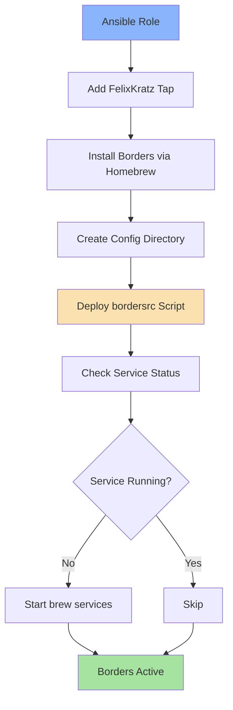

# 🎨 Borders (JankyBorders)

A beautiful, lightweight window border tool for macOS that adds customizable borders around active windows. Perfect for tiling window managers like Yabai or standalone use to improve visual focus clarity.

## Overview

This Ansible role installs and configures [JankyBorders](https://github.com/FelixKratz/JankyBorders) by FelixKratz - a highly performant tool that draws colored borders around active windows on macOS. The borders use GPU acceleration for smooth animations and support glowing effects, gradients, and extensive customization.

## Supported Platforms

- ✅ **macOS** (via Homebrew)

## What Gets Installed

### Packages
- **borders** - JankyBorders window border utility (from `FelixKratz/formulae` tap)

### Services
- Borders service via `brew services` (automatically started and managed)

## What Gets Configured

### Configuration Files
```
~/.config/borders/
└── bordersrc          # Main configuration script (executable)
```

### Default Configuration

The role deploys a pre-configured `bordersrc` with:

- **Style**: Round borders with 10.0pt width
- **Active Color**: Catppuccin Sapphire glow (`0xff74c7ec`)
- **Inactive Color**: Catppuccin Surface0 (`0xff45475a`)
- **HiDPI**: Enabled for retina displays
- **Theme**: Catppuccin Mocha palette with multiple color presets commented for easy switching

### Configuration Highlights

```bash
# Glowing active window borders
active_color="glow(0xff74c7ec)"  # Sapphire blue with glow effect

# Subtle inactive borders
inactive_color=0xff45475a         # Dark gray (Catppuccin Surface0)

# 13 alternative Catppuccin colors available (commented in config)
# Gradient support for advanced customization
# Optional app filtering (whitelist/blacklist)
```

## Features

- 🌟 **GPU-Accelerated Rendering** - Smooth, performant border drawing
- 🎨 **Catppuccin Mocha Theme** - Pre-configured with beautiful color palette
- ✨ **Glow Effects** - Active windows get a subtle glow for better visibility
- 🔄 **Gradient Support** - Mix multiple colors for dynamic borders
- 🎯 **App Filtering** - Whitelist/blacklist specific applications
- 🔍 **HiDPI Support** - Crisp borders on retina displays
- ⚡ **Auto-Start** - Managed via brew services for seamless integration

## Dependencies

### Required
- **Homebrew** - macOS package manager
- **macOS** - This tool is macOS-specific

### Recommended
- **Yabai** - Tiling window manager (borders pairs perfectly with it)
- **SketchyBar** - Status bar (by the same author, integrates nicely)

## Architecture



## Customization

### Changing Border Colors

Edit `~/.config/borders/bordersrc` and uncomment your preferred color:

```bash
# Switch to pink glow
active_color="glow(0xfff5c2e7)"  # Catppuccin Pink

# Or use gradients
active_color="gradient(top_left=0xfff5c2e7,bottom_right=0xff89dceb)"
```

Then restart the service:
```bash
brew services restart borders
```

### Application Filtering

Add to `bordersrc` options array:

```bash
# Only show borders on terminals
whitelist="kitty,Ghostty,Terminal,iTerm2"

# Or exclude specific apps
blacklist="Finder,Preview,System Settings"
```

### Border Styling

Available style options in `bordersrc`:
- `style=round` - Rounded corners (default)
- `style=square` - Sharp corners
- `width=10.0` - Border thickness (adjust as needed)
- `hidpi=on` - HiDPI rendering (recommended for retina)

## Usage

### Manual Commands

```bash
# Start borders
brew services start borders

# Restart after config changes
brew services restart borders

# Stop borders
brew services stop borders

# Check status
brew services list | grep borders
```

### Uninstallation

Run the provided uninstall script:

```bash
~/.dotfiles/roles/borders/uninstall.sh
```

This will:
1. Stop the borders service
2. Uninstall the borders package
3. Remove the FelixKratz tap (if no other packages depend on it)
4. Prompt before removing configuration files

## Links

- 🏠 [Official Repository](https://github.com/FelixKratz/JankyBorders)
- 🎨 [Catppuccin Theme](https://github.com/catppuccin/catppuccin)
- 🪟 [Yabai Window Manager](https://github.com/koekeishiya/yabai)
- 📊 [SketchyBar](https://github.com/FelixKratz/SketchyBar)

## Screenshot Ideas

*Note: Consider adding a screenshot of your setup with borders enabled to showcase the visual appearance*

## Troubleshooting

### Borders not appearing
1. Check if service is running: `brew services list | grep borders`
2. Restart the service: `brew services restart borders`
3. Check permissions: macOS may require accessibility permissions

### Performance issues
- Disable `ax_focus` option in bordersrc (uses faster focus detection)
- Reduce border width
- Use solid colors instead of gradients

### Configuration not updating
- Restart the service after config changes
- Ensure bordersrc is executable: `chmod +x ~/.config/borders/bordersrc`
