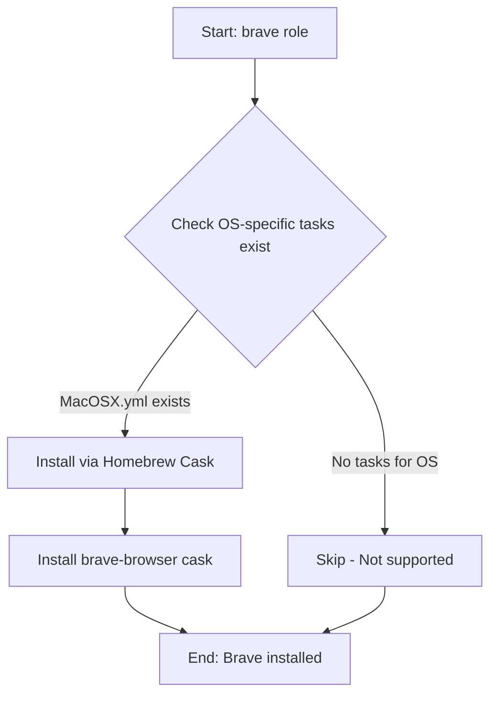

# 🦁 Brave Browser

A minimal Ansible role for installing the [Brave browser](https://brave.com) - a privacy-focused web browser built on Chromium with built-in ad blocking and tracker protection.

## 📋 Overview

This role provides automated installation of Brave Browser on macOS systems using Homebrew Cask. The role follows the dotfiles repository's OS detection pattern and only executes on supported platforms.

## 🖥️ Supported Platforms

| Platform | Support | Package Manager |
|----------|---------|-----------------|
| macOS    | ✅ Yes  | Homebrew Cask   |
| Ubuntu   | ⚠️ See Flatpak | `flatpak` role installs `com.brave.Browser` |
| Fedora   | ❌ No   | -               |
| Arch     | ❌ No   | -               |

> **Note**: On Ubuntu/Linux systems, Brave is installed via the [`flatpak`](/roles/flatpak) role as `com.brave.Browser`.

## 📦 What Gets Installed

### macOS
- **Package**: `brave-browser` (via Homebrew Cask)
- **Application**: Brave Browser.app

### Linux (via Flatpak)
- **Package**: `com.brave.Browser`
- **Desktop Entry**: Brave Browser

## ⚙️ Configuration

This role performs **installation only** - no custom configuration files are deployed. Brave Browser settings are managed through the application's UI or via browser policies.

### Window Manager Integration

Brave Browser is integrated with several window management configurations in this dotfiles setup:

**AwesomeWM** (`roles/awesomewm`):
- Keyboard binding: `CapsLock + b` launches/focuses Brave
- Notification rules configured for Brave windows
- Cell-based window management with auto-focus support

**Hammerspoon** (macOS):
- Application shortcuts configured
- Layout management for tiling workflows

## 🔄 Role Execution Flow



## 🚀 Usage

### Install Brave Browser
```bash
# Run only the brave role
dotfiles -t brave

# Include brave in full dotfiles installation
dotfiles
```

### Enable in Configuration
Uncomment in `~/.dotfiles/group_vars/all.yml`:
```yaml
default_roles:
  - brave        # Privacy-focused web browser
```

## 📚 Dependencies

**None** - This role has no dependencies on other roles.

> **Platform-specific note**: On Linux, the `flatpak` role handles Brave installation automatically if flatpak support is enabled.

## 🔗 Links

- [Official Brave Browser Website](https://brave.com)
- [Brave GitHub Repository](https://github.com/brave/brave-browser)
- [Brave Privacy Features](https://brave.com/privacy-features/)
- [Homebrew Cask: brave-browser](https://formulae.brew.sh/cask/brave-browser)

## 📝 Notes

- **macOS**: Installed as a standard .app in `/Applications/`
- **Linux**: Managed by Flatpak, runs in sandboxed environment
- **No custom config**: This role only installs the browser; user preferences are managed in-app
- **Window manager ready**: Pre-configured keyboard shortcuts in AwesomeWM and Hammerspoon
- **Privacy defaults**: Brave ships with ad-blocking and tracker protection enabled by default

---

**Part of**: [TechDufus/dotfiles](https://github.com/TechDufus/dotfiles) Ansible automation
