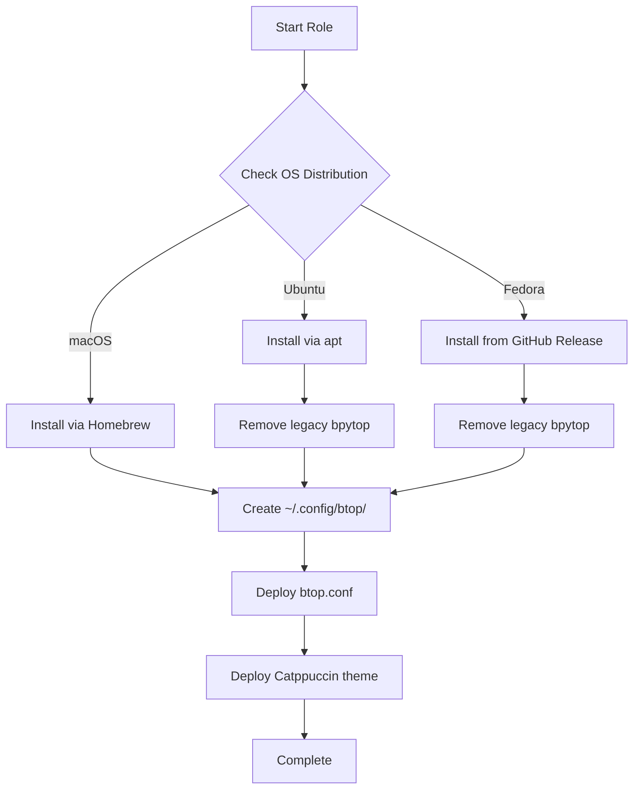

# btop

Resource monitor that shows usage and stats for processor, memory, disks, network and processes. A modern, beautiful alternative to top/htop with a responsive terminal UI.

## Overview

This Ansible role installs and configures [btop++](https://github.com/aristocratos/btop) with a pre-configured setup featuring the Catppuccin Mocha theme, optimized performance settings, and sensible defaults for system monitoring.

## Supported Platforms

- macOS (via Homebrew)
- Ubuntu/Debian (via apt)
- Fedora (via GitHub Release)

## What Gets Installed

### Packages
- **macOS**: `btop` (via Homebrew)
- **Ubuntu**: `btop` (via apt)
- **Fedora**: `btop` binary from GitHub releases (`btop-x86_64-linux-musl.tbz`)

### Migration
- Automatically removes legacy `bpytop` package if present (Ubuntu/Fedora)

## Configuration

### Directory Structure
```
~/.config/btop/
├── btop.conf                    # Main configuration file
└── themes/
    └── catppuccin_mocha.theme  # Custom color theme
```

### Key Features

The role deploys a pre-configured `btop.conf` with:

- **Theme**: Catppuccin Mocha color scheme with terminal background transparency
- **Update Rate**: 200ms for responsive monitoring
- **Display Options**:
  - CPU, Memory, Network, Processes, and GPU monitoring
  - Braille graph symbols for high-resolution charts
  - Temperature monitoring with Celsius scale
  - Battery stats when available
  - System uptime display
- **Process View**:
  - CPU lazy sorting (easier to follow top processes)
  - Memory shown in bytes
  - Gradient coloring for processes
  - Process tree view available
- **Network**: Auto-scaling bandwidth graphs
- **Memory**: Graphical representation with swap and disk info

### Configuration Flow



## Dependencies

### Ansible Collections
- `community.general` (for Homebrew module on macOS)

### Role Dependencies
- **Fedora only**: `github_release` role (for binary installation from GitHub)

## Usage

Install as part of dotfiles setup:
```bash
dotfiles -t btop
```

Or run manually with Ansible:
```bash
ansible-playbook main.yml --tags btop
```

Launch btop after installation:
```bash
btop
```

## Customization

To customize btop settings:

1. Edit the configuration file:
   ```bash
   nvim ~/.config/btop/btop.conf
   ```

2. Available options include:
   - `color_theme`: Change visual theme
   - `update_ms`: Adjust refresh rate (default: 200ms)
   - `shown_boxes`: Control which widgets display
   - `proc_sorting`: Change process sorting method
   - `graph_symbol`: Switch between braille/block/tty symbols

3. Changes take effect immediately in btop

## Uninstallation

Remove btop completely (package + config):
```bash
dotfiles --delete btop
```

Or use the uninstall script directly:
```bash
~/.dotfiles/roles/btop/uninstall.sh
```

## Links

- [btop++ GitHub Repository](https://github.com/aristocratos/btop)
- [Catppuccin Theme](https://github.com/catppuccin/catppuccin)
- [btop++ Documentation](https://github.com/aristocratos/btop#usage)

---

**Pro Tip**: Press `?` in btop to see all keyboard shortcuts and interactive features.
