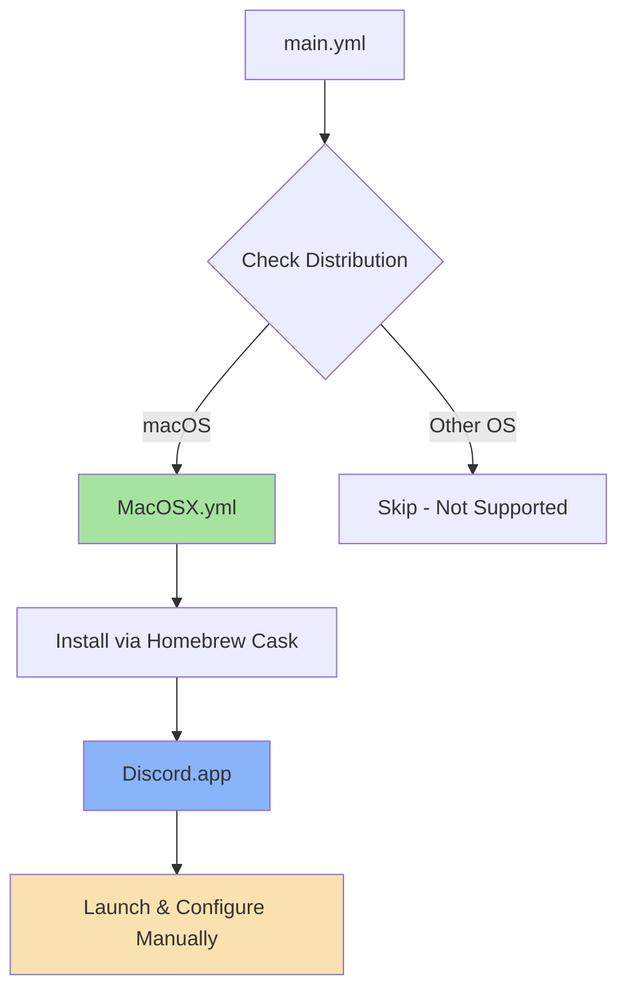

# 💬 Discord

A voice, video, and text communication platform for communities and friends.

## Overview

This Ansible role installs [Discord](https://discord.com/), a popular communication platform designed for creating communities. Whether you're part of a school club, gaming group, worldwide art community, or just a handful of friends that want to spend time together, Discord makes it easy to talk every day and hang out more often.

## Supported Platforms

| Platform | Installation Method | Status |
|----------|-------------------|--------|
| **macOS** | Homebrew Cask | ✅ Supported |

## What Gets Installed

### macOS
- **Package**: `discord` (via Homebrew Cask)
- **Type**: Full Discord desktop application

The Discord app will be available in your Applications folder and can be launched like any other macOS application.

## What Gets Configured

This role performs a **minimal installation only** - no configuration files are deployed. Discord manages its own settings through the application interface.

**User Configuration** (handled by Discord app):
- Account login and authentication
- Server memberships
- Notification preferences
- Audio/video device settings
- Appearance themes (light/dark mode)

## Architecture



## Dependencies

### System Requirements
- **macOS**: Homebrew must be installed
- **Internet**: Active connection required for Discord to function

### Required Roles
- **homebrew**: Ensures Homebrew is installed and configured (implicit dependency)

## Usage

### Install Discord

```bash
# Install with all dotfiles
dotfiles

# Install only Discord role
dotfiles -t discord
```

### Uninstall

```bash
# Complete removal
dotfiles --delete discord

# Or use Homebrew directly
brew uninstall --cask discord
```

**Note**: Uninstalling removes the application but preserves user data stored in:
```
~/Library/Application Support/discord/
```

To completely remove all Discord data:
```bash
rm -rf ~/Library/Application\ Support/discord/
rm -rf ~/Library/Caches/com.eljef.discord/
```

## First Launch

After installation, Discord will be available in your Applications folder:

1. Launch Discord from Applications or Spotlight
2. Create an account or log in
3. Join servers via invite links
4. Configure audio/video settings in User Settings

## File Structure

```
roles/discord/
└── tasks/
    ├── main.yml          # OS detection logic
    └── MacOSX.yml        # macOS-specific installation
```

## Known Limitations

- **Platform Support**: Currently macOS-only
- **No Auto-Configuration**: Settings must be configured manually in-app
- **No Beta/PTB Variants**: Only installs the stable Discord client
- **Updates**: Managed by Discord's built-in updater, not Homebrew

## Links

- [Official Discord Website](https://discord.com/)
- [Discord Download Page](https://discord.com/download)
- [Discord Support](https://support.discord.com/)
- [Discord Developer Portal](https://discord.com/developers/docs/intro) (for bot development)

## Notes

This role is part of a larger dotfiles management system. It follows the standard OS detection pattern used across all roles in this repository.

> 💡 **Tip**: For Linux platforms, consider adding distribution-specific tasks to install Discord via native package managers (apt, dnf, pacman) or Flatpak.
