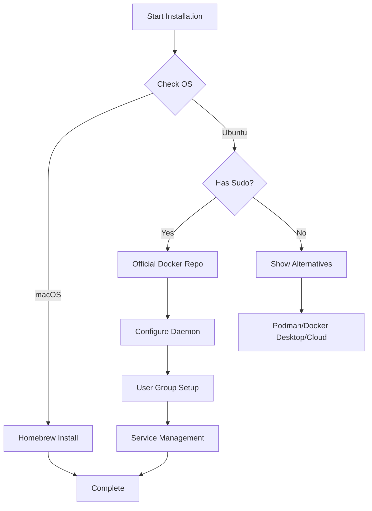

# 🐳 Docker

> Cross-platform Docker installation and configuration for containerized application development

Automated installation and setup of Docker Engine/CLI with optimized daemon configuration, custom network pools, and user-friendly permissions management.

## 🎯 Overview

This Ansible role provides a comprehensive Docker setup across multiple platforms, handling the complexities of Docker installation while maintaining secure defaults and optimal configurations. It intelligently detects your operating system, checks for necessary permissions, and configures Docker with production-ready settings.

## 📋 Supported Platforms

| Platform | Installation Method | Notes |
|----------|-------------------|-------|
| **macOS** | Homebrew CLI | CLI-only installation via `brew` |
| **Ubuntu** | Official Docker Repository | Full Docker Engine with systemd service |

## 📦 What Gets Installed

### macOS
- **Docker CLI** - Command-line interface via Homebrew
  - Note: Docker Desktop can be installed separately if GUI is needed

### Ubuntu/Linux
- **Docker Engine** (`docker-ce`) - Docker Community Edition
- **Docker CLI** (`docker-ce-cli`) - Command-line interface
- **Container Runtime** (`containerd.io`) - Container runtime
- **BuildKit Plugin** (`docker-buildx-plugin`) - Extended build capabilities with caching
- **Docker Compose** (`docker-compose-plugin`) - Docker Compose v2

## ⚙️ What Gets Configured

### Custom Daemon Configuration
The role deploys an optimized `daemon.json` configuration to `/etc/docker/daemon.json` (Ubuntu only):

```json
{
  "default-address-pools": [
    {
      "base": "172.18.0.0/16",
      "size": 24
    }
  ],
  "data-root": "~/.local/lib/docker",
  "experimental": true,
  "features": {
    "buildkit": true
  }
}
```

**Configuration Highlights:**
- **Custom Network Pools**: Uses `172.18.0.0/16` range to avoid conflicts with common corporate/home networks
- **User-Space Storage**: Docker data stored in `~/.local/lib/docker` for easier management
- **BuildKit Enabled**: Faster, more efficient builds with advanced caching
- **Experimental Features**: Access to cutting-edge Docker capabilities

### User Permissions
- **Ubuntu/Linux**: Adds user to `docker` group for passwordless Docker commands
  - ⚠️ Requires logout/login or `newgrp docker` to take effect
- **macOS**: Permissions handled by Docker Desktop (if installed)

### Service Management
- **Ubuntu/Linux**: Docker service enabled and auto-started via systemd
- **WSL Environments**: Service management automatically skipped (uses Windows Docker Desktop)

## 🔧 Key Features

### Intelligent Installation


### Sudo Detection & Graceful Fallback
The role intelligently detects sudo availability and provides helpful alternatives when not available:

**Alternatives Without Sudo:**
1. **Podman** - Rootless container alternative
2. **System Administrator** - Request Docker installation
3. **Docker Desktop** - GUI alternative
4. **Cloud Development** - Use cloud-based environments

### WSL (Windows Subsystem for Linux) Support
- Automatically detects WSL environments
- Skips service management (relies on Docker Desktop on Windows host)
- Prevents unnecessary service operations

### Network Configuration
- **Custom address pools** prevent conflicts with:
  - `10.0.0.0/8` (corporate networks)
  - `192.168.0.0/16` (home networks)
- **256 available subnets** with 254 hosts each
- **RFC 1918 compliant** private IP range

## 📚 Dependencies

### System Requirements
- **macOS**: Homebrew package manager
- **Ubuntu**: Sudo/admin access for system-level installation
- **All Platforms**: Internet connectivity for repository access

### Optional Integrations
Works well with other container-related roles:
- **podman** - Alternative container runtime
- **kind** - Kubernetes in Docker
- **whalebrew** - Package manager using Docker images
- **orbstack** - Docker Desktop alternative for macOS

## 🚀 Usage

### Install Docker
```bash
# Install via dotfiles command
dotfiles -t docker

# Or run Ansible directly
ansible-playbook main.yml --tags docker
```

### Verify Installation
```bash
# Check version
docker --version

# View configuration
docker info

# Test functionality
docker run hello-world
```

### Common Commands
```bash
# View daemon configuration (Ubuntu)
sudo cat /etc/docker/daemon.json

# Check service status (Ubuntu)
sudo systemctl status docker

# Restart Docker service (Ubuntu)
sudo systemctl restart docker

# Apply group changes without logout
newgrp docker
```

## 🔍 Notable Configurations

### Storage Directory
- **Location**: `~/.local/lib/docker`
- **Permissions**: `0710` (owner full access, group execute only)
- **Benefits**:
  - User-owned data directory
  - Easier backup and migration
  - Cleaner uninstallation
  - No system-wide permission conflicts

### BuildKit Features
BuildKit provides:
- Parallel build step execution
- Incremental layer caching
- Build secrets and SSH forwarding
- Multi-platform builds
- Better output and progress tracking

### Service Handler
The role includes a service restart handler triggered by configuration changes:
- Automatically restarts Docker when `daemon.json` is modified
- Skips restart in WSL environments
- Requires sudo access

## 🧹 Uninstallation

The role includes a comprehensive uninstall script with safety features:

```bash
# Run uninstall script
~/.dotfiles/roles/docker/uninstall.sh
```

**What Gets Removed:**
- Docker packages (CE, CLI, containerd)
- Docker data directories
- Docker group (Linux)
- User configuration files
- Docker Desktop (macOS)

**Safety Features:**
- Interactive confirmation prompt
- Data backup warning
- Graceful handling of missing components
- Cross-platform detection

## ⚠️ Important Notes

### Group Membership Changes
After installation on Ubuntu/Linux, you must either:
1. **Log out and back in** for group changes to take effect, or
2. Run `newgrp docker` to activate the new group in your current session

### Docker Desktop vs Docker Engine
- **macOS**: This role installs CLI only; Docker Desktop is separate
- **Ubuntu**: Full Docker Engine installation with daemon

### Security Considerations
- Docker group membership grants **root-equivalent privileges**
- Group members can mount host filesystem with full access
- Consider [rootless Docker](https://docs.docker.com/engine/security/rootless/) for enhanced security

### WSL-Specific Notes
- Docker daemon typically runs through Docker Desktop on Windows host
- Ensure Docker Desktop WSL integration is enabled
- Service management is handled by Windows, not systemd

## 📖 Further Reading

- [Official Docker Documentation](https://docs.docker.com/)
- [Docker Engine Installation (Ubuntu)](https://docs.docker.com/engine/install/ubuntu/)
- [Docker Security Best Practices](https://docs.docker.com/engine/security/)
- [BuildKit Documentation](https://docs.docker.com/build/buildkit/)
- [Rootless Docker](https://docs.docker.com/engine/security/rootless/)
- [Docker Networking](https://docs.docker.com/network/)

## 🔧 Troubleshooting

### Permission Denied Errors
```bash
# Check docker group membership
groups $USER | grep docker

# If not in group, add manually
sudo usermod -aG docker $USER
newgrp docker
```

### Service Won't Start
```bash
# Check service status
sudo systemctl status docker

# View logs
sudo journalctl -u docker -n 50

# Validate daemon configuration
sudo dockerd --validate
```

### Network Conflicts
If custom address pools conflict with existing networks:
1. Edit `templates/daemon.json` to use different range
2. Restart Docker service: `sudo systemctl restart docker`
3. Recreate affected containers/networks

---

**Role Status**: Optional (commented in default_roles)
**Maintenance**: Active
**Last Updated**: 2024
