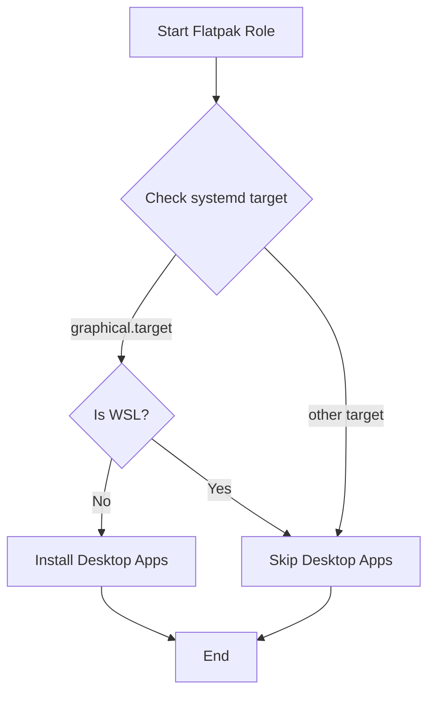
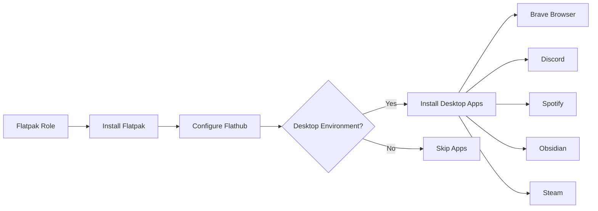

# 📦 Flatpak Role

Universal Linux application management with Flatpak - Install and manage containerized desktop applications from Flathub.

## Overview

This Ansible role sets up Flatpak on Linux systems and intelligently installs a curated set of desktop applications when a graphical environment is detected. It provides a consistent application experience across different Linux distributions by leveraging Flatpak's containerized approach.

## Supported Platforms

- **Ubuntu** (and Debian-based distributions)

## What Gets Installed

### System Packages
- **flatpak** - Universal Linux application sandboxing and distribution framework

### Flathub Remote
- Automatically configures the official [Flathub](https://flathub.org) repository

### Desktop Applications

When a graphical desktop environment is detected, the following applications are automatically installed:

| Application | Flatpak ID | Description |
|------------|------------|-------------|
| **Brave Browser** | `com.brave.Browser` | Privacy-focused web browser |
| **Discord** | `com.discordapp.Discord` | Voice, video, and text communication |
| **Spotify** | `com.spotify.Client` | Music streaming service |
| **Obsidian** | `md.obsidian.Obsidian` | Markdown-based knowledge base |
| **Steam** | `com.valvesoftware.Steam` | Gaming platform |

## Features

### 🎯 Smart Desktop Detection

The role uses systemd to detect whether the system is running a graphical desktop environment:



- Checks if `systemctl get-default` returns `graphical.target`
- Skips desktop applications on headless servers
- Skips desktop applications in WSL environments

### 🔒 Sandboxed Applications

All Flatpak applications run in containerized environments with:
- Isolated filesystem access
- Controlled system permissions
- Consistent runtime dependencies

### 🔄 Idempotent Installation

- Safe to run multiple times
- Only installs missing packages
- Updates existing Flathub remote configuration

## What Gets Configured

### Flathub Remote Repository
- **URL**: `https://flathub.org/repo/flathub.flatpakrepo`
- **Name**: `flathub`
- **Scope**: System-wide

### Desktop Integration
- Applications appear in system application menus
- Desktop files integrated with DE
- Icon themes properly registered

## Dependencies

### Ansible Collections
- `community.general` (for `flatpak` and `flatpak_remote` modules)

### System Requirements
- systemd-based Linux distribution
- Graphical desktop environment (for desktop apps)
- Internet connection for Flathub

## Usage

### Install with specific tag
```bash
dotfiles -t flatpak
```

### Install as part of default roles
The role is included in `default_roles` and runs automatically with:
```bash
dotfiles
```

### Skip desktop applications
If you want Flatpak but not the desktop apps, modify the role or run on a headless system (automatically detected).

## Architecture



## Key Implementation Details

### Environment Detection Logic
```yaml
# Checks systemd default target
systemctl get-default  # Returns: graphical.target or multi-user.target

# Combines with WSL detection
flatpak_is_desktop: "{{ flatpak_systemd_target.stdout == 'graphical.target' and not ansible_host_environment_is_wsl }}"
```

### Application Installation Pattern
- Uses `community.general.flatpak` module
- Installs from `flathub` remote
- Loops through application list
- Requires `become: true` for system-wide installation

## Customization

To modify the list of desktop applications, edit `roles/flatpak/tasks/Ubuntu.yml`:

```yaml
- name: "Flatpak | Install desktop applications"
  community.general.flatpak:
    name: "{{ item }}"
    state: present
    remote: flathub
  loop:
    - com.your.Application  # Add your Flatpak ID here
  when: flatpak_is_desktop
  become: true
```

Browse available applications at [Flathub.org](https://flathub.org).

## Troubleshooting

### Applications not installing
- Verify you're running a graphical desktop: `systemctl get-default`
- Check Flathub is accessible: `flatpak remote-list`
- Manually test: `flatpak install flathub com.brave.Browser`

### Permission issues
- Ensure role runs with `become: true`
- Check user is in required groups: `groups $USER`

### WSL limitations
- Desktop apps are intentionally skipped in WSL
- Use native Windows apps or WSLg instead

## Links

- [Flatpak Official Site](https://flatpak.org/)
- [Flathub Application Repository](https://flathub.org/)
- [Flatpak Documentation](https://docs.flatpak.org/)
- [Ansible community.general.flatpak module](https://docs.ansible.com/ansible/latest/collections/community/general/flatpak_module.html)

## Role Structure

```
roles/flatpak/
├── README.md          # This file
└── tasks/
    ├── main.yml       # OS detection entry point
    └── Ubuntu.yml     # Ubuntu-specific installation tasks
```
