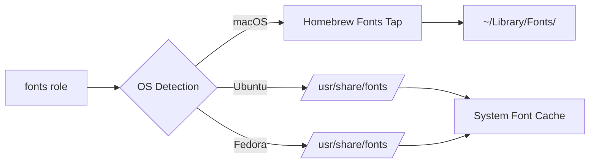

# Fonts

A lightweight Ansible role for installing Powerline-compatible fonts across macOS, Ubuntu, and Fedora systems. Essential for terminal themes, status bars, and developer-focused applications.

## Overview

This role ensures Powerline fonts are installed system-wide, providing the special glyphs and icons required by tools like tmux, vim-airline, oh-my-zsh themes, and Starship prompt. It handles platform-specific package managers automatically and provides graceful fallback instructions when sudo access is unavailable.

## Supported Platforms

| Platform | Package Manager | Font Package |
|----------|----------------|--------------|
| macOS | Homebrew | `font-powerline-symbols` |
| Ubuntu | APT | `fonts-powerline` |
| Fedora | DNF | `powerline-fonts` |

## What Gets Installed

### Powerline Fonts Collection
- Special glyphs for terminal UI elements
- Patched symbols for status bars and prompts
- Unicode characters for branch icons, arrows, and separators
- Compatible with popular terminal themes and frameworks

### Installation Locations



## Features

### Cross-Platform Consistency
- Automatic OS detection and appropriate package manager selection
- Idempotent installation (safe to run multiple times)
- No configuration files or symlinks needed

### Graceful Degradation
On Fedora systems without sudo access, provides helpful manual installation instructions:
```bash
git clone https://github.com/powerline/fonts.git ~/.local/share/fonts/powerline
fc-cache -f ~/.local/share/fonts
```

### Clean Uninstallation
The included `uninstall.sh` script removes:
- Nerd Fonts from user directories
- Homebrew cask installations (macOS)
- System font directories (Linux)
- Updates font cache automatically

## Usage

### Install via dotfiles command
```bash
# Install as part of full dotfiles setup
dotfiles

# Install only the fonts role
dotfiles -t fonts

# Dry run to preview changes
dotfiles -t fonts --check
```

### Verify Installation
```bash
# Check installed fonts (macOS)
ls ~/Library/Fonts/ | grep -i powerline

# Check installed fonts (Linux)
fc-list | grep -i powerline

# Test glyphs in terminal
echo " \ue0b0 \ue0b1 \ue0b2 \ue0b3"
```

## Dependencies

### Runtime Requirements
- **macOS**: Homebrew
- **Ubuntu**: APT package manager, sudo access
- **Fedora**: DNF package manager, sudo access (or manual installation)

### No Role Dependencies
This role is standalone and does not depend on other roles in the dotfiles repository.

## Integration

These fonts are used by several other roles in this dotfiles collection:

- **tmux**: Status bar icons and separators
- **starship**: Git branch symbols and prompt decorations
- **neovim**: vim-airline and status line plugins
- **zsh**: oh-my-zsh themes with special characters

## Technical Details

### Role Structure
```
roles/fonts/
├── tasks/
│   ├── main.yml       # OS detection entry point
│   ├── MacOSX.yml     # Homebrew installation
│   ├── Ubuntu.yml     # APT installation
│   └── Fedora.yml     # DNF installation with fallback
└── uninstall.sh       # Clean removal script
```

### Package Selection Strategy
Each OS uses its native font packaging:
- **macOS**: Taps into `homebrew/cask-fonts` repository
- **Ubuntu**: Uses official Debian `fonts-powerline` package
- **Fedora**: Uses EPEL/RPM Fusion `powerline-fonts` package

## Resources

- [Powerline Documentation](https://powerline.readthedocs.io/)
- [Powerline Fonts Repository](https://github.com/powerline/fonts)
- [Nerd Fonts](https://www.nerdfonts.com/) - Extended font collection with even more glyphs

## Troubleshooting

### Fonts not appearing in terminal
1. Restart your terminal application after installation
2. Configure your terminal to use a Powerline-compatible font
3. Verify installation: `fc-list | grep -i powerline` (Linux) or `ls ~/Library/Fonts/` (macOS)

### Glyphs showing as boxes or question marks
- Ensure your terminal emulator supports Unicode
- Check that the selected font is actually a Powerline-patched variant
- Try setting terminal font to "Monaco for Powerline" or similar

### Manual installation needed (Fedora without sudo)
Follow the instructions displayed during role execution, or run:
```bash
git clone https://github.com/powerline/fonts.git ~/.local/share/fonts/powerline
fc-cache -f ~/.local/share/fonts
```
