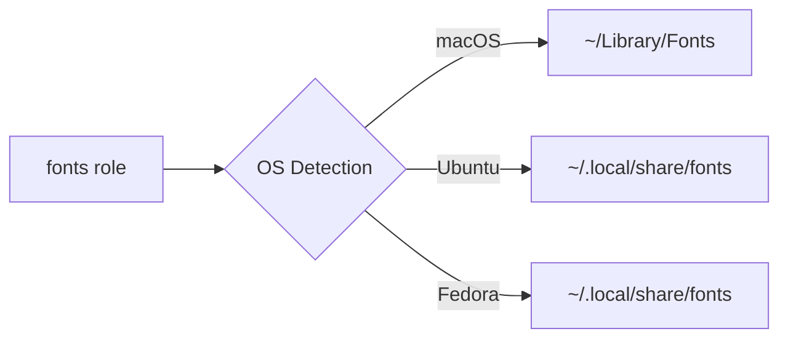

# Fonts

An Ansible role for installing your private BerkeleyMono Nerd Font files across macOS, Ubuntu, and Fedora systems.

## Overview

This role downloads BerkeleyMono Nerd Font files from a 1Password item in your Private vault, installs them into the current user's font directory, and skips automatically when the managed files already exist.

## Supported Platforms

| Platform | BerkeleyMono Install Path |
|----------|---------------------------|
| macOS | `~/Library/Fonts/` |
| Ubuntu | `~/.local/share/fonts/` |
| Fedora | `~/.local/share/fonts/` |

## What Gets Installed

### BerkeleyMono Nerd Font
- Pulled from a 1Password item named `BerkeleyMono Fonts`
- Expected as four file attachment fields:
  - `BerkeleyMonoNerdFont-Regular` -> `BerkeleyMonoNerdFont-Regular.otf`
  - `BerkeleyMonoNerdFont-Italic` -> `BerkeleyMonoNerdFont-Italic.otf`
  - `BerkeleyMonoNerdFont-Bold` -> `BerkeleyMonoNerdFont-Bold.otf`
  - `BerkeleyMonoNerdFont-BoldItalic` -> `BerkeleyMonoNerdFont-BoldItalic.otf`
- Installed per-user so the role stays idempotent and does not need sudo

### Installation Locations


```mermaid
graph LR
    A[fonts role] --> B{OS Detection}
    B -->|macOS| C[~/Library/Fonts]
    B -->|Ubuntu| D[~/.local/share/fonts]
    B -->|Fedora| E[~/.local/share/fonts]
```

## Features

### Cross-Platform Consistency
- Automatic OS detection and appropriate per-user install path selection
- Idempotent installation based on the managed BerkeleyMono font files
- No configuration files or symlinks needed

### 1Password-Backed Private Fonts
- Uses `op read --out-file` to install the BerkeleyMono attachments directly from 1Password
- Skips cleanly when 1Password is not installed, not authenticated, or the item is missing
- Safe to rerun after authenticating with 1Password on a fresh machine

### Graceful Degradation
- Skips cleanly when 1Password is unavailable or unauthenticated
- Prints the exact rerun command once 1Password access is ready

### Clean Uninstallation
The included `uninstall.sh` script removes:
- Nerd Fonts from user directories
- Updates font cache automatically

## Usage

### Install via dotfiles command
```bash
# Install as part of full dotfiles setup
dotfiles

# Install only the fonts role
dotfiles -t fonts

# Dry run to preview changes
dotfiles -t fonts --check
```

### Verify Installation
```bash
# Check installed fonts (macOS)
ls ~/Library/Fonts/ | grep -i BerkeleyMono

# Check installed fonts (Linux)
fc-list | grep -i BerkeleyMono

# Test glyphs in terminal
echo " \ue0b0 \ue0b1 \ue0b2 \ue0b3"
```

## Dependencies

### Runtime Requirements
- **Private BerkeleyMono install**: 1Password CLI authenticated with access to the `BerkeleyMono Fonts` item in the `Private` vault

### Role Dependencies
- Private BerkeleyMono installation depends on the `1password` role being installed and authenticated

## Integration

These fonts are used by several other roles in this dotfiles collection:

- **ghostty**: Uses `BerkeleyMono Nerd Font`
- **kitty**: Uses `BerkeleyMono Nerd Font`

## Technical Details

### Role Structure
```
roles/fonts/
├── tasks/
│   ├── main.yml       # OS detection entry point
│   ├── MacOSX.yml     # macOS user font install
│   ├── Ubuntu.yml     # Linux user font install
│   ├── Fedora.yml     # Linux user font install
│   └── private_berkeley_mono.yml
└── uninstall.sh       # Clean removal script
```

### Install Strategy
Each OS installs BerkeleyMono as a user font from 1Password attachments:
- **macOS**: `~/Library/Fonts`
- **Ubuntu**: `~/.local/share/fonts`
- **Fedora**: `~/.local/share/fonts`

## Resources

- [Nerd Fonts](https://www.nerdfonts.com/) - Extended font collection with patched developer fonts

## Troubleshooting

### Fonts not appearing in terminal
1. Restart your terminal application after installation
2. Configure your terminal to use `BerkeleyMono Nerd Font`
3. Verify installation: `fc-list | grep -i BerkeleyMono` (Linux) or `ls ~/Library/Fonts/ | grep -i BerkeleyMono` (macOS)

### BerkeleyMono files were skipped
- Unlock or sign in to 1Password
- Confirm the `Private` vault contains an item named `BerkeleyMono Fonts`
- Confirm the item has file attachment fields named exactly:
  - `BerkeleyMonoNerdFont-Regular`
  - `BerkeleyMonoNerdFont-Italic`
  - `BerkeleyMonoNerdFont-Bold`
  - `BerkeleyMonoNerdFont-BoldItalic`
- Rerun `dotfiles -t fonts`

### Glyphs showing as boxes or question marks
- Ensure your terminal emulator supports Unicode
- Check that the selected font is actually `BerkeleyMono Nerd Font`
- Reload the terminal after the font files land in the user font directory
