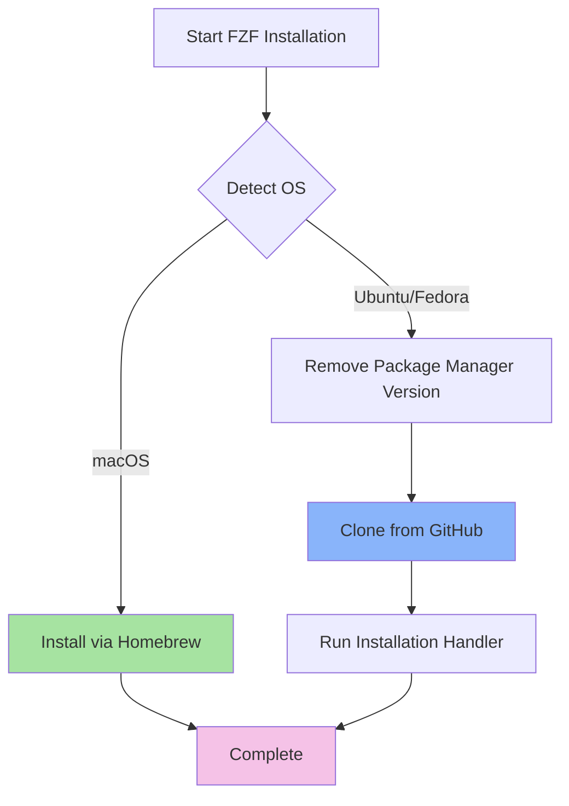

# 🔍 FZF Role

> Command-line fuzzy finder for interactive filtering, searching, and selection across your development environment

[](#supported-platforms)
[](#shell-integration)
[](#theming)

## Overview

This Ansible role installs and configures [fzf](https://github.com/junegunn/fzf), a blazingly fast command-line fuzzy finder. FZF enhances your terminal workflow with interactive selection capabilities for files, command history, git operations, and more.

## Features

- **Cross-platform support** - Works on macOS, Ubuntu, and Fedora
- **Smart installation strategy** - Homebrew on macOS, source installation on Linux for latest features
- **Enhanced previews** - Syntax-highlighted file previews with bat, directory trees with lsd
- **Custom theming** - Beautiful Catppuccin Mocha color scheme
- **Shell integration** - Seamless zsh and bash integration with custom completions
- **Git workflow enhancements** - Interactive branch checkout, commit browsing, stash management
- **Tmux integration** - Popup-based session management and URL extraction
- **Performance optimized** - Intelligent caching and output limiting

## Supported Platforms

| Platform | Installation Method | Status |
|----------|-------------------|--------|
| macOS | Homebrew | ✅ Supported |
| Ubuntu | Git (source) | ✅ Supported |
| Fedora | Git (source) | ✅ Supported |

## Installation Flow



### macOS Installation

```yaml
- name: "FZF | MacOSX | Install fzf"
  community.general.homebrew:
    name: fzf
    state: present
```

Simple Homebrew installation for easy updates and integration.

### Linux Installation

```yaml
# Remove outdated system package
- name: "FZF | Uninstall APT/DNF fzf"
  ansible.builtin.apt:  # or dnf for Fedora
    name: fzf
    state: absent
  become: true

# Install latest version from source
- name: "FZF | Clone Latest Version"
  ansible.builtin.git:
    repo: https://github.com/junegunn/fzf.git
    depth: 1
    dest: "{{ ansible_user_dir }}/.fzf"
  notify: "Install FZF"
```

**Why source installation on Linux?**
- Always get the latest features and bug fixes
- Consistent behavior across all Linux distributions
- Better integration with custom configurations

## What Gets Installed

### Binaries
- `fzf` - Main fuzzy finder binary
- `fzf-tmux` - Tmux integration wrapper

### Shell Components
- Shell completions (zsh/bash)
- Key bindings for interactive operations
- Custom completion functions

### Configuration Files
- `~/.fzf.bash` - Bash integration (optional)
- `~/.fzf.zsh` - ZSH integration (optional)

## Shell Integration

### Default Keybindings

| Keybinding | Action | Description |
|------------|--------|-------------|
| `Ctrl-T` | File finder | Fuzzy search files/directories from current location |
| `Ctrl-R` | History search | Interactive command history with preview |
| `Alt-C` | Directory navigation | Change to selected directory |

### Enhanced Previews

FZF is configured with intelligent previews that adapt to content type:

**Files**: Syntax-highlighted with [bat](https://github.com/sharkdp/bat)
```bash
bat -n --color=always --line-range :500 <file>
```

**Directories**: Tree view with [lsd](https://github.com/lsd-rs/lsd)
```bash
lsd --oneline --tree --color=always --icon=always <dir> | head -200
```

### Custom Completions

The role provides context-aware completions:

```zsh
_fzf_comprun() {
  local command=$1
  shift

  case "$command" in
    export|unset) fzf --preview "eval 'echo ${}'" "$@" ;;
    ssh)          fzf --preview 'dig {}'          "$@" ;;
    *)            fzf --preview "$show_file_or_dir_preview" "$@" ;;
  esac
}
```

## Theming

The role applies the beautiful **Catppuccin Mocha** theme for consistent visual experience:

```zsh
export FZF_DEFAULT_OPTS=" \
--color=bg+:#313244,bg:#1e1e2e,spinner:#f5e0dc,hl:#f38ba8 \
--color=fg:#cdd6f4,header:#f38ba8,info:#cba6f7,pointer:#f5e0dc \
--color=marker:#b4befe,fg+:#cdd6f4,prompt:#cba6f7,hl+:#f38ba8 \
--color=selected-bg:#45475a \
--multi"
```

## Integration with Other Tools

### Git Enhanced Workflows

FZF enables powerful git operations through custom functions:

- **`gco`** - Interactive branch checkout with commit preview
- **`glog`** - Browse commit history with full diffs
- **`gstash`** - Manage stashes with interactive preview
- **`gtags`** - Browse and checkout tags
- **`gws`** - Switch between git worktrees

### Tmux Integration

- **URL extraction** - Find and open URLs from terminal output
- **Session management** - Quick session switching with [sesh](https://github.com/joshmedeski/sesh)
- **Popup windows** - Integrated fzf popups within tmux

### Kubernetes

- **`kctx`** - Interactive Kubernetes context switching

## Dependencies

### Required
- `git` - For cloning fzf repository (Linux only)
- Shell environment (zsh or bash)

### Optional (Enhanced Features)
- [bat](https://github.com/sharkdp/bat) - Syntax-highlighted file previews
- [lsd](https://github.com/lsd-rs/lsd) - Enhanced directory listings with icons
- [tmux](https://github.com/tmux/tmux) - Terminal multiplexer integration
- [kubectl](https://kubernetes.io/docs/tasks/tools/) - Kubernetes context switching

## Usage Examples

### Basic File Finding
```bash
# Find and edit a file
vim $(fzf)

# Multi-select files for deletion
rm $(fzf -m)

# Search from specific directory
cd $(find ~/projects -type d | fzf)
```

### Command History
```bash
# Search and execute from history
Ctrl-R
```

### Git Operations
```bash
# Interactive branch checkout
gco

# Browse commit history with preview
glog

# Manage stashes
gstash
```

## Uninstallation

The role includes a comprehensive uninstall script that handles all platforms:

```bash
# Run from dotfiles directory
./roles/fzf/uninstall.sh
```

This will:
1. Remove fzf binary and components
2. Clean up shell integration files
3. Remove git installation directory (Linux)

## Configuration Files

This role integrates with other roles for complete functionality:

| Component | Location | Purpose |
|-----------|----------|---------|
| Installation | `roles/fzf/tasks/` | OS-specific installation tasks |
| Shell config | `roles/zsh/files/zsh/fzf_config.zsh` | ZSH integration and theming |
| Git functions | `roles/zsh/files/zsh/git_functions.zsh` | Enhanced git workflows |
| Tmux config | `roles/tmux/files/tmux/tmux.conf` | Tmux popup integration |

## Performance Optimizations

- **Shallow clone** - `depth: 1` for faster installation
- **Output limiting** - Preview truncation prevents UI freezing
- **Lazy loading** - Shell integration loads on-demand
- **Smart caching** - Efficient command history management

## Troubleshooting

### FZF command not found

Check if fzf is in your PATH:
```bash
# macOS
which fzf  # Should show /opt/homebrew/bin/fzf or /usr/local/bin/fzf

# Linux
which fzf  # Should show ~/.fzf/bin/fzf
```

If not found, verify installation completed:
```bash
# macOS
brew list fzf

# Linux
ls -la ~/.fzf/bin/fzf
```

### Previews not working

Ensure dependencies are installed:
```bash
bat --version    # For file previews
lsd --version    # For directory previews
```

### Slow performance

For large repositories, create a `.fzfignore` file:
```bash
cat > ~/.fzfignore <<EOF
node_modules/
vendor/
.git/
EOF
```

## Links

- [Official FZF Repository](https://github.com/junegunn/fzf)
- [FZF Wiki](https://github.com/junegunn/fzf/wiki)
- [Catppuccin Theme](https://github.com/catppuccin/catppuccin)
- [Advanced FZF Examples](https://github.com/junegunn/fzf/wiki/examples)

## License

This role follows the same license as the parent dotfiles repository.
