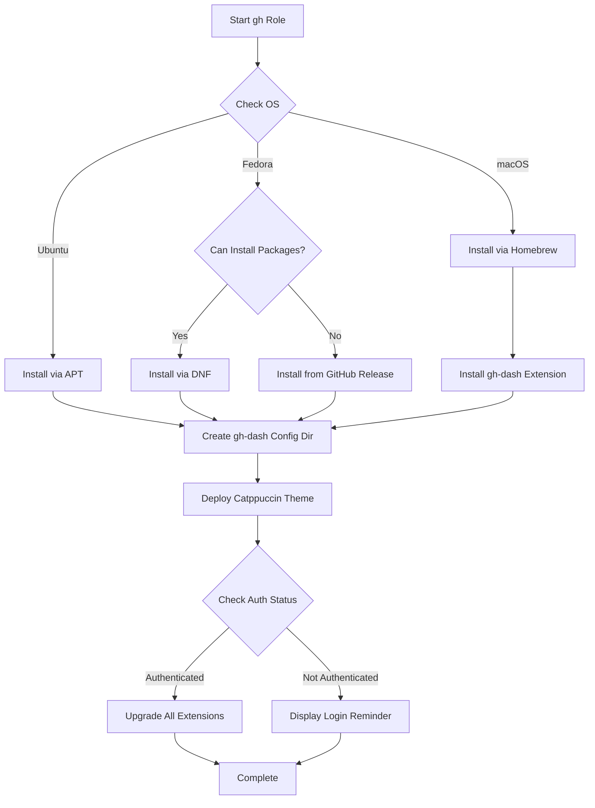

# :octopus: GitHub CLI (gh)

Ansible role for installing and configuring [GitHub CLI](https://cli.github.com/) (`gh`) with the [gh-dash](https://github.com/dlvhdr/gh-dash) extension for an enhanced terminal GitHub experience.

## Overview

This role automates the installation of GitHub's official command-line tool and sets up a beautifully themed dashboard extension for managing pull requests and issues directly from your terminal.

## Supported Platforms

| Platform | Installation Method | Status |
|----------|-------------------|--------|
| macOS | Homebrew | :white_check_mark: Full support |
| Ubuntu/Debian | APT | :white_check_mark: Full support |
| Fedora | DNF or GitHub Release | :white_check_mark: Full support with fallback |

## What Gets Installed

### Core Package
- **GitHub CLI** (`gh`) - Official GitHub command-line tool for:
  - Managing pull requests and issues
  - Running GitHub Actions workflows
  - Managing repositories and releases
  - Cloning and forking repositories
  - And much more

### Extensions
- **gh-dash** - A beautiful dashboard for viewing and interacting with pull requests and issues

## What Gets Configured

### gh-dash Theme
The role deploys a custom Catppuccin Mocha Green theme for `gh-dash`:

**Configuration File:** `~/.config/gh-dash/config.yaml`

```yaml
theme:
  colors:
    text:
      primary: "#cdd6f4"    # Catppuccin Mocha Text
      secondary: "#a6e3a1"  # Catppuccin Mocha Green
      success: "#a6e3a1"    # Green for success states
      error: "#f38ba8"      # Red for error states
    border:
      primary: "#a6e3a1"    # Green borders for visual pop
```

### Authentication Check
The role automatically:
- Checks if `gh` is authenticated
- Upgrades all installed extensions if authenticated
- Displays a helpful message if authentication is needed

## Installation Flow



## Key Features

### Intelligent Installation
- **Platform-aware:** Automatically detects your OS and uses the appropriate package manager
- **Fallback support:** On Fedora, falls back to GitHub Release installation if package manager isn't available
- **Dependency handling:** Leverages the `github_release` role for binary installations

### Extension Management
- Automatically installs `gh-dash` extension on macOS
- Upgrades all extensions when authenticated
- Graceful handling of unauthenticated states

### Beautiful Defaults
- Pre-configured Catppuccin Mocha theme for `gh-dash`
- Consistent color scheme with green accents
- Professional visual appearance out of the box

## Dependencies

### Role Dependencies
- **github_release** (Fedora only, when installing from GitHub Release)

### System Requirements
- No authentication required for installation
- `gh auth login` recommended after installation for full functionality

## Post-Installation

After the role completes, authenticate with GitHub:

```bash
# Login with browser-based authentication
gh auth login

# Or use SSH key authentication
gh auth login --hostname github.com --method ssh
```

Once authenticated, launch the dashboard:

```bash
gh dash
```

## Uninstallation

The role includes a comprehensive uninstall script that:
- Removes `gh` using the appropriate package manager
- Optionally removes configuration and authentication (with user confirmation)
- Cleans up all installed extensions

```bash
# Run the uninstall script
~/.dotfiles/roles/gh/uninstall.sh
```

## Links

- [GitHub CLI Official Documentation](https://cli.github.com/manual/)
- [gh-dash Extension](https://github.com/dlvhdr/gh-dash)
- [Catppuccin Theme](https://github.com/catppuccin/catppuccin)

## Notes

- The Ubuntu installation has a TODO note about potentially installing from the latest GitHub release instead of APT
- The Fedora installation intelligently falls back to GitHub releases when running without package installation privileges
- All extension operations gracefully skip if `gh` is not authenticated
