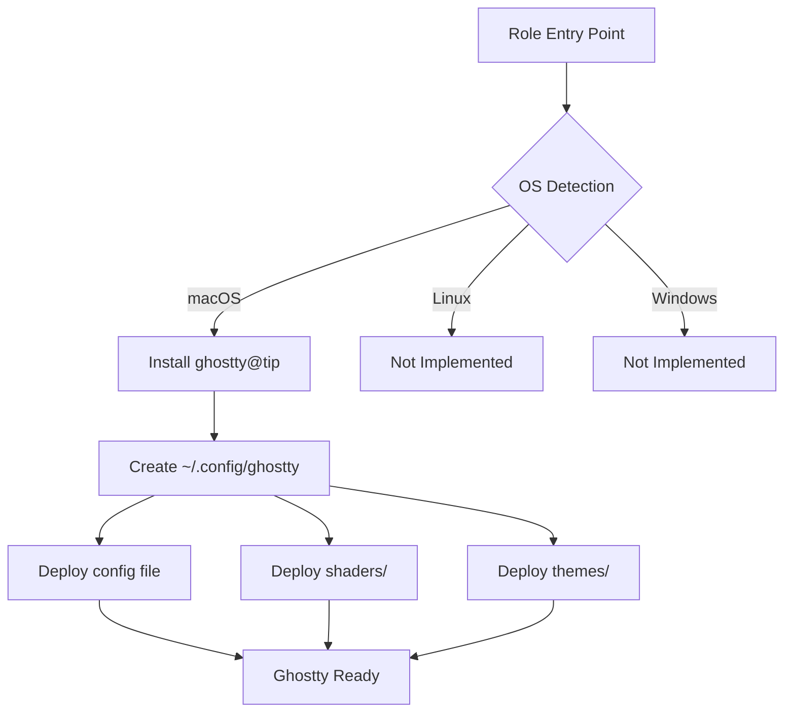

# 👻 Ghostty Terminal Role

Modern GPU-accelerated terminal emulator configuration with custom shaders, themes, and performance optimizations.

## Overview

This Ansible role installs and configures [Ghostty](https://ghostty.org) - a fast, native, GPU-accelerated terminal emulator written in Zig by Mitchell Hashimoto. The configuration includes custom GLSL cursor shaders, background images, and the Catppuccin Mocha theme for a visually stunning development environment.

## Supported Platforms

| Platform | Status | Installation Method |
|----------|--------|---------------------|
| macOS | ✅ Full Support | Homebrew Cask (`ghostty@tip`) |
| Linux | 🚧 Architecture Ready | Not yet implemented |
| Windows | 🚧 Architecture Ready | Not yet implemented |

## What Gets Installed

### Packages
- **Ghostty nightly** (`ghostty@tip`) - Latest features including background image support

### Configuration Files

```
~/.config/ghostty/
├── config                      # Main configuration
├── shaders/
│   ├── cursor_blaze.glsl      # Electric cyan trail effect
│   └── cursor_smear.glsl      # Smooth sapphire trail effect
└── themes/
    └── catppuccin-mocha       # Color palette
```

## Key Features

### 🎨 Visual Effects
- **Custom Cursor Shaders**: GPU-powered cursor trail effects
  - `cursor_blaze.glsl` - Electric cyan trail with motion blur (200ms)
  - `cursor_smear.glsl` - Smooth sapphire trail (120ms)
- **Background Images**: Custom backgrounds with opacity and blur support
- **Catppuccin Mocha Theme**: Professional dark color scheme

### ⚡ Performance
- **GPU Acceleration**: Metal rendering on macOS for smooth 60+ FPS
- **Font Rendering**: Enhanced typography with BerkeleyMono Nerd Font
- **Optimized Shaders**: Branch-free GLSL for minimal performance impact

### 🛠️ Configuration Highlights

```ini
# Theme & Appearance
theme = catppuccin-mocha
background = #030304
background-opacity = 1
background-blur-radius = 20
background-image = ~/Pictures/your-image.jpg
background-image-opacity = 0.15

# Typography
font-size = 15
font-family = "BerkeleyMono Nerd Font"
font-thicken = true

# Window Behavior (macOS)
macos-titlebar-style = hidden
macos-option-as-alt = true
window-padding-x = 10
window-padding-y = 10

# Cursor Effects
cursor-style = block
cursor-style-blink = true
custom-shader = shaders/cursor_blaze.glsl

# Productivity
clipboard-read = allow
clipboard-write = allow
copy-on-select = true
auto-update = check
auto-update-channel = tip
```

## Architecture



## Shader Technology

Both custom shaders use **Signed Distance Fields (SDF)** for precise geometric calculations and are based on [Inigo Quilez's distance functions](https://iquilezles.org/articles/distfunctions2d/).

### Cursor Blaze
- Electric cyan color scheme (`#00E0FF`)
- Parallelogram trail between cursor positions
- Distance-based opacity fade
- 200ms duration with easing functions

### Cursor Smear
- Catppuccin Sapphire blue (`#74c7ed`)
- 12+ color variants available (commented)
- 120ms duration for snappier feel
- Optimized for better performance

## Usage

### Install with dotfiles
```bash
# Install/update Ghostty
dotfiles -t ghostty

# Dry run to preview changes
dotfiles -t ghostty --check

# Uninstall (interactive)
~/.dotfiles/roles/ghostty/uninstall.sh
```

### Customize Cursor Effect

Edit `~/.config/ghostty/config`:
```ini
# Switch between effects
custom-shader = shaders/cursor_blaze.glsl   # Electric trail
custom-shader = shaders/cursor_smear.glsl   # Smooth trail
# custom-shader =                           # Disable effects
```

### Change Background Image

```ini
background-image = ~/path/to/your/image.jpg
background-image-opacity = 0.15            # 0.0-1.0
background-image-fit = cover               # cover, contain, stretch, tile
```

## Dependencies

### Required
- **macOS**: Homebrew installed
- **Font**: BerkeleyMono Nerd Font (or modify `font-family` in config)

### Optional
- Background image at configured path
- GPU with Metal support for shader effects

## Troubleshooting

| Issue | Solution |
|-------|----------|
| Background image not loading | Verify file path exists, use absolute path |
| Shader effects not working | Update to nightly (`ghostty@tip`), check GPU support |
| Font rendering issues | Install BerkeleyMono Nerd Font via Homebrew |
| Performance problems | Disable custom shaders, reduce blur radius |

## Links

- [Official Website](https://ghostty.org)
- [GitHub Repository](https://github.com/ghostty-org/ghostty)
- [Documentation](https://ghostty.org/docs)
- [Catppuccin Theme](https://github.com/catppuccin/catppuccin)

## Advanced Configuration

For detailed customization options, shader development, and platform-specific notes, see [CLAUDE.md](./CLAUDE.md).
