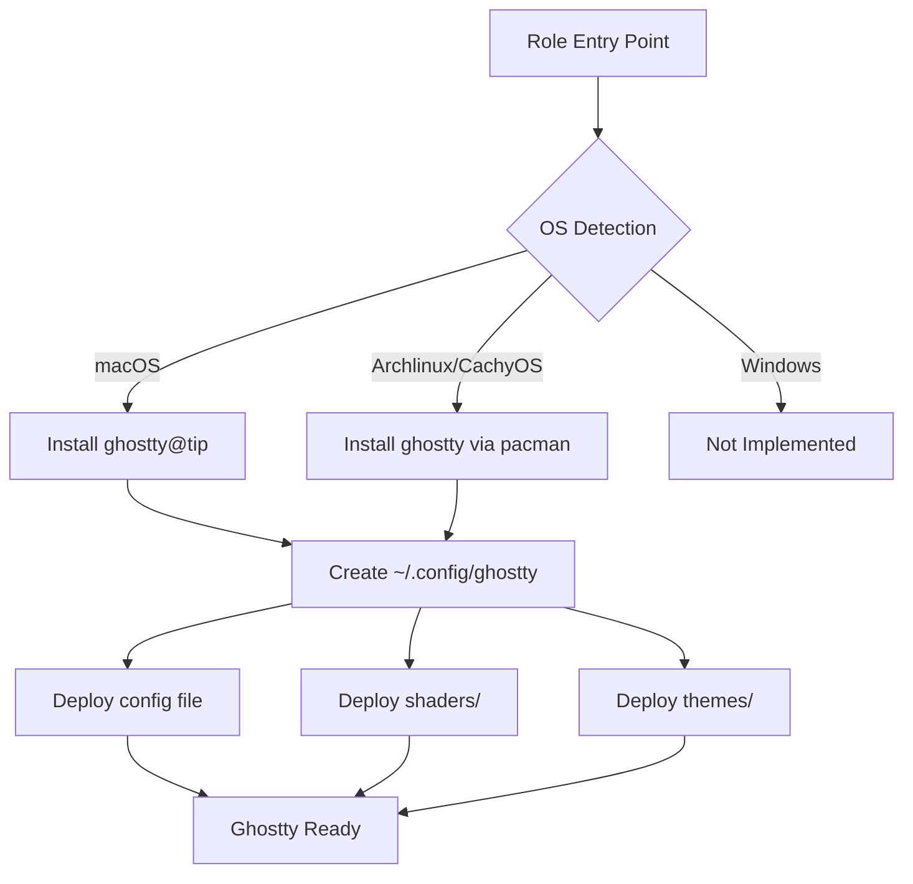

# 👻 Ghostty Terminal Role

Modern GPU-accelerated terminal emulator configuration with custom shaders, themes, and performance optimizations.

## Overview

This Ansible role installs and configures [Ghostty](https://ghostty.org) - a fast, native, GPU-accelerated terminal emulator written in Zig by Mitchell Hashimoto. The configuration includes custom GLSL cursor shaders, background images, and the Catppuccin Mocha theme for a visually polished development environment.

## Supported Platforms

| Platform          | Status | Installation Method |
|-------------------|--------|---------------------|
| macOS             | ✅ Full Support | Homebrew Cask (`ghostty@tip`) |
| Archlinux/CachyOS | ✅ Full Support | pacman (`ghostty`) |
| Windows           | 🚧 Architecture Ready | Not yet implemented |

## What Gets Installed

### Packages
- **macOS:** Ghostty nightly (`ghostty@tip`) via Homebrew Cask
- **Archlinux/CachyOS:** Ghostty (`ghostty`) via pacman

### Configuration Files

```
~/.config/ghostty/
├── config                      # Main configuration
├── shaders/
│   └── cursor_blaze.glsl       # Deep Catppuccin mauve trail effect
└── themes/
    └── catppuccin-mocha        # Color palette
```

## Key Features

### 🎨 Visual Effects
- **Custom Cursor Shaders**: GPU-powered cursor trail effects
  - `cursor_blaze.glsl` - Deep Catppuccin mauve trail with motion blur (200ms)
- **Background Images**: Custom backgrounds with opacity and blur support
- **Catppuccin Mocha Theme**: Professional dark color scheme

### ⚡ Performance
- **GPU Acceleration**: Native Ghostty rendering on supported platforms for smooth 60+ FPS
- **Font Rendering**: Enhanced typography with BerkeleyMono Nerd Font
- **Optimized Shaders**: Branch-free GLSL for minimal performance impact

### 🛠️ Configuration Highlights

```ini
# Theme & Appearance
theme = catppuccin-mocha
background = #030304
background-opacity = 1
background-blur-radius = 20
background-image = ~/Pictures/your-image.jpg
background-image-opacity = 0.15

# Typography
font-size = 11
font-family = "BerkeleyMono Nerd Font"
font-thicken = true

# Window Behavior (macOS)
macos-titlebar-style = hidden
macos-option-as-alt = true
window-padding-x = 10
window-padding-y = 10

# Cursor Effects
cursor-style = block
cursor-style-blink = true
cursor-invert-fg-bg = true
custom-shader = shaders/cursor_blaze.glsl

# Productivity
clipboard-read = allow
clipboard-write = allow
copy-on-select = true
shell-integration-features = no-cursor
auto-update = check
auto-update-channel = tip
```

## Architecture


```mermaid
graph TD
    A[Role Entry Point] --> B{OS Detection}
    B -->|macOS| C[Install ghostty@tip]
    B -->|Archlinux/CachyOS| D[Install ghostty via pacman]
    B -->|Windows| E[Not Implemented]
    C --> F[Create ~/.config/ghostty]
    D --> F
    F --> G[Deploy config file]
    F --> H[Deploy shaders/]
    F --> I[Deploy themes/]
    G --> J[Ghostty Ready]
    H --> J
    I --> J
```

## Usage

### Install with dotfiles
```bash
# Install/update Ghostty
dotfiles -t ghostty

# Dry run to preview changes
dotfiles -t ghostty --check

# Uninstall (interactive)
~/.dotfiles/roles/ghostty/uninstall.sh
```

### Customize Cursor Effect

Edit `~/.config/ghostty/config`:
```ini
# Active cursor shader
custom-shader = shaders/cursor_blaze.glsl   # Deep Catppuccin mauve trail
# custom-shader =                           # Disable effects
```

### Change Background Image

```ini
background-image = ~/path/to/your/image.jpg
background-image-opacity = 0.15            # 0.0-1.0
background-image-fit = cover               # cover, contain, stretch, tile
```

## Dependencies

### Required
- **macOS**: Homebrew installed
- **Archlinux/CachyOS**: pacman package installation available
- **Font**: BerkeleyMono Nerd Font (or modify `font-family` in config)

### Optional
- Background image at configured path
- GPU support for shader effects

## Troubleshooting

| Issue | Solution |
|-------|----------|
| Background image not loading | Verify file path exists, use absolute path |
| Shader effects not working | Update Ghostty, verify `custom-shader` points at `shaders/cursor_blaze.glsl`, and check GPU support |
| Font rendering issues | Install BerkeleyMono Nerd Font or update `font-family` |
| Performance problems | Disable custom shaders, reduce blur radius, or lower background-image opacity |

## Links

- [Official Website](https://ghostty.org)
- [GitHub Repository](https://github.com/ghostty-org/ghostty)
- [Documentation](https://ghostty.org/docs)
- [Catppuccin Theme](https://github.com/catppuccin/catppuccin)

## Advanced Configuration

For detailed customization options and platform-specific notes, use the upstream Ghostty docs plus this README.
