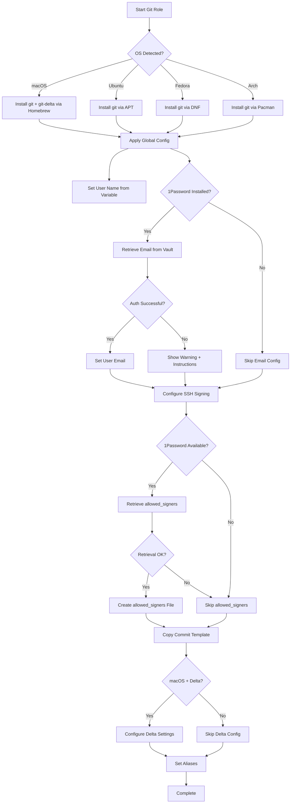

# 🔧 Git Role

A comprehensive, security-focused Ansible role that configures Git with modern best practices, SSH-based commit signing, and 1Password integration across macOS, Ubuntu, Fedora, and Arch Linux.

## Overview

This role transforms your Git environment into a professional, secure, and efficient workflow with:
- **SSH-based commit signing** - Simpler and more secure than GPG
- **1Password integration** - Secure credential management without storing secrets
- **Delta diff viewer** - Beautiful, syntax-highlighted diffs (macOS)
- **Professional commit templates** - Enforce best practices with visual guides
- **Cross-platform consistency** - Same configuration across all supported OSes
- **Graceful fallbacks** - Works even when 1Password isn't authenticated

## Supported Platforms

| Platform | Package Manager | Delta Support | Status |
|----------|----------------|---------------|--------|
| macOS | Homebrew | ✅ Yes | ✅ Full |
| Ubuntu/Debian | APT | ❌ No | ✅ Full |
| Fedora/RHEL | DNF | ❌ No | ✅ Full |
| Arch Linux | Pacman | ❌ No | ✅ Full |

## What Gets Installed

### Packages
- **git** - Core version control system (all platforms)
- **git-delta** - Modern diff viewer with syntax highlighting (macOS only)

### Configuration Files
```
~/.gitconfig                           # Global git configuration
~/.config/git/commit_template          # Commit message template with guides
~/.config/git/allowed_signers          # SSH public keys for signature verification (from 1Password)
```

## Key Features

### 🔐 SSH-Based Commit Signing

Automatically configures Git to sign commits and tags using your SSH key:

```ini
[user]
    signingkey = ~/.ssh/id_ed25519.pub
[gpg]
    format = ssh
[commit]
    gpgsign = true
[tag]
    gpgsign = true
[gpg "ssh"]
    allowedSignersFile = ~/.config/git/allowed_signers
```

**Why SSH over GPG?**
- Reuses existing SSH infrastructure
- Simpler key management
- Native GitHub/GitLab support
- Cross-platform consistency

### 🔑 1Password Secret Management

User email and SSH allowed signers are securely retrieved from 1Password:

```yaml
# Expected 1Password vault structure
op:
  git:
    user:
      email: "op://Personal/GitHub/email"
    allowed_signers: "op://Personal/TechDufus SSH/allowed_signers"
```

The role gracefully handles cases where 1Password isn't authenticated, providing clear instructions without breaking the playbook.

### 🎨 Enhanced Diff Viewing (macOS)

On macOS, [git-delta](https://github.com/dandavison/delta) provides beautiful syntax-highlighted diffs:

```ini
[core]
    pager = delta
[delta]
    side-by-side = true
    negative = true
    interactive.diffFilter = delta --color-only --features=interactive
[merge]
    conflictStyle = zdiff3
```

### 📝 Professional Commit Template

Enforces best practices with visual guides:

```
# No more than 50 chars ##### 50 chars is here: #


# Wrap at 72 chars ################################ 72 chars is here: #
```

Encourages:
- 50-character subject line limit
- Blank line separation
- 72-character body wrap
- Imperative mood

### ⚡ Optimized Git Workflow

Pre-configured settings for a modern Git workflow:

```yaml
# Visual enhancements
color.ui: auto
diff.colorMoved: zebra

# Repository hygiene
fetch.prune: true
init.defaultBranch: main
rerere.enabled: true

# Pull/push behavior
pull.ff: only
pull.rebase: true
rebase.autoStash: true
```

### 🎯 Useful Aliases

Built-in productivity aliases:

```bash
git undo   # Reset last commit, keep changes (reset HEAD~1 --mixed)
git br     # Formatted branch list with dates and authors
```

## Configuration Flow



## Dependencies

### Prerequisites
- **SSH key pair** - Must exist at `~/.ssh/id_ed25519` (not created by this role)
- **1Password CLI** (optional) - For secure credential management
- **Sudo access** (Linux) - For package installation (graceful fallback if unavailable)

### Variable Requirements

Set in `group_vars/all.yml`:

```yaml
# Required
git_user_name: "Your Full Name"

# Optional 1Password references
op:
  git:
    user:
      email: "op://Vault/Item/field"
    allowed_signers: "op://Vault/Item/field"
```

### Role Order

For optimal results, run these roles before `git`:
1. **ssh** - Ensures SSH keys exist for signing
2. **1password** - Installs and configures 1Password CLI

## Installation

### Run Specific Role
```bash
dotfiles -t git
```

### Check Mode (Dry Run)
```bash
dotfiles -t git --check
```

### Verbose Output
```bash
dotfiles -t git -vvv
```

## Post-Installation

### Verify Configuration
```bash
# Check global config
git config --list --global

# Test commit signing
git commit --allow-empty -m "test commit"
git log --show-signature -1
```

### Verify 1Password Integration
```bash
# Check email was set
git config user.email

# Check allowed signers
cat ~/.config/git/allowed_signers
```

### Test Delta (macOS)
```bash
# Make a change and view diff
git diff
```

## Troubleshooting

### 1Password Not Authenticated
```bash
# Sign in to 1Password
eval $(op signin)

# Re-run dotfiles
dotfiles -t git
```

### SSH Signing Fails
```bash
# Verify SSH key exists
ls -la ~/.ssh/id_ed25519*

# Check permissions
chmod 600 ~/.ssh/id_ed25519

# Test SSH agent
ssh-add -l
```

### Delta Not Working (macOS)
```bash
# Verify delta is installed
brew list git-delta

# Check pager config
git config core.pager
```

### Permission Denied (Linux)
```bash
# Install git manually if sudo unavailable
# Download from: https://github.com/git/git/releases

# Or ask system administrator
```

## Uninstallation

The role includes a comprehensive uninstall script:

```bash
dotfiles --uninstall git
```

This removes:
- Global git configuration (`~/.gitconfig`)
- Git config directory (`~/.config/git`)
- git-delta package (macOS only)
- Optionally removes stored credentials (interactive prompt)

**Note:** Git itself is NOT uninstalled as it's often a system dependency.

## Advanced Features

### Bisect Configuration

The role includes a bisect configuration file (`bisect.conf`) for future extensibility with enhanced `git bisect` functionality:

- Auto-save bisect state
- Progress bar during bisect
- Configurable logging and timeouts
- Future support for parallel bisecting

*Currently included for future features - not actively used.*

### Shell Integration

Works seamlessly with companion shell roles (zsh/bash) that provide:

**Quick workflow functions:**
- `gacp` - Add, commit (signed), and push
- `gacpgh` - Same as gacp + create PR and merge

**Interactive functions (ZSH):**
- `gss` - Enhanced status with repo info
- `gco` - Interactive branch checkout with fuzzy search
- `glog` - Interactive commit browser
- `gstash` - Interactive stash manager
- `gtags` - Interactive tag browser

**Worktree management:**
- `gwl` - List worktrees
- `gwn` - Create new worktree
- `gwd` - Delete worktree
- `gws` - Switch worktree

## Security Considerations

- **No secrets in repository** - All sensitive data via 1Password
- **SSH-based signing** - More secure than password-based auth
- **Commit authenticity** - All commits automatically signed
- **Secure file permissions** - `allowed_signers` set to 0600
- **Graceful degradation** - Failed 1Password auth doesn't break setup

## References

- [Git Documentation](https://git-scm.com/doc)
- [Git Delta](https://github.com/dandavison/delta)
- [SSH Commit Signing](https://docs.github.com/en/authentication/managing-commit-signature-verification/about-commit-signature-verification#ssh-commit-signature-verification)
- [1Password CLI](https://developer.1password.com/docs/cli)
- [Conventional Commits](https://www.conventionalcommits.org/)

---

Part of the [dotfiles](https://github.com/TechDufus/dotfiles) collection - Automated cross-platform development environment setup.
