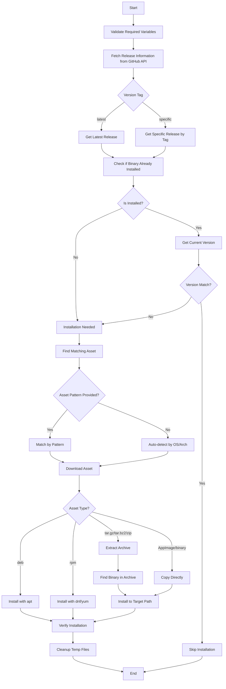

# 📦 GitHub Release Installer Role

A reusable Ansible role that automates downloading and installing binaries from GitHub releases. This role intelligently detects your platform, finds the correct asset, handles multiple archive formats, and ensures idempotent installations with version checking.

## 🎯 Purpose

This is a **utility role** designed to be included by other roles that need to install software from GitHub releases. It eliminates the repetitive boilerplate of version checking, asset detection, and platform-specific installation logic.

## ✨ Key Features

- **Intelligent Asset Detection**: Automatically finds the correct release asset based on your OS and architecture
- **Version Management**: Smart version comparison prevents unnecessary reinstallations
- **Multi-Format Support**: Handles tar.gz, tar.bz2, zip, deb, rpm, AppImage, and raw binaries
- **Idempotent**: Only downloads and installs when needed
- **Cross-Platform**: Supports Linux (Ubuntu, Debian, Fedora, Arch) and macOS
- **Flexible Installation**: Can install system-wide or to user directories
- **Automatic Cleanup**: Cleans up downloaded files after installation

## 📋 Supported Platforms

| Platform | Supported | Notes |
|----------|-----------|-------|
| Ubuntu/Debian | ✅ | .deb packages and archives |
| Fedora/RHEL | ✅ | .rpm packages and archives |
| Arch Linux | ✅ | Archives and binaries |
| macOS | ✅ | All archive formats |

## 📦 Supported Asset Types

The role automatically handles the following release asset formats:

- **Archives**: `.tar.gz`, `.tar.bz2`, `.zip`
- **Packages**: `.deb` (Ubuntu/Debian), `.rpm` (Fedora/RHEL)
- **Linux**: `.AppImage`
- **Raw Binaries**: Standalone executables

## 🚀 Usage

This role is designed to be included by other roles. Here's a typical usage pattern:

### Basic Example

```yaml
- name: Install bat from GitHub releases
  ansible.builtin.include_role:
    name: github_release
  vars:
    github_release_repo: "sharkdp/bat"
    github_release_binary_name: "bat"
```

### Advanced Example with Custom Configuration

```yaml
- name: Install lazygit from GitHub releases
  ansible.builtin.include_role:
    name: github_release
  vars:
    github_release_repo: "jesseduffield/lazygit"
    github_release_binary_name: "lazygit"
    github_release_asset_name_pattern: "lazygit_.*_Linux_x86_64.tar.gz"
    github_release_check_command: "lazygit --version"
    github_release_version_pattern: 'version=([^,]+)'
    github_release_install_path: "/usr/local/bin"
```

### Install Specific Version

```yaml
- name: Install specific version of a tool
  ansible.builtin.include_role:
    name: github_release
  vars:
    github_release_repo: "cli/cli"
    github_release_binary_name: "gh"
    github_release_tag: "v2.40.0"  # Specific version instead of "latest"
```

### User-Local Installation Without Sudo

```yaml
- name: Install to user directory
  ansible.builtin.include_role:
    name: github_release
  vars:
    github_release_repo: "owner/repo"
    github_release_binary_name: "tool"
    github_release_install_path: "~/.local/bin"
    github_release_become: false
    github_release_owner: "{{ ansible_user_id }}"
    github_release_group: "{{ ansible_user_id }}"
```

## 🔧 Configuration Variables

### Required Variables

| Variable | Description | Example |
|----------|-------------|---------|
| `github_release_repo` | GitHub repository in `owner/repo` format | `"sharkdp/bat"` |
| `github_release_binary_name` | Name of the binary to install | `"bat"` |

### Optional Variables

| Variable | Default | Description |
|----------|---------|-------------|
| `github_release_tag` | `"latest"` | Release tag to install (use "latest" or specific tag like "v1.2.3") |
| `github_release_install_path` | `"/usr/local/bin"` | Installation directory for the binary |
| `github_release_install_mode` | `"0755"` | File permissions for the installed binary |
| `github_release_check_command` | `"<binary> --version"` | Command to check current version |
| `github_release_version_pattern` | `"[0-9]+\\.[0-9]+\\.[0-9]+"` | Regex pattern to extract version from command output |
| `github_release_force_install` | `false` | Force reinstallation even if already installed |
| `github_release_asset_name_pattern` | `""` | Custom regex pattern to match asset name (auto-detected if empty) |
| `github_release_asset_type` | `"auto"` | Asset type: auto, tar.gz, zip, deb, rpm, binary, AppImage |
| `github_release_become` | `true` | Use sudo for installation |
| `github_release_owner` | `"root"` | Owner of the installed binary |
| `github_release_group` | `"root"` | Group of the installed binary |
| `github_release_cleanup` | `true` | Clean up downloaded files after installation |
| `github_release_temp_dir` | `"/tmp"` | Temporary directory for downloads |
| `github_release_strip_components` | `1` | For tar archives, number of path components to strip |
| `github_release_extract_subpath` | `""` | Specific path within archive to extract from |

### Platform Detection Variables (Auto-configured)

| Variable | Description | Auto-detected Value |
|----------|-------------|---------------------|
| `github_release_os` | Operating system | `linux`, `darwin`, `windows` |
| `github_release_arch` | CPU architecture | `x86_64`, `aarch64`, `arm64`, etc. |

## 🔄 Installation Flow



## 🎨 Asset Detection Logic

The role uses intelligent asset detection when `github_release_asset_name_pattern` is not provided:

### 1. OS Detection

Maps `ansible_facts['system']` to common naming patterns:

- **Linux**: `linux`, `Linux`
- **macOS**: `darwin`, `Darwin`, `macos`, `macOS`, `osx`
- **Windows**: `windows`, `Windows`, `win`

### 2. Architecture Detection

Maps `ansible_facts['machine']` to common patterns:

- **x86_64**: `x86_64`, `amd64`, `x64`, `64-bit`
- **aarch64**: `aarch64`, `arm64`, `ARM64`
- **armv7l**: `armv7`, `arm`, `ARM`
- **i386**: `i386`, `i686`, `x86`, `32-bit`

### 3. Asset Type Preference

When `github_release_asset_type: "auto"`, the role prefers assets in this order:

1. `.tar.gz` archives (most common)
2. `.zip` archives (cross-platform)
3. `.deb` packages (Linux only)
4. `.AppImage` (Linux only)
5. First matching candidate (fallback)

## 📁 Archive Extraction

### tar.gz / tar.bz2 / zip Archives

The role automatically:
1. Extracts the archive to a temporary directory
2. Recursively searches for the binary by name
3. Filters executable files (excludes `.sh`, `.1`, `.md`, etc.)
4. Prioritizes exact matches over partial matches
5. Installs the binary to the target path
6. Cleans up extracted files

### Package Installation

- **.deb**: Uses `apt` module for Debian-based systems
- **.rpm**: Uses `dnf` or `yum` (auto-detects availability)

### Direct Installation

- **Binary/AppImage**: Copies directly to installation path with proper permissions

## 🔍 Version Checking

The role implements intelligent version checking to prevent unnecessary downloads:

```yaml
# Example: Current version extraction
github_release_check_command: "bat --version"
github_release_version_pattern: "[0-9]+\\.[0-9]+\\.[0-9]+"

# Output: "bat 0.24.0"
# Extracted: "0.24.0"
# Compared with: "v0.24.0" from GitHub release tag
```

The role compares the installed version against the target release and only proceeds with installation if they differ.

## 🛠️ Real-World Examples

### Example 1: bat (Syntax Highlighting Cat)

```yaml
# roles/bat/tasks/Fedora.yml
- name: Install bat from GitHub Release
  ansible.builtin.include_role:
    name: github_release
  vars:
    github_release_repo: "sharkdp/bat"
    github_release_binary_name: "bat"
    github_release_asset_name_pattern: "bat-v{{ bat_version.stdout }}-x86_64-unknown-linux-musl.tar.gz"
```

### Example 2: lazygit (Git Terminal UI)

```yaml
# roles/lazygit/tasks/Fedora.yml
- name: Install lazygit from GitHub Release
  ansible.builtin.include_role:
    name: github_release
  vars:
    github_release_repo: "jesseduffield/lazygit"
    github_release_binary_name: "lazygit"
    github_release_asset_name_pattern: "lazygit_.*_Linux_{{ ansible_architecture }}.tar.gz"
    github_release_check_command: "lazygit --version"
    github_release_version_pattern: 'version=([^,]+)'
    github_release_install_path: "{{ '~/.local/bin' if not can_install_packages else '/usr/local/bin' }}"
```

### Example 3: k9s (Kubernetes CLI)

```yaml
# roles/k9s/tasks/main.yml
- name: Install k9s from GitHub Release
  ansible.builtin.include_role:
    name: github_release
  vars:
    github_release_repo: "derailed/k9s"
    github_release_binary_name: "k9s"
    github_release_force_install: false
```

## 🧪 Testing

Test the role with a simple playbook:

```yaml
---
- hosts: localhost
  tasks:
    - name: Test github_release role
      ansible.builtin.include_role:
        name: github_release
      vars:
        github_release_repo: "sharkdp/bat"
        github_release_binary_name: "bat"
```

Run with:
```bash
ansible-playbook test-playbook.yml
```

## 🐛 Troubleshooting

### No Matching Asset Found

If you see an error about no matching assets:

```
No assets found matching OS 'linux' and architecture 'x86_64'
```

**Solution**: Specify `github_release_asset_name_pattern` manually:

```yaml
github_release_asset_name_pattern: "tool-name-.*-linux-amd64.tar.gz"
```

### Binary Not Found in Archive

If extraction succeeds but the binary isn't found:

```
Could not find binary 'tool' in extracted archive
```

**Solution**: Check the archive structure and use `github_release_extract_subpath`:

```yaml
github_release_extract_subpath: "path/to/binary/in/archive"
```

### Version Mismatch Detection

If version checking isn't working correctly:

**Solution**: Adjust the version pattern:

```yaml
# For output like "tool version v1.2.3"
github_release_version_pattern: 'v?[0-9]+\.[0-9]+\.[0-9]+'

# For output like "tool 1.2.3 (build 456)"
github_release_version_pattern: '[0-9]+\.[0-9]+\.[0-9]+'
```

### Permission Denied

If installation fails with permission errors:

**Solution**: Either use sudo or install to a user directory:

```yaml
# Option 1: Install to user directory
github_release_install_path: "~/.local/bin"
github_release_become: false

# Option 2: Ensure sudo is available
github_release_become: true
```

## 📚 Architecture Patterns

### OS-Specific Naming Conventions

Different GitHub projects use various naming conventions:

```yaml
# Pattern 1: OS first, then architecture
"tool-linux-amd64.tar.gz"
"tool-darwin-arm64.tar.gz"

# Pattern 2: Architecture first
"tool-x86_64-unknown-linux-gnu.tar.gz"
"tool-aarch64-apple-darwin.tar.gz"

# Pattern 3: Compound names
"tool_1.2.3_Linux_x86_64.tar.gz"
"tool_1.2.3_macOS_arm64.tar.gz"
```

The role's auto-detection handles all these patterns intelligently.

## 🔐 Security Notes

- Downloads are fetched directly from GitHub's official release API
- Uses HTTPS for all GitHub API and download operations
- Validates release information from GitHub API
- No checksum validation is currently implemented (potential future enhancement)
- Installed binaries use secure permissions (0755 by default)
- Cleanup prevents temporary file accumulation

## 🤝 Integration with Other Roles

This role is used by several dotfiles roles including:

- **bat**: Syntax-highlighted cat alternative
- **lazygit**: Terminal UI for git
- **k9s**: Kubernetes CLI
- **lsd**: Modern ls with icons
- And many others...

## 📖 Related Documentation

- [GitHub Releases API](https://docs.github.com/en/rest/releases)
- [Ansible URI Module](https://docs.ansible.com/ansible/latest/collections/ansible/builtin/uri_module.html)
- [Ansible Get URL Module](https://docs.ansible.com/ansible/latest/collections/ansible/builtin/get_url_module.html)

## 📝 License

MIT

## 👤 Author

TechDufus

---

**Note**: This is a utility role and doesn't install anything by itself. It must be included by other roles that specify what to install.
