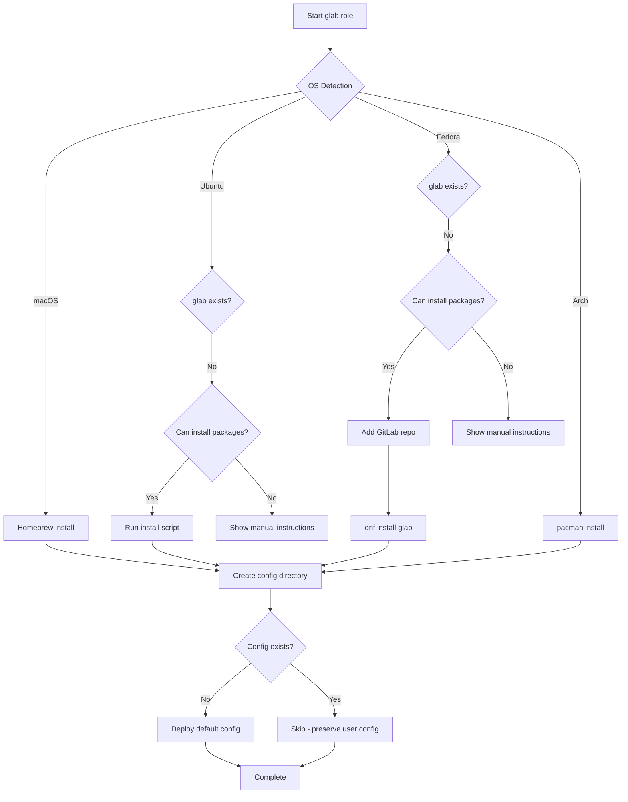

# 🦊 GitLab CLI (glab)

> Ansible role for installing and configuring GitLab's official command-line tool

## Overview

This role installs [GitLab CLI (glab)](https://gitlab.com/gitlab-org/cli), a powerful command-line interface that brings GitLab to your terminal. Work with merge requests, issues, CI/CD pipelines, and more without leaving your development environment.

## Supported Platforms

- **macOS** - via Homebrew
- **Ubuntu/Debian** - via official installation script
- **Fedora** - via official GitLab repository
- **Arch Linux** - via pacman (`gitlab-glab`)

## What Gets Installed

### Package Installation
- **macOS**: `brew install glab`
- **Ubuntu**: Official GitLab install script → `/usr/local/bin/glab`
- **Fedora**: GitLab repository → `dnf install glab`
- **Arch**: `pacman -S gitlab-glab`

### Configuration
- **Config Directory**: `~/.config/glab-cli/`
- **Config File**: `~/.config/glab-cli/config.yml`
  - Sets `nvim` as default editor
  - Includes commented alias examples for common workflows
  - Only created if no existing config detected (preserves user customizations)

## Installation Flow



## Key Features

### Smart Configuration Management
- **Non-destructive**: Only deploys default config if none exists
- **User-friendly defaults**: nvim as editor, helpful alias examples
- **Secure permissions**: Config file set to `0600` (user read/write only)

### Graceful Degradation
- Checks for package manager access before attempting installation
- Provides helpful manual installation instructions when sudo is unavailable
- Idempotent installation checks prevent redundant operations

### Platform-Specific Optimizations
- **Fedora**: Adds official GitLab repository for native package management
- **Ubuntu**: Uses official install script for latest version
- **macOS**: Leverages Homebrew's version management
- **Arch**: Native pacman package

## Configuration

### Default Editor
The role sets `nvim` as the default editor. Modify `files/config.yml` to change this:

```yaml
editor: nvim  # Change to vim, code, emacs, etc.
```

### Custom Aliases
The default config includes commented examples for common workflows:
- `mr` commands (list, view, create, checkout, merge)
- `issue` commands (list, view)
- `pipeline` commands (list, view, retry, cancel)

Uncomment and customize in `~/.config/glab-cli/config.yml` after installation.

## Usage

### Install Role
```bash
# Install with all dotfiles
dotfiles

# Install glab role only
dotfiles -t glab
```

### Uninstall
```bash
# Uninstall package only (keeps config)
dotfiles --uninstall glab

# Complete removal (package + config, with prompt)
./roles/glab/uninstall.sh
```

The uninstall script:
- Removes the glab package using the appropriate package manager
- Prompts before removing configuration files
- Cleans up Fedora repository file if applicable
- Provides reminder about keychain-stored authentication tokens

## Authentication

After installation, authenticate with your GitLab instance:

```bash
# Authenticate with gitlab.com (default)
glab auth login

# Authenticate with self-hosted GitLab
glab auth login --hostname gitlab.example.com
```

Tokens are stored securely in your system keychain.

## Dependencies

- **Ansible Collections**: `community.general` (for Homebrew and pacman modules)
- **System Requirements**:
  - Internet access for package downloads
  - Sudo access for system-wide installation (except macOS with Homebrew)

## Official Documentation

- [GitLab CLI Repository](https://gitlab.com/gitlab-org/cli)
- [GitLab CLI Documentation](https://docs.gitlab.com/ee/editor_extensions/gitlab_cli/)
- [Release Notes](https://gitlab.com/gitlab-org/cli/-/releases)

## Notes

- Configuration is managed at `~/.config/glab-cli/config.yml` (follows XDG Base Directory spec)
- Authentication tokens are stored in system keychain, not in the config file
- The role preserves existing configurations to avoid overwriting user customizations
- Manual installation links provided when package manager access is unavailable
