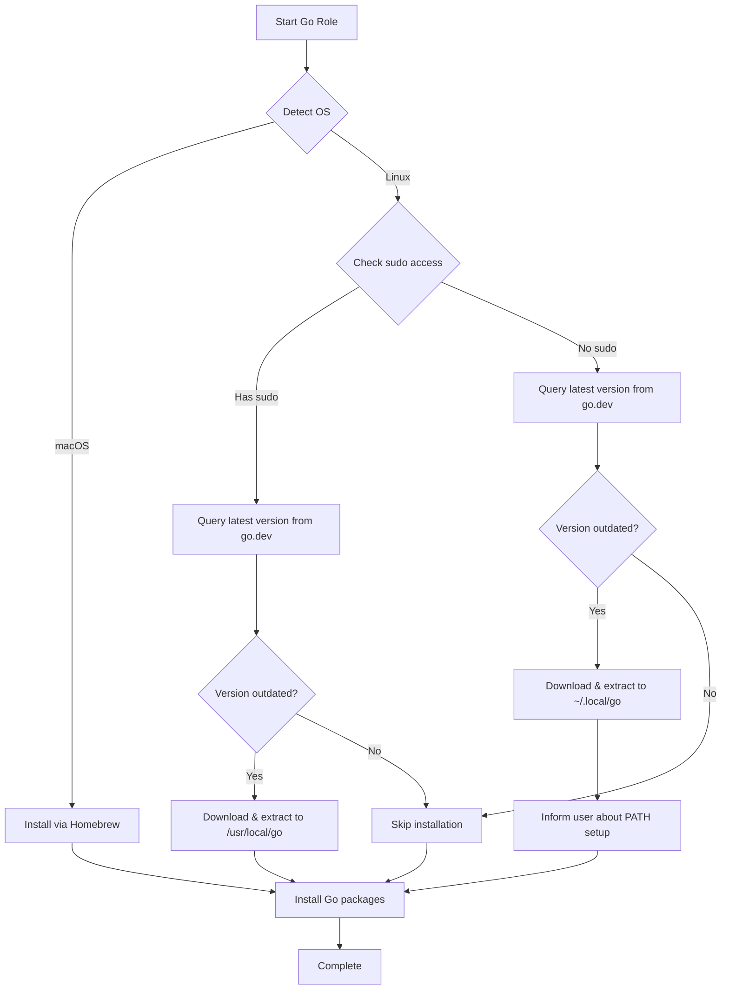

# Go Programming Language

> Automated installation and configuration of the Go programming language with intelligent version management and cross-platform support.

## Overview

This Ansible role installs and manages the [Go programming language](https://go.dev/) on macOS and Linux systems. It automatically detects the latest stable version, handles platform-specific installations, and provides graceful degradation for environments without sudo access.

## Features

- **Latest Version Detection**: Automatically queries Go's official API to install the most recent stable release
- **Intelligent Version Management**: Only reinstalls when a new version is available
- **Multi-Platform Support**: Seamless installation across macOS, Ubuntu, and Fedora
- **Flexible Installation Modes**:
  - System-wide installation (`/usr/local/go`) with sudo access
  - User-local installation (`~/.local/go`) without sudo
- **Optional Package Installation**: Install Go-based tools via `go install`
- **Clean Uninstallation**: Comprehensive removal script with interactive GOPATH cleanup

## Supported Platforms

| Platform | Installation Method | Notes |
|----------|-------------------|-------|
| macOS | Homebrew | Official `go` formula |
| Ubuntu/Debian | Source tarball | Installs to `/usr/local/go` |
| Fedora/RHEL | System package or source | Prefers dnf package if version >= 1.21 |

## Installation Flow



## What Gets Installed

### Core Installation

- **Go Toolchain**: Latest stable version from [go.dev](https://go.dev/)
- **Dependencies** (Linux only):
  - `curl`, `gcc`, `git`, `findutils`
  - `make`, `rsync`, `tar`, `jq`

### Installation Locations

| Environment | Installation Path | Requires Sudo |
|-------------|------------------|---------------|
| macOS | `/opt/homebrew/bin/go` | Yes (Homebrew) |
| Linux (system-wide) | `/usr/local/go` | Yes |
| Linux (user-local) | `~/.local/go` | No |

### Optional Go Packages

The role can install Go-based CLI tools via `go install`. Configure in `group_vars/all.yml`:

```yaml
go:
  packages:
    - package: github.com/go-task/task/v3/cmd/task@latest
      cmd: task
    - package: github.com/joshmedeski/sesh/v2@latest
      cmd: sesh
    - package: github.com/golangci/golangci-lint/cmd/golangci-lint@latest
      cmd: golangci-lint
```

## Configuration

No configuration files are managed by this role. The role focuses solely on installing the Go toolchain and optional packages.

### Environment Variables

After installation, ensure these are in your shell configuration:

```bash
# For system-wide installation
export PATH="/usr/local/go/bin:$PATH"
export GOPATH="$HOME/go"
export PATH="$GOPATH/bin:$PATH"

# For user-local installation (no sudo)
export PATH="$HOME/.local/go/bin:$PATH"
export GOPATH="$HOME/go"
export PATH="$GOPATH/bin:$PATH"
```

## Usage

### Install Go

```bash
# Install or update Go
dotfiles -t go

# Install with specific packages defined in group_vars
dotfiles -t go

# Dry run to see what would change
dotfiles -t go --check
```

### Uninstall Go

```bash
# Run the uninstall script
~/.dotfiles/roles/go/uninstall.sh
```

The uninstall script will:
1. Remove the Go installation (via package manager or manual)
2. Optionally remove `$GOPATH` directory (interactive prompt)
3. Clean up Go build cache (`~/.cache/go-build`)

## Platform-Specific Behavior

### macOS

- Installed via Homebrew
- Automatically managed by `brew upgrade`
- Location: `/opt/homebrew/bin/go` (Apple Silicon) or `/usr/local/bin/go` (Intel)

### Ubuntu/Debian

- Downloads official tarball from go.dev
- Installs required build dependencies via apt
- Extracts to `/usr/local/go` (with sudo) or `~/.local/go` (without)

### Fedora/RHEL

- **Smart Installation**:
  - Checks for `golang` package in dnf
  - Installs via dnf if version >= 1.21
  - Falls back to tarball installation if package is outdated or unavailable
- **Dual Installation Support**:
  - System-wide with sudo: `/usr/local/go`
  - User-local without sudo: `~/.local/go`

## Dependencies

### Ansible Collections

- `community.general` (for Homebrew on macOS)

### System Requirements

- **Internet connection**: To query go.dev API and download tarballs
- **Disk space**: ~150MB for Go installation, additional space for GOPATH packages
- **sudo access** (optional): Required for system-wide installation on Linux

## Idempotency

This role is fully idempotent:

- Only downloads and installs Go when a new version is detected
- Skips installation if the latest version is already installed
- Package installations use `creates:` to prevent redundant operations

## Troubleshooting

### Version Check Fails

If the role can't determine the current Go version:
```bash
# Manually check installed version
/usr/local/go/bin/go version
# or
~/.local/go/bin/go version
```

### Missing Dependencies (No Sudo)

On systems without sudo, the role checks for required tools (`curl`, `tar`, `jq`) and warns if they're missing. Ask your system administrator to install these.

### Go Packages Won't Install

Ensure `GOPATH` is set correctly:
```bash
echo $GOPATH  # Should be ~/go
ls ~/go/bin   # Should contain installed binaries
```

## Related Roles

This role pairs well with:
- **git**: For version control
- **neovim**: Go development with LSP support
- **zsh**: Shell configuration with Go PATH setup

## Links

- [Go Official Website](https://go.dev/)
- [Go Documentation](https://go.dev/doc/)
- [Go Downloads](https://go.dev/dl/)
- [Go Package Discovery](https://pkg.go.dev/)

---

**Maintained by**: This dotfiles repository
**Last Updated**: 2024-11-24
