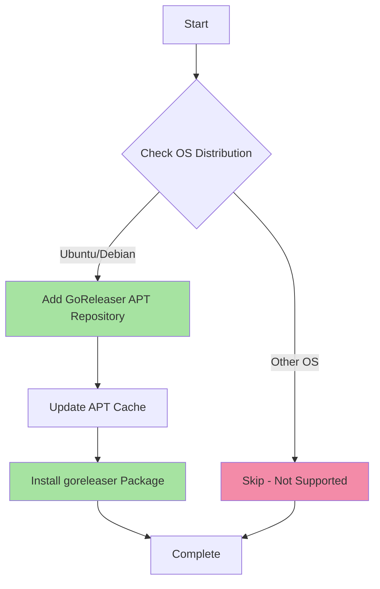

# 🚀 GoReleaser

> Automates release engineering for Go, Rust, TypeScript, Zig, and Python projects

This Ansible role installs and configures [GoReleaser](https://goreleaser.com/), a release automation tool that builds binaries, creates GitHub releases, pushes Homebrew formulas, and handles the entire release workflow with a single command.

## 📋 What It Does

GoReleaser simplifies the release process by automating:
- Cross-platform binary compilation
- Archive creation for multiple targets
- GitHub release management
- Homebrew tap publishing
- Docker image building
- Changelog generation

## 🖥️ Supported Platforms

| Platform | Status | Package Manager |
|----------|--------|-----------------|
| Ubuntu   | ✅ Supported | APT |
| Debian   | ✅ Supported | APT |
| Other    | ❌ Not configured | - |

> **Note**: This role currently only supports Ubuntu/Debian-based distributions. macOS and Fedora/Arch support can be added by creating corresponding task files.

## 📦 What Gets Installed

### Packages
- **goreleaser** - The GoReleaser CLI tool from the official APT repository

### Repository Configuration
- Adds official GoReleaser APT repository: `https://repo.goreleaser.com/apt/`
- Repository is marked as trusted for seamless installation

## 🔧 Installation Flow



## 🎯 Key Features

- **Official Repository**: Installs from GoReleaser's official APT repository for latest updates
- **Automatic Updates**: Uses standard APT repository, enabling updates via system package manager
- **Minimal Configuration**: No additional configuration files or templates - uses goreleaser defaults
- **Sudo Required**: Installation requires elevated privileges for APT operations

## 🚦 Usage

### Install via Dotfiles Script
```bash
# Install only goreleaser
dotfiles -t goreleaser

# Include in full dotfiles installation
dotfiles
```

### Standalone Ansible
```bash
# Run the role directly
ansible-playbook -t goreleaser main.yml

# Check mode (dry run)
ansible-playbook -t goreleaser main.yml --check
```

### Using GoReleaser
```bash
# Initialize a new project
goreleaser init

# Test release locally (snapshot mode)
goreleaser release --snapshot --clean

# Create a release (usually run in CI/CD)
goreleaser release --clean

# Check configuration
goreleaser check
```

## 🔗 Dependencies

### System Requirements
- Ubuntu/Debian-based Linux distribution
- APT package manager
- Sudo privileges for package installation

### Ansible Requirements
- Ansible 2.9+
- `ansible.builtin` collection (standard)

## 📚 Official Documentation

- **Homepage**: [goreleaser.com](https://goreleaser.com/)
- **Quick Start**: [goreleaser.com/quick-start/](https://goreleaser.com/quick-start/)
- **How It Works**: [goreleaser.com/how-it-works/](https://goreleaser.com/how-it-works/)
- **GitHub**: [github.com/goreleaser/goreleaser](https://github.com/goreleaser/goreleaser)

## 🛠️ Extending This Role

To add support for additional platforms:

1. Create OS-specific task file:
   ```bash
   touch roles/goreleaser/tasks/MacOSX.yml
   # or
   touch roles/goreleaser/tasks/Fedora.yml
   ```

2. Add installation tasks using appropriate package manager:
   - **macOS**: Use Homebrew (`brew install goreleaser/tap/goreleaser`)
   - **Fedora**: Use DNF with GoReleaser repository
   - **Arch**: Use yay/AUR (`goreleaser-bin`)

3. Test the new tasks:
   ```bash
   dotfiles -t goreleaser --check
   ```

## 📝 Notes

- **No Configuration Files**: This role only handles installation, not configuration
- **CI/CD Integration**: GoReleaser is typically configured per-project via `.goreleaser.yaml`
- **Token Requirements**: GitHub releases require `GITHUB_TOKEN` environment variable
- **Go Projects**: While GoReleaser supports multiple languages, it's most commonly used for Go projects

---

**Part of**: [dotfiles](https://github.com/TechDufus/.dotfiles) - Ansible-based development environment automation
