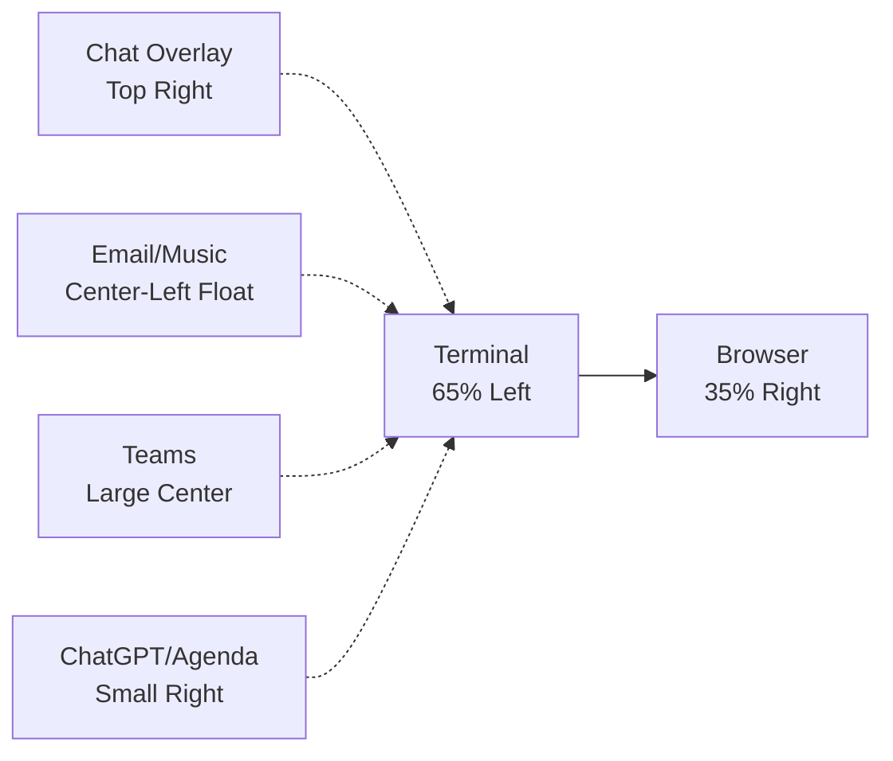
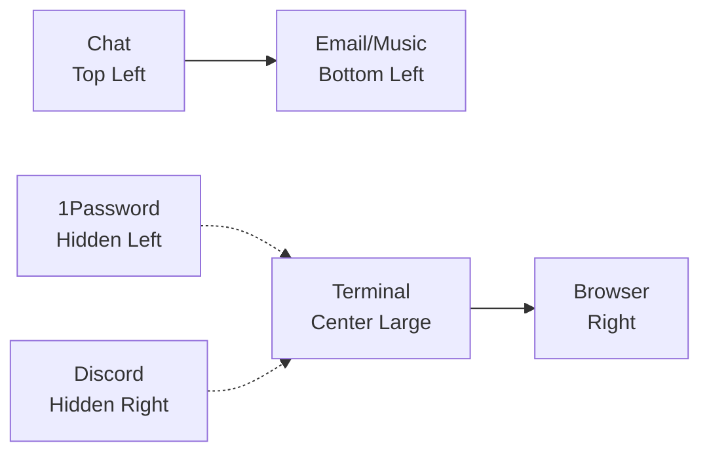
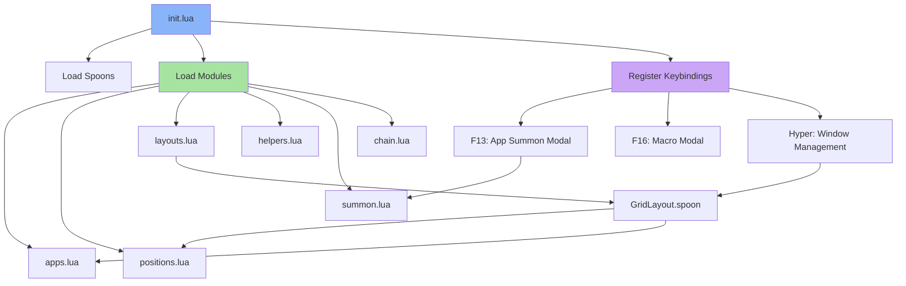

# 🔨 Hammerspoon

**Advanced macOS window management and automation powerhouse**

Hammerspoon is a powerful macOS automation tool that bridges the gap between the operating system and Lua scripting. This role deploys a comprehensive configuration focused on intelligent window management, application summoning, and workspace layouts.

## 🎯 Key Features

- **Smart App Summoning** - Toggle between applications with single keypress (F13 modal)
- **Multi-Layout Window Management** - Predefined workspace layouts for different monitor configurations
- **Grid-Based Positioning** - Precise window placement using an 80x40 grid system
- **Modal Macros** - Quick access to system shortcuts (F16 modal)
- **Automatic Layout Selection** - Detects screen size and applies appropriate layout
- **Window Margin Intelligence** - Smart margins that adjust based on window positioning

## 📦 What Gets Installed

### Packages
- **Hammerspoon** - Installed via Homebrew Cask

### Spoons (Extensions)
- **GridLayout.spoon** - Custom grid-based layout manager (commented out, using custom implementation)
- **ReloadConfiguration.spoon** - Auto-reload on config changes

## ⚙️ What Gets Configured

### Configuration Files
All Lua configuration files are deployed to `~/.hammerspoon/`:

```
~/.hammerspoon/
├── init.lua          # Main entry point, keybindings
├── apps.lua          # Application definitions with bundle IDs
├── positions.lua     # Grid position definitions
├── layouts.lua       # Multi-monitor workspace layouts
├── helpers.lua       # Utility functions
├── summon.lua        # Smart app toggling logic
├── chain.lua         # Position chaining for window movements
└── grid.lua          # Grid calculation with margins
```

### Hyper Keys
- **lilHyper**: `Cmd+Alt+Ctrl` (⌘⌥⌃)
- **Hyper**: `Shift+Cmd+Alt+Ctrl` (⇧⌘⌥⌃)

### Key Bindings

#### F13 Modal - App Summoning
Quick application switching with intelligent toggle behavior:

| Key | Application | Description |
|-----|-------------|-------------|
| `a` | Granola/Agenda | Calendar/meeting notes |
| `b` | Brave Browser | Web browser |
| `c` | Mattermost | Team chat |
| `d` | Discord | Community chat |
| `e` | Outlook | Email client |
| `f` | Finder | File manager |
| `g` | ChatGPT | AI assistant |
| `h` | Screen Sharing | macOS screen sharing |
| `m` | Teams | Microsoft Teams meetings |
| `n` | Obsidian | Note-taking |
| `o` | 1Password | Password manager |
| `s` | Spotify | Music player |
| `t` | Ghostty | Terminal |
| `w` | Windows App | RDP client |

#### F16 Modal - Quick Macros
| Key | Action | Shortcut |
|-----|--------|----------|
| `s` | Screenshot | ⌘⇧4 |
| `e` | Emoji Picker | ⌘⌃Space |
| `a` | Next Window | ⌘` |
| `b` | Browser Bookmark Search | Hyper+b (Raycast) |
| `t` | Current Tab Search | Hyper+t (Raycast) |
| `g` | GIF Search | Hyper+g (Raycast) |

#### Hyper + Key - Window Management
| Key | Action |
|-----|--------|
| `h/j/k/l` | Focus window west/south/north/east |
| `a` | Unhide all windows of focused app |
| `p` | Pick layout from menu |
| `u` | Bind window to cell |
| `;` | Toggle next layout variant |
| `'` | Reset layout |

## 🖥️ Workspace Layouts

### 4K Workspace (3840x2160)
Optimized for single 4K display or primary 4K monitor:



**Layout Cells:**
1. **Terminal** (65% left) - Primary workspace
2. **Browser** (35% right) - Always docked right
3. **MatterMost/Discord** (top-right overlay) - Floating chat
4. **Outlook/Spotify/Finder/1Password** (center-left float) - Behind terminal
5. **Teams** (large center) - Meeting focus mode
6. **ChatGPT/Agenda** (small right popup) - AI assistant/notes

### Standard Dev (5120x1440 Ultrawide)
Designed for 49" ultrawide monitors:



**Layout Cells:**
1. **MatterMost** (top-left)
2. **Spotify/Outlook** (bottom-left)
3. **Teams** (center-left) - Meeting mode
4. **Terminal/Windows** (center large)
5. **Browser** (right column)
6. **1Password/Obsidian** (left hidden) - Utility position
7. **Discord** (right hidden) - Secondary chat

## 🎨 Grid System

### Grid Configuration
- **Base Grid**: 80x40 units (fine-grained control)
- **Default Margins**: 5x5 pixels
- **Smart Margin Adjustment**: Margins reduce between adjacent windows

### Position Presets

#### Standard Positions (Ultrawide)
- **Full Left**: 0,0 19x40 (24%)
- **Center**: 22,0 36x40 (45%)
- **Right**: 58,0 22x40 (28%)
- **Hidden Left/Right**: 30x30 units (full 1080p on 5K screen)

#### 4K Positions
- **Left Large**: 65% width, full height
- **Right Side**: 35% width, full height
- **Center Float**: Large centered window for focus mode
- **Utility Floats**: Various sizes for secondary apps

## 🔧 Advanced Features

### Smart App Summoning
The `summon.lua` module implements intelligent app toggling:

1. **Toggle Behavior**: If target app is focused, switch back to previous app
2. **Window Detection**: Activates existing windows instead of creating new ones
3. **Window History**: Tracks previous app for reliable toggling
4. **Bundle ID Support**: Works with macOS bundle identifiers

### Position Chaining
Inspired by Slate's chain feature with enhancements:

- Chains reset after 2 seconds of inactivity
- Chains reset when switching windows or apps
- Cycles through positions on repeated keypresses
- Always starts on current screen

### Auto-Reload
Configuration automatically reloads when files change in `~/.hammerspoon/`.

## 🖼️ Visual Architecture



## 🚀 Usage

### Quick Start
After installation, Hammerspoon will:
1. Auto-start on login (configure in System Settings)
2. Display notification: "Hammerspoon loaded...more like hammerspork"
3. Monitor configuration changes and auto-reload

### Switching Layouts
1. Press `Hyper+p` to open layout picker
2. Select layout (automatically applied based on screen)
3. All configured apps move to assigned positions
4. Press `Hyper+;` to cycle through layout variants

### App Summoning
1. Press `F13` to activate summon modal
2. Press letter key for desired app (see table above)
3. Press again to toggle back to previous app
4. Press `Esc` or `Ctrl+C` to exit modal

### Window Positioning
- Use `Hyper+h/j/k/l` to navigate between windows
- Use `Hyper+u` to manually bind window to layout cell
- Windows automatically snap to grid with smart margins

## 📋 Supported Platforms

| Platform | Supported | Notes |
|----------|-----------|-------|
| macOS | ✅ Yes | Primary platform |
| Linux | ❌ No | macOS-only tool |
| Windows | ❌ No | macOS-only tool |

## 🔗 Dependencies

### Ansible Roles
- None (standalone role)

### System Requirements
- macOS 10.12+ (recommended: macOS 13+)
- Homebrew package manager
- Accessibility permissions for Hammerspoon

## 📚 Resources

- [Hammerspoon Official Site](https://www.hammerspoon.org/)
- [Hammerspoon API Documentation](https://www.hammerspoon.org/docs/)
- [Hammerspoon Getting Started Guide](https://www.hammerspoon.org/go/)
- [GridLayout.spoon](https://github.com/jesseleite/GridLayout.spoon) - Custom layout manager
- [Official Spoons Repository](https://github.com/Hammerspoon/Spoons)

## 💡 Tips & Tricks

### Debugging
- View Hammerspoon console: Click menu bar icon → Console
- Reload configuration: `Cmd+R` in console
- Check for syntax errors in console output

### Custom Applications
Edit `~/.hammerspoon/apps.lua` to add/modify application definitions:
```lua
MyApp = {
  id = 'com.company.myapp',  -- Bundle ID
  summon = 'x',              -- Summon key
}
```

### Screen-Specific Settings
The configuration auto-detects screens:
- Applies "4K Workspace" on 4K displays
- Applies "Standard Dev" on ultrawide displays
- Customize in `init.lua` based on screen name

### Performance
- Window animations disabled (`hs.window.animationDuration = 0`)
- Instant window movements for snappy UX
- Minimal overhead when idle

## 🎯 Design Philosophy

This configuration prioritizes:
1. **Speed**: Instant app switching and window movements
2. **Muscle Memory**: Consistent keybindings across all operations
3. **Context Awareness**: Layouts adapt to monitor configuration
4. **Minimal Disruption**: Smart margins and precise positioning
5. **Extensibility**: Modular Lua architecture for easy customization

---

**Note**: This is a macOS-exclusive tool. The role will only run on macOS systems and gracefully skip on other platforms.
