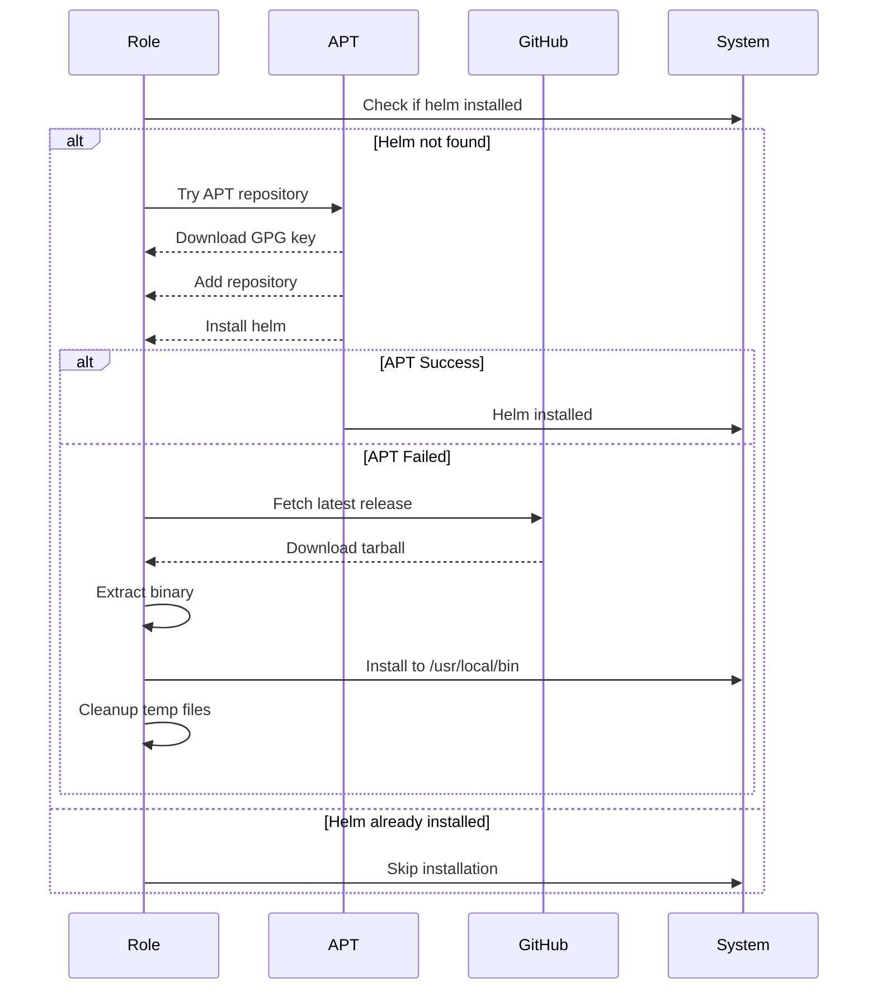

# ⎈ Helm

Automated installation and configuration of Helm, the Kubernetes package manager, with repository management and cross-platform support.

## Overview

This Ansible role installs Helm CLI and configures chart repositories for Kubernetes application deployment and management. It provides intelligent platform-specific installation methods with automatic fallback strategies and security-first package verification.

## Supported Platforms

| Platform | Installation Method | Status |
|----------|-------------------|--------|
| macOS | Homebrew | ✅ |
| Ubuntu/Debian | APT Repository (GPG verified) | ✅ |
| Fedora/RHEL | DNF + GitHub Release fallback | ✅ |
| Arch Linux | Not implemented | ❌ |

## What Gets Installed

### Packages
- **helm**: Kubernetes package manager CLI

### Installation Locations
- **macOS**: `/opt/homebrew/bin/helm`
- **Ubuntu/Fedora**: `/usr/bin/helm` or `/usr/local/bin/helm`
- **User-local** (no sudo): `~/.local/bin/helm`

### Configuration Directories
- **Config**: `~/.config/helm/`
- **Cache**: `~/.cache/helm/`
- **Repositories**: `~/.cache/helm/repository/`
- **Plugins**: `~/.local/share/helm/plugins/`

## Key Features

### Platform-Specific Installation Strategies

```mermaid
flowchart TD
    A[Start Installation] --> B{Platform?}
    B -->|macOS| C[Homebrew Install]
    B -->|Ubuntu| D[Check if Helm exists]
    B -->|Fedora| E[Check if Helm exists]

    D -->|Not Found| F[Try APT Repository]
    F -->|Success| G[Complete]
    F -->|Failed| H[Fallback to GitHub Release]
    H --> G

    E -->|Not Found| I[Try DNF Package]
    I -->|Success| G
    I -->|Failed/No Sudo| J[GitHub Release Install]
    J -->|System-wide| K[/usr/local/bin/helm]
    J -->|User-local| L[~/.local/bin/helm]
    K --> G
    L --> G

    C --> G
    D -->|Found| G
    E -->|Found| G
```

### Security Features

#### Ubuntu Installation
- **GPG key verification**: Downloads and verifies Helm's official signing key
- **Secure keyring storage**: `/usr/share/keyrings/helm.gpg`
- **HTTPS repository**: `https://baltocdn.com/helm/stable/debian/`
- **Architecture-aware**: Auto-detects amd64/arm64

#### Fedora Installation
- **Multi-tier fallback**: System package → Official installer → User-local
- **Graceful degradation**: Installs to user directory when no sudo access
- **Installation reporting**: Detailed status output showing installation method and location

### Repository Management

The role automatically configures Helm chart repositories defined in `group_vars/all.yml`:

```yaml
helm:
  repos:
    - name: traefik
      url: https://helm.traefik.io/traefik
```

Add additional repositories by extending this configuration:

```yaml
helm:
  repos:
    - name: traefik
      url: https://helm.traefik.io/traefik
    - name: prometheus-community
      url: https://prometheus-community.github.io/helm-charts
    - name: grafana
      url: https://grafana.github.io/helm-charts
```

## Integration

### Kubernetes Ecosystem
- **kubectl**: Primary Kubernetes CLI companion
- **k9s**: Visual Kubernetes management with Helm plugins
- **Docker/Podman**: Container runtime integration

### Shell Integration
- **Bash/ZSH**: Command completion automatically configured
- **Starship/PowerLevel10k**: Kubernetes context display in prompt

## Usage Examples

### Repository Management
```bash
# List configured repositories
helm repo list

# Update repository indexes
helm repo update

# Add new repository
helm repo add bitnami https://charts.bitnami.com/bitnami

# Search for charts
helm search repo nginx
```

### Chart Operations
```bash
# Install a chart
helm install my-release bitnami/nginx

# Upgrade a release
helm upgrade my-release bitnami/nginx

# Uninstall a release
helm uninstall my-release

# List releases
helm list -A
```

### Chart Development
```bash
# Create new chart
helm create my-chart

# Validate chart
helm lint my-chart/

# Template rendering (dry-run)
helm template my-chart/ --values values.yaml

# Package chart
helm package my-chart/
```

## Architecture Details

### Multi-Architecture Support
The role automatically detects system architecture and downloads the appropriate binary:

```yaml
helm_arch: "{{ ansible_facts['machine'] | replace('x86_64', 'amd64') | replace('aarch64', 'arm64') }}"
```

Supported architectures:
- x86_64 → amd64
- aarch64 → arm64

### Ubuntu Installation Flow



### Fedora Installation Modes

The Fedora installation supports three modes based on system permissions:

1. **System Package** (preferred): Uses `dnf install helm`
2. **System-wide Manual**: Downloads from GitHub, installs to `/usr/local/bin/helm`
3. **User-local**: Downloads from GitHub, installs to `~/.local/bin/helm`

## Dependencies

### Ansible Collections
- `community.general`: Homebrew module (macOS)
- `kubernetes.core`: Helm repository management

### System Requirements
- **Ubuntu**: `apt-transport-https` (auto-installed)
- **Network**: HTTPS access to helm repositories and GitHub

## Uninstallation

The role includes an intelligent uninstall script that removes Helm based on how it was installed:

```bash
# Run from dotfiles root
./roles/helm/uninstall.sh
```

Uninstall actions:
- Removes Helm binary via appropriate package manager
- Cleans up configuration directory (`~/.config/helm/`)
- Preserves chart repositories (can be manually removed)

## Troubleshooting

### Helm Not Found After Installation
```bash
# Check installation location
which helm

# Fedora user-local install: ensure PATH includes ~/.local/bin
echo 'export PATH="$HOME/.local/bin:$PATH"' >> ~/.bashrc
source ~/.bashrc

# Verify version
helm version
```

### Repository Access Issues
```bash
# Update repository indexes
helm repo update

# Remove and re-add problematic repository
helm repo remove traefik
helm repo add traefik https://helm.traefik.io/traefik

# Verify repository connectivity
curl -I https://helm.traefik.io/traefik/index.yaml
```

### Permission Errors
```bash
# Check Helm config directory permissions
ls -la ~/.config/helm/
ls -la ~/.cache/helm/

# Fix ownership if needed
chown -R $USER:$USER ~/.config/helm/
chown -R $USER:$USER ~/.cache/helm/
```

### GPG Key Verification Failed (Ubuntu)
```bash
# Re-download GPG key
sudo rm /usr/share/keyrings/helm.gpg
sudo curl -fsSL https://baltocdn.com/helm/signing.asc -o /usr/share/keyrings/helm.gpg

# Update repository
sudo apt-get update
```

## Advanced Configuration

### Custom Repository Configuration
Edit `~/.dotfiles/group_vars/all.yml` and add repositories:

```yaml
helm:
  repos:
    - name: jetstack
      url: https://charts.jetstack.io
    - name: ingress-nginx
      url: https://kubernetes.github.io/ingress-nginx
    - name: bitnami
      url: https://charts.bitnami.com/bitnami
```

Then run:
```bash
dotfiles -t helm
```

### Environment-Specific Values
```bash
# Production deployment
helm install app ./chart -f values-prod.yaml -n production

# Staging deployment
helm install app ./chart -f values-staging.yaml -n staging
```

## Related Documentation

- [Helm Official Documentation](https://helm.sh/docs/)
- [Helm Hub - Chart Repository](https://artifacthub.io/)
- [Helm Best Practices](https://helm.sh/docs/chart_best_practices/)
- [Kubernetes Documentation](https://kubernetes.io/docs/)

## Development Notes

### Adding Support for Arch Linux
To extend this role for Arch Linux:

1. Create `roles/helm/tasks/Archlinux.yml`
2. Add pacman installation logic
3. Update `uninstall.sh` with Arch support
4. Test with `dotfiles -t helm` on Arch system

### Testing Changes
```bash
# Syntax check
ansible-playbook main.yml --syntax-check

# Dry run
dotfiles --check -t helm

# Apply changes
dotfiles -t helm

# Verify installation
helm version
helm repo list
```
