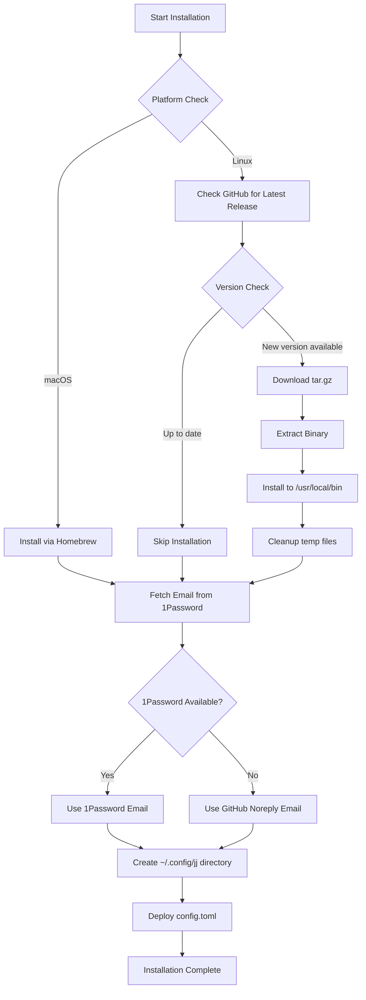

# 🌲 Jujutsu (jj) Version Control

Ansible role for installing and configuring [Jujutsu](https://github.com/jj-vcs/jj), a Git-compatible version control system that combines the features of Git and Mercurial. Jujutsu is designed to be easier to use while maintaining full compatibility with Git repositories.

## Overview

This role automates the installation of Jujutsu across multiple platforms and provides a pre-configured setup with sensible defaults, SSH commit signing, and integration with your existing Git configuration.

## Supported Platforms

| Platform | Installation Method | Auto-Update |
|----------|-------------------|-------------|
| **macOS** | Homebrew | ✓ |
| **Ubuntu/Debian** | GitHub Release (binary) | ✓ |
| **Other Linux** | GitHub Release (binary) | ✓ |

## What Gets Installed

### Package Installation

- **macOS**: `jj` via Homebrew
- **Linux**: Latest release binary from GitHub (`x86_64-unknown-linux-musl`)
  - Installed to `/usr/local/bin/jj`
  - Automatically checks for and installs newer versions

### Configuration Files

| File | Location | Purpose |
|------|----------|---------|
| `config.toml` | `~/.config/jj/config.toml` | Main jj configuration |

## Key Features

### 🔐 Secure Commit Signing
- **SSH-based signing** using your existing `~/.ssh/id_ed25519.pub` key
- Automatic signing for all commits (`behavior = "own"`)
- Matches your Git SSH configuration

### 🔑 1Password Integration
- User email fetched from 1Password vault when available
- Graceful fallback to GitHub noreply email if 1Password unavailable
- Shares email configuration with Git role

### 🎨 Rich Configuration
```toml
[ui]
default-command = "log"              # Show log when running `jj` alone
color = "auto"                       # Colorized output
conflict-marker-style = "diff"       # Git-style conflict markers
relative-timestamps = true           # Human-readable timestamps

[git]
auto-local-bookmark = true           # Auto-create local bookmarks
default-push-remote = "origin"       # Default Git remote
default-fetch-remote = "origin"

[revset-aliases]
# Treat main@origin as immutable
"immutable_heads()" = "builtin_immutable_heads() | main@origin"
```

### 📊 Custom Log Template
Beautiful, information-rich log output including:
- Short change ID with conflict/empty indicators
- Author name and timestamp (with relative "ago" format)
- Branch, tag, and Git ref information
- Commit description with highlighting
- Color-coded elements for easy scanning

### 🎨 Color Scheme
Consistent color coding across the CLI:
- **Commit ID**: Blue
- **Change ID**: Magenta
- **Author**: Yellow
- **Working Copy**: Bold Green
- **Conflicts**: Bold Red
- **Timestamps**: Bright Black (subtle)

## Installation Flow



## Dependencies

### Required Variables
- `git_user_name`: Your full name (from `group_vars/all.yml`)

### Optional Variables
- `op_installed`: Whether 1Password CLI is available
- `op.git.user.email`: 1Password reference for Git email

### Role Dependencies
This role integrates with:
- **Git role**: Shares user configuration and SSH keys
- **1Password role**: Fetches email from vault (optional)

## Configuration Details

### User Identity
```toml
[user]
name = "{{ git_user_name }}"
email = "{{ jj_user_email }}"
```

Email resolution priority:
1. 1Password vault (`op://Dotfiles/Github/email`)
2. GitHub noreply email (`username@users.noreply.github.com`)

### Commit Signing
```toml
[signing]
behavior = "own"                      # Sign your own commits
backend = "ssh"                       # Use SSH keys
key = "~/.ssh/id_ed25519.pub"        # SSH public key
```

This configuration mirrors Git's SSH commit signing setup for consistency.

## Uninstallation

The role includes a comprehensive uninstall script:

```bash
# Remove jj and all configuration
~/.dotfiles/roles/jj/uninstall.sh
```

**What gets removed:**
- Binary installation (`/usr/local/bin/jj` or Homebrew package)
- Configuration directory (`~/.config/jj`)
- Platform-specific cleanup (apt/dnf/pacman/brew)

## Usage Examples

After installation, Jujutsu is ready to use:

```bash
# Initialize a new repo
jj init --git myproject

# Clone an existing Git repo
jj git clone https://github.com/user/repo.git

# View commit history (default command)
jj

# Create a new change
jj new

# Describe your change
jj describe -m "Add new feature"

# Push to Git remote
jj git push
```

## Official Documentation

- **Project Homepage**: [Jujutsu VCS](https://github.com/jj-vcs/jj)
- **Documentation**: [Jujutsu Docs](https://martinvonz.github.io/jj/)
- **Tutorial**: [Getting Started](https://martinvonz.github.io/jj/latest/tutorial/)

## Why Jujutsu?

Jujutsu offers several advantages over traditional Git:

- **Automatic commit creation**: No need to manually stage/commit
- **Easy history editing**: Powerful rebase and squash operations
- **Conflict resolution**: First-class support for merge conflicts
- **Git interoperability**: Works seamlessly with Git remotes
- **Simpler mental model**: Easier to understand than Git's staging area

All while maintaining full compatibility with your existing Git workflows and repositories.
