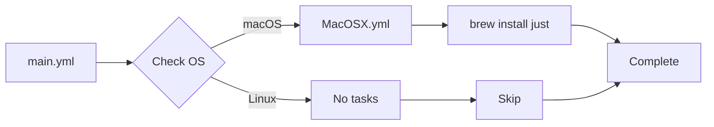

# ⚡ Just

A minimal Ansible role for installing [just](https://github.com/casey/just), a modern command runner and task automation tool.

## Overview

`just` is a handy way to save and run project-specific commands, similar to `make` but without the build system baggage. This role installs the `just` binary using platform-specific package managers.

## Supported Platforms

| Platform | Package Manager | Status |
|----------|----------------|--------|
| macOS | Homebrew | ✅ Supported |
| Ubuntu/Debian | apt | ⚠️ Uninstall only |
| Fedora | dnf | ⚠️ Uninstall only |
| Arch Linux | pacman | ⚠️ Uninstall only |

> **Note**: Currently only macOS has installation tasks. Linux support can be added by creating OS-specific task files in `tasks/`.

## What Gets Installed

### Packages
- `just` - Command runner binary

### Configuration
This role performs a minimal installation with no additional configuration files or templates. The `just` tool uses `justfile` files in project directories, which are managed per-project rather than system-wide.

## Dependencies

None. This is a standalone role with no dependencies on other roles.

## Role Structure

```
roles/just/
├── tasks/
│   ├── main.yml       # OS detection and task routing
│   └── MacOSX.yml     # macOS installation via Homebrew
└── uninstall.sh       # Cross-platform uninstall script
```

## Installation Flow



## Usage

### Install via dotfiles command
```bash
# Install just along with other roles
dotfiles -t just

# Check what would be installed
dotfiles -t just --check
```

### Manual Ansible playbook
```yaml
- hosts: localhost
  roles:
    - just
```

## Uninstallation

The role includes a comprehensive uninstall script that handles all supported platforms:

```bash
# Via dotfiles command
dotfiles --uninstall just

# Or run the script directly
~/.dotfiles/roles/just/uninstall.sh
```

The uninstall process:
1. Removes the `just` package via the appropriate package manager
2. Cleans up any configuration directory at `~/.config/just` (if present)

## What is Just?

`just` is a command runner that makes it easy to save and share common commands for your projects. Some key features:

- **Simple syntax**: Easier to read and write than Makefiles
- **Cross-platform**: Works on macOS, Linux, and Windows
- **Language agnostic**: Use any shell or scripting language
- **Project-specific**: Each project has its own `justfile`

### Example justfile

```just
# List available recipes
default:
    @just --list

# Run tests
test:
    pytest tests/

# Build the project
build:
    cargo build --release

# Deploy to production
deploy: test build
    ./scripts/deploy.sh
```

## Links

- [Official Documentation](https://just.systems/)
- [GitHub Repository](https://github.com/casey/just)
- [Installation Guide](https://github.com/casey/just#installation)
- [Justfile Cookbook](https://just.systems/man/en/chapter_20.html)

## Contributing

To add support for additional Linux distributions:

1. Create a new task file: `tasks/<Distribution>.yml`
2. Add installation tasks using the appropriate package manager
3. Test with `dotfiles -t just --check`
4. Update this README's platform support table

Example for Ubuntu:
```yaml
---
- name: "Just | Install Just"
  ansible.builtin.apt:
    name: just
    state: present
    update_cache: true
  become: true
```
