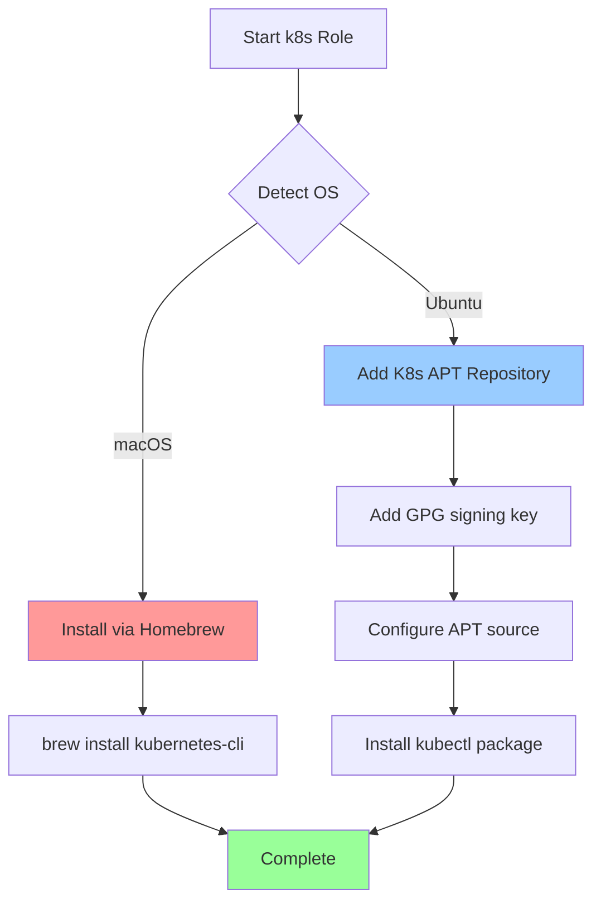

# ☸️ Kubernetes (kubectl) Role

Automated installation and configuration of Kubernetes CLI tools (`kubectl`) for container orchestration and cluster management.

## 📋 Overview

This Ansible role installs the official Kubernetes command-line tool (`kubectl`) for interacting with Kubernetes clusters. It handles platform-specific installation methods and repository configuration, providing a consistent kubectl installation across macOS and Ubuntu systems.

## 🖥️ Supported Platforms

| Platform | Method | Package |
|----------|--------|---------|
| **macOS** | Homebrew | `kubernetes-cli` |
| **Ubuntu** | APT (official K8s repo) | `kubectl` |

## 📦 What Gets Installed

### Core Tools
- **kubectl** - Kubernetes command-line tool for cluster management

### Repository Configuration (Ubuntu)
- Official Kubernetes APT repository (pkgs.k8s.io)
- GPG signing key in `/etc/apt/keyrings/kubernetes-apt-keyring.gpg`
- Repository version configurable via `k8s.repo.version` (default: `v1.34`)

## 🔧 Configuration

### Default Variables

Configure in `group_vars/all.yml`:

```yaml
k8s:
  repo:
    version: "v1.34"  # Kubernetes repository version
```

### Kubeconfig Management

The role includes support for deploying a pre-configured kubeconfig file (currently commented out):

```yaml
# Uncomment in tasks/Ubuntu.yml to enable:
# - Creates ~/.kube directory with proper permissions (0755)
# - Deploys kubeconfig from files/config (encrypted with ansible-vault)
# - Sets secure permissions (0600) on kubeconfig
```

**Note:** The included `files/config` is encrypted with ansible-vault and contains cluster credentials. For security, consider using 1Password references instead of storing encrypted credentials in the repository.

## 📁 File Structure

```
roles/k8s/
├── tasks/
│   ├── main.yml       # OS detection and role orchestration
│   ├── MacOSX.yml     # Homebrew installation for macOS
│   └── Ubuntu.yml     # APT repository setup and installation
├── files/
│   └── config         # Encrypted kubeconfig (ansible-vault)
└── uninstall.sh       # Clean removal script
```

## 🚀 Installation Flow



## 🎯 Usage

### Install kubectl
```bash
# Install kubernetes tools
dotfiles -t k8s

# Verify installation
kubectl version --client
```

### Configure Cluster Access
```bash
# Set up kubeconfig manually
mkdir -p ~/.kube
# Copy your cluster config to ~/.kube/config

# Or use kubectl config commands
kubectl config set-cluster <cluster-name> --server=<server-url>
kubectl config set-credentials <user-name> --token=<token>
kubectl config set-context <context-name> --cluster=<cluster> --user=<user>
```

### Common kubectl Commands
```bash
# View cluster information
kubectl cluster-info
kubectl get nodes

# Manage resources
kubectl get pods --all-namespaces
kubectl get deployments
kubectl get services

# Apply configurations
kubectl apply -f deployment.yaml
kubectl delete -f deployment.yaml
```

## 🗑️ Uninstallation

The role includes an intelligent uninstall script that:

1. **Removes kubectl** - Platform-specific removal (Homebrew on macOS, APT on Ubuntu)
2. **Interactive kubeconfig removal** - Prompts before deleting `~/.kube` directory
3. **Cleanup dotfiles** - Removes `~/.config/k8s` if present

```bash
# Uninstall kubernetes tools
dotfiles --uninstall k8s

# Or run uninstall script directly
~/.dotfiles/roles/k8s/uninstall.sh
```

## 🔗 Dependencies

- **macOS**: Homebrew must be installed
- **Ubuntu**: Sudo privileges required for repository and package management

## 🌟 Key Features

- **Official Kubernetes Repository** - Uses pkgs.k8s.io for latest stable releases
- **Version Control** - Configurable Kubernetes version via variables
- **Secure Key Management** - GPG keyring verification for package authenticity
- **Cross-Platform** - Consistent kubectl installation on macOS and Ubuntu
- **Safe Uninstall** - Interactive removal with configuration preservation option
- **Kubeconfig Encryption** - Optional ansible-vault encrypted cluster credentials

## 📚 Additional Resources

- [kubectl Official Documentation](https://kubernetes.io/docs/reference/kubectl/)
- [Kubernetes Concepts](https://kubernetes.io/docs/concepts/)
- [kubectl Cheat Sheet](https://kubernetes.io/docs/reference/kubectl/cheatsheet/)
- [Kubernetes Package Repository](https://kubernetes.io/docs/tasks/tools/install-kubectl-linux/)

## ⚠️ Notes

- **Security**: The included `files/config` contains encrypted cluster credentials. Consider migrating to 1Password references for better secret rotation.
- **Version Updates**: Update `k8s.repo.version` in `group_vars/all.yml` to track different Kubernetes release channels.
- **Cluster Access**: kubectl installation does not grant cluster access - you must configure kubeconfig separately.
- **Ubuntu Only**: The APT repository configuration only applies to Ubuntu systems.
