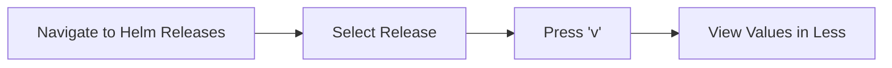
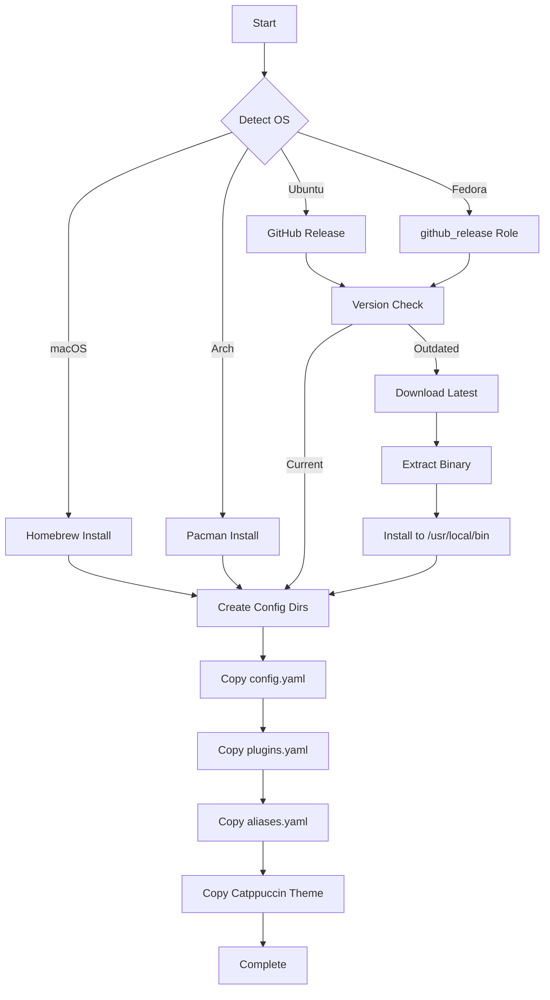

# ⚓ K9s Ansible Role

> Terminal-based Kubernetes UI with Catppuccin Mocha theme and custom configurations

A comprehensive Ansible role for installing and configuring [K9s](https://k9scli.io/), a powerful terminal-based UI for managing Kubernetes clusters. This role provides cross-platform installation, themed configuration, and productivity-enhancing plugins for efficient cluster management.

## Features

- **Cross-platform installation** - macOS, Ubuntu, Fedora, and Arch Linux support
- **Auto-updating** - Intelligent version detection and updates from GitHub releases
- **Catppuccin Mocha theme** - Beautiful, consistent color scheme with transparent backgrounds
- **Custom plugins** - Helm values viewer and extensible plugin system
- **Aliases** - Quick navigation shortcuts for common resources
- **Optimized configuration** - Performance-tuned settings for large clusters

## Supported Platforms

| Platform | Installation Method | Config Location |
|----------|-------------------|-----------------|
| macOS | Homebrew | `~/Library/Application Support/k9s/` |
| Ubuntu | GitHub Release | `~/.config/k9s/` |
| Fedora/RHEL | GitHub Release (via `github_release` role) | `~/.config/k9s/` |
| Arch Linux | Pacman | `~/.config/k9s/` |

## What Gets Installed

### Binary/Package
- **k9s** - Latest stable version from appropriate source
  - macOS: via Homebrew
  - Linux: Latest GitHub release binary

### Configuration Files

```
~/.config/k9s/                    (Linux)
~/Library/Application Support/k9s/ (macOS)
├── config.yaml                   # Main configuration
├── aliases.yaml                  # Resource navigation aliases
├── plugins.yaml                  # Custom plugins and commands
└── skins/
    └── catppuccin_mocha.yaml     # Catppuccin Mocha theme
```

## Key Configurations

### Performance Settings
```yaml
liveViewAutoRefresh: true    # Auto-refresh enabled
refreshRate: 1               # 1 second refresh
maxConnRetry: 5              # API retry limit
```

### UI Customization
```yaml
enableMouse: false           # Disabled for text selection
logoless: true               # Clean interface
headless: true               # Hide header
skin: catppuccin_mocha       # Beautiful Catppuccin theme
```

### Log Management
```yaml
tail: 200                    # Initial log lines
buffer: 500                  # Max lines in memory
sinceSeconds: 300            # Last 5 minutes
```

## Built-in Features

### Aliases
Quick navigation shortcuts configured in `aliases.yaml`:

```yaml
aliases:
  dep: apps/v1/deployments   # Type :dep to view deployments
```

### Plugins

#### Helm Values Viewer
View Helm chart values with a single keypress:

- **Shortcut**: `v` (when viewing Helm releases)
- **Action**: Displays user-supplied values for selected Helm chart
- **Output**: Paginated view via `less`



## Installation Flow



## Dependencies

### Role Dependencies
- **Fedora/RHEL only**: `github_release` role (handles GitHub release downloads)

### System Requirements
- Kubernetes cluster with configured `kubectl` access
- Valid `KUBECONFIG` or `~/.kube/config`
- (Optional) Helm CLI for Helm plugin functionality

## Usage

### Apply the Role
```bash
# Install/update k9s
dotfiles -t k9s

# Or via ansible-playbook
ansible-playbook main.yml -t k9s
```

### Launch K9s
```bash
k9s                          # Launch with current context
k9s --context prod          # Launch with specific context
k9s --readonly              # Launch in read-only mode
```

### Navigation Tips
```bash
:pods                        # View pods
:svc                         # View services
:dep                         # View deployments (alias)
:ctx                         # Switch contexts
/filter                      # Filter current view
?                            # Help menu
```

## Theme Preview

The Catppuccin Mocha theme provides:
- **Transparent background** - Preserves terminal appearance
- **Semantic colors** - Different states clearly distinguished
- **Low eye strain** - Carefully balanced contrast ratios
- **Consistent palette** - Matches other Catppuccin-themed tools

### Color Scheme
| Element | Color | Hex |
|---------|-------|-----|
| Main text | Text | `#cdd6f4` |
| Titles | Teal | `#94e2d5` |
| Borders | Mauve | `#cba6f7` |
| Errors | Red | `#f38ba8` |
| Success | Green | `#a6e3a1` |
| Modified | Lavender | `#b4befe` |

## Customization

### Adding Custom Aliases
Edit `files/aliases.yaml`:
```yaml
aliases:
  dep: apps/v1/deployments
  cm: v1/configmaps          # Add configmap alias
  ing: networking.k8s.io/v1/ingresses  # Add ingress alias
```

### Creating Custom Plugins
Edit `files/plugins.yaml`:
```yaml
plugins:
  my-plugin:
    shortCut: x              # Keyboard shortcut
    confirm: true            # Require confirmation
    description: "My Custom Plugin"
    scopes:
      - pods                 # Available in pod views
    command: sh
    background: false
    args:
      - -c
      - "kubectl describe pod $NAME -n $NAMESPACE"
```

### Theme Customization
Modify `files/catppuccin_mocha.yaml` or create a new theme file and update `config.yaml`:
```yaml
ui:
  skin: my_custom_theme     # References skins/my_custom_theme.yaml
```

## Uninstallation

```bash
# Via dotfiles script
dotfiles --uninstall k9s

# Or run the uninstall script directly
~/.dotfiles/roles/k9s/uninstall.sh
```

Removes:
- K9s binary (`/usr/local/bin/k9s` or via package manager)
- Configuration directory (`~/.config/k9s/` or `~/Library/Application Support/k9s/`)
- All themes, plugins, and settings

## Advanced Configuration

### Multi-Cluster Management
K9s automatically detects all contexts from your kubeconfig:
```bash
export KUBECONFIG=~/.kube/prod:~/.kube/dev:~/.kube/staging
k9s                          # Switch contexts with :ctx
```

### Read-Only Mode
For production environments, enable read-only mode in `config.yaml`:
```yaml
readOnly: true               # Disable modification commands
```

### Custom Shell Pod
Configure debug container for shell access:
```yaml
shellPod:
  image: nicolaka/netshoot   # Network debugging tools
  namespace: default
  limits:
    cpu: 200m
    memory: 200Mi
```

## Troubleshooting

### Connection Issues
```bash
# Verify kubectl connectivity
kubectl cluster-info

# Check current context
kubectl config current-context

# Test with explicit context
k9s --context my-cluster
```

### Theme Not Loading
```bash
# Verify skin file exists
ls ~/.config/k9s/skins/catppuccin_mocha.yaml

# Check config references correct skin
grep "skin:" ~/.config/k9s/config.yaml

# Restart k9s
```

### Version Detection Issues (Ubuntu)
The role checks installed version and compares with latest GitHub release. If updates aren't detected:
```bash
# Check current version
k9s version

# Force reinstall
dotfiles -t k9s --check  # Dry run to see what would happen
```

## Links

- [K9s Official Documentation](https://k9scli.io/)
- [K9s GitHub Repository](https://github.com/derailed/k9s)
- [Catppuccin Theme](https://github.com/catppuccin/catppuccin)
- [K9s Plugins Guide](https://k9scli.io/topics/plugins/)
- [Kubernetes Documentation](https://kubernetes.io/docs/)

## License

This role is part of a personal dotfiles repository. K9s itself is licensed under Apache 2.0.

---

**Note**: This role is designed to work within a larger Ansible-based dotfiles management system. It follows the repository's conventions for OS detection, idempotency, and cross-platform support.
