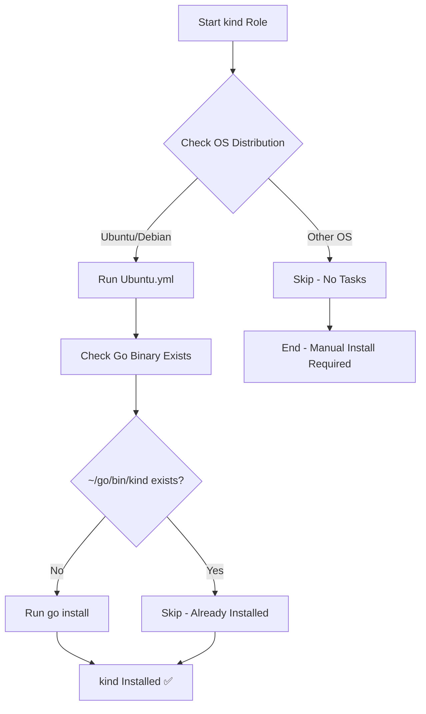

# 🐳 kind - Kubernetes in Docker

Ansible role for installing [kind](https://kind.sigs.k8s.io/) (Kubernetes IN Docker), a tool for running local Kubernetes clusters using Docker container "nodes". Perfect for local development, testing, and CI/CD workflows.

## 📋 Description

This role installs kind using Go's package manager, allowing you to spin up multi-node Kubernetes clusters locally in seconds. kind is particularly useful for testing Kubernetes applications, developing operators, and learning Kubernetes without requiring cloud resources or complex VM setups.

## 🖥️ Supported Platforms

| Platform | Status | Installation Method |
|----------|--------|-------------------|
| Ubuntu   | ✅ Supported | Go install |
| Debian   | ✅ Supported | Go install |
| Fedora   | ⚠️ Uninstall only | N/A |
| Arch     | ⚠️ Uninstall only | N/A |
| macOS    | ⚠️ Uninstall only | N/A |

> **Note**: Currently only Ubuntu/Debian have automated installation tasks. Other platforms support uninstallation but require manual kind installation.

## 📦 What Gets Installed

### Binaries
- `kind` - Latest version installed to `~/go/bin/kind`

### Source
- Package: `sigs.k8s.io/kind@latest`
- Installation: Via `go install` command

## 🔧 Configuration

This is a minimal installation role - no configuration files are deployed. kind uses cluster configuration files that you create as needed:

```bash
# Example: Create a cluster
kind create cluster --name dev-cluster

# Example: Create cluster with config
kind create cluster --config cluster-config.yaml
```

## 📊 Installation Flow



## 🔗 Dependencies

### Required
- **Go**: This role requires Go to be installed and available in PATH
  - Managed by the `go` role in this dotfiles repository
  - Must be installed before running the `kind` role

### Optional
- **Docker**: kind requires Docker to be installed and running
  - Managed by the `docker` role in this dotfiles repository
  - kind creates Kubernetes nodes as Docker containers

## ⚡ Key Features

- **Minimal footprint**: Single binary installation via Go
- **Idempotent**: Safe to run multiple times (checks for existing binary)
- **Latest version**: Always installs the most recent kind release
- **Clean uninstall**: Removes binary and configuration directory

## 🚀 Usage

### Installation
```bash
# Install with all dotfiles
dotfiles

# Install only kind (and dependencies)
dotfiles -t kind

# Check if kind is installed
kind version
```

### Quick Start
```bash
# Create a cluster
kind create cluster

# Create a cluster with specific name
kind create cluster --name my-cluster

# List clusters
kind get clusters

# Delete a cluster
kind delete cluster --name my-cluster
```

### Uninstallation
```bash
# Uninstall via dotfiles script
dotfiles --uninstall kind

# Or run uninstall script directly
~/.dotfiles/roles/kind/uninstall.sh
```

## 📚 Official Documentation

- [kind Documentation](https://kind.sigs.k8s.io/)
- [kind GitHub Repository](https://github.com/kubernetes-sigs/kind)
- [Quick Start Guide](https://kind.sigs.k8s.io/docs/user/quick-start/)
- [Configuration Reference](https://kind.sigs.k8s.io/docs/user/configuration/)

## 🔍 Implementation Details

### Installation Logic
- Uses `go install` with the `creates` parameter for idempotency
- Targets the official kind package: `sigs.k8s.io/kind@latest`
- Binary installed to Go's default bin directory (`~/go/bin`)

### Uninstall Logic
- Detects OS and package manager
- Removes kind binary (if installed via package manager)
- Cleans up `~/.config/kind` configuration directory
- Supports macOS (Homebrew), Ubuntu/Debian (apt), Fedora (dnf), and Arch (pacman)

## 💡 Tips

- **PATH Configuration**: Ensure `~/go/bin` is in your PATH to use kind directly
- **Docker Desktop**: If using Docker Desktop on macOS/Windows, ensure it's running before creating clusters
- **Resource Limits**: kind clusters run in Docker, so monitor Docker resource allocation
- **Multi-node Clusters**: kind can create multi-node clusters by providing a config file
- **Port Mapping**: Expose services by mapping ports in cluster configuration

## 🐛 Troubleshooting

### kind not found in PATH
```bash
# Add Go bin directory to PATH in your shell config
export PATH="$HOME/go/bin:$PATH"
```

### Docker not running
```bash
# Check Docker status
docker info

# Start Docker (varies by platform)
sudo systemctl start docker  # Linux systemd
```

### Cluster creation fails
```bash
# Check Docker resources
docker system df

# Clean up old kind resources
kind delete cluster --name <cluster-name>
docker system prune
```

---

*Part of the [dotfiles](https://github.com/TechDufus/dotfiles) automated development environment setup.*
