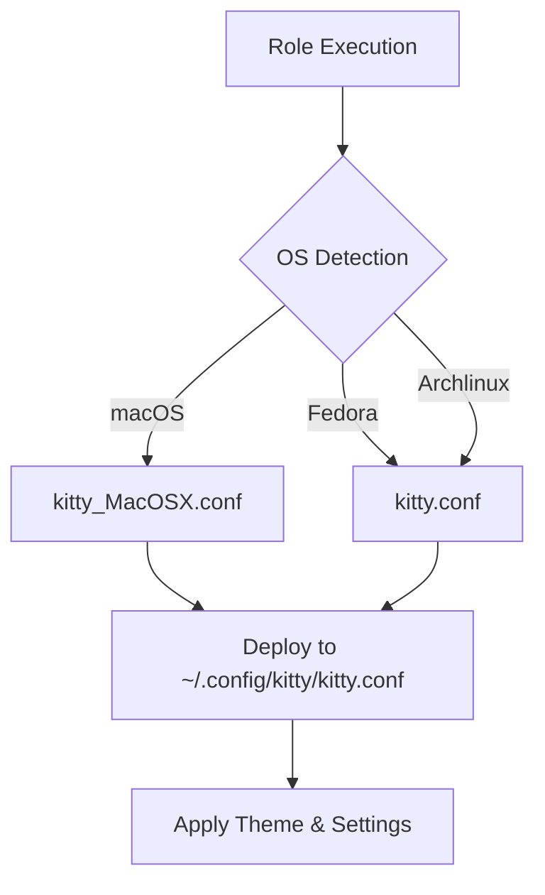

# 🐱 Kitty Terminal Emulator

A GPU-accelerated terminal emulator that combines speed, beauty, and rich features. This Ansible role installs and configures Kitty with a modern, aesthetically pleasing setup featuring the Catppuccin Mocha color scheme.

## Overview

Kitty is a fast, feature-rich, cross-platform terminal emulator that leverages GPU acceleration for smooth rendering. This role provides an opinionated configuration with beautiful theming, optimized fonts, and sensible defaults for developers.

## Supported Platforms

- **macOS** - Installed via Homebrew Cask
- **Fedora** - Installed via DNF (with graceful fallback to manual installation)
- **Archlinux** - Installed via pacman; deploys the shared Linux `kitty.conf`

## What Gets Installed

### Packages
- **Kitty Terminal Emulator** - Latest stable version from official sources

### Configuration Files

For macOS, the role deploys an OS-specific configuration; Fedora and Archlinux deploy the shared Linux configuration:


```mermaid
flowchart TD
    A[Role Execution] --> B{OS Detection}
    B -->|macOS| C[kitty_MacOSX.conf]
    B -->|Fedora| D[kitty.conf]
    B -->|Archlinux| D
    C --> E[Deploy to ~/.config/kitty/kitty.conf]
    D --> E
    E --> F[Apply Theme & Settings]
```

#### Deployed Configurations

- **`~/.config/kitty/kitty.conf`** - Main configuration file
  - **macOS**: Uses `kitty_MacOSX.conf` with darker Catppuccin Mocha theme
  - **Fedora/Archlinux**: Uses `kitty.conf` with a darker custom Catppuccin Mocha variant

#### Additional Theme Files

- **`kitty_modern_theme.conf`** - Alternative modern Tokyo Night-inspired theme (not deployed by default)

## Key Features

### Visual Aesthetics
- **Custom darker Catppuccin Mocha variants** - Soothing pastel themes tuned per deployed config
- **BerkeleyMono Nerd Font** - Beautiful monospace font with ligatures
- **Powerline-style tabs** - Slanted tab bar at the top
- **Custom window padding** - Spacious 16-20pt padding for a clean look
- **Optional background images** - Supported but disabled by default to avoid image/tint overhead

### macOS-Specific Features
- **Titlebar-only decorations** - Hide titlebar while keeping window borders
- **140% line height** - Extra breathing room for better readability
- **Option key as Alt** - Proper keyboard behavior for terminal applications
- **Optional background image hooks** - Commented by default for responsiveness

### Performance
- **GPU acceleration** - Smooth scrolling and rendering
- **Default repaint/input timing** - Uses Kitty defaults unless latency tuning is needed
- **Sync to monitor** - Left at Kitty default to avoid tearing unless measured latency requires changing it

### Font Configuration
- **14pt font size** - Comfortable default size
- **Ligature support** - Disabled on cursor for easier editing
- **Disable blinking cursor** - Steady cursor for reduced distraction

### Developer-Friendly
- **Cmd/Super+/- font size adjustment** - Easy font scaling across deployed configs
- **xterm-kitty TERM** - Proper terminal capabilities
- **Mouse URL detection** - Cmd/Super+click URL opening is configured via `mouse_map`
- **Tab management** - Disabled conflicting keyboard shortcuts

## Installation Logic

### macOS Flow
1. Install Kitty via Homebrew Cask
2. Create `~/.config/kitty` directory
3. Detect OS-specific config: `kitty_MacOSX.conf`
4. Deploy config to `~/.config/kitty/kitty.conf`

### Fedora/Archlinux Flow
1. Install Kitty via DNF or pacman when package installation is allowed
2. On Fedora without sudo access, display manual installation instructions
3. Create `~/.config/kitty` directory
4. Deploy `kitty.conf` to `~/.config/kitty/kitty.conf`

## Configuration Highlights

### Color Scheme

The role uses two custom Catppuccin Mocha variants:

**Fedora/Archlinux darker custom variant:**
- Background: `#11111b` (darker than Catppuccin default)
- Foreground: `#cdd6f4`
- Accent: `#cba6f7` (mauve)

**macOS Variant:**
- Background: `#0F0F17` (even darker midpoint)
- Background images disabled by default
- Dynamic opacity disabled by default

### Tab Bar Styling
```
┌─────────────────────────────────────┐
│ ⟨ Active Tab ⟩ Inactive Tab  Inactive Tab │
└─────────────────────────────────────┘
```

- Powerline slanted style
- Active tab: Bold with mauve background
- Tab bar at top with 5pt margin

### Window Padding

**macOS**: 16pt vertical, 10pt horizontal
**Fedora/Archlinux**: 20pt uniform padding

## Uninstallation

The role includes a comprehensive uninstallation script that:

1. **Closes** running Kitty instances
2. **Removes** the application:
   - macOS: Removes `/Applications/kitty.app` and Homebrew cask
   - Fedora: Removes via `dnf`
   - Archlinux: Removes via `pacman`
3. **Cleans up** configuration files in `~/.config/kitty`

Run uninstallation:
```bash
~/.dotfiles/roles/kitty/uninstall.sh
```

## Customization

### Switching Themes

To use the alternative modern theme:
```bash
cd ~/.config/kitty
cp ~/.dotfiles/roles/kitty/files/kitty_modern_theme.conf kitty.conf
```

### Changing Fonts

Edit the font family in your config:
```conf
font_family      JetBrains Mono Nerd Font
bold_font        JetBrains Mono Nerd Font
italic_font      JetBrains Mono Nerd Font
bold_italic_font JetBrains Mono Nerd Font
```

### Background Images

Uncomment and customize these if you want a background image:
```conf
# background_image ~/path/to/your/image.jpg
# background_image_layout cscaled
# background_tint 0.95
```

## Dependencies

- **Font**: BerkeleyMono Nerd Font (should be installed via a separate font role)
- **Homebrew** (macOS only): Required for cask installation
- **DNF** (Fedora only): For package management
- **pacman** (Archlinux/CachyOS only): For package management

## Known Gotchas

- **Custom cursor warning**: The config avoids `macos_custom_beam_cursor` as it can make cursors invisible on dual GPU machines
- **Background images**: Supports PNG/JPEG/WEBP/TIFF/GIF/BMP; keep disabled while diagnosing latency
- **Manual installation**: On Fedora without sudo, user must manually install using the provided instructions
- **Conflicting shortcuts**: Some default tab shortcuts are disabled to avoid conflicts with other applications
- **GL/EGL startup failures**: Kitty requires a working GPU/OpenGL stack; if `kitty --config NONE` fails, investigate driver or GPU-resource issues before changing kitty.conf.

## Official Documentation

- [Kitty Terminal](https://sw.kovidgoyal.net/kitty/) - Official website
- [Kitty Configuration](https://sw.kovidgoyal.net/kitty/conf/) - Full configuration reference
- [Catppuccin Theme](https://github.com/catppuccin/kitty) - Theme repository

## Role Variables

This role uses Ansible facts for dynamic configuration:
- `ansible_facts['distribution']` - OS detection for config selection
- `ansible_facts['user_dir']` or `ansible_facts['env']['HOME']` - User home directory
- `can_install_packages` - Controls whether to attempt system package installation

## Example Usage

```bash
# Install just Kitty
dotfiles -t kitty

# Install with verbose output
dotfiles -t kitty -vvv

# Test without applying
dotfiles -t kitty --check
```

---

**Pro Tip**: Kitty supports remote control via socket connections, allowing you to script terminal operations. See the [remote control documentation](https://sw.kovidgoyal.net/kitty/remote-control/) for advanced automation.
