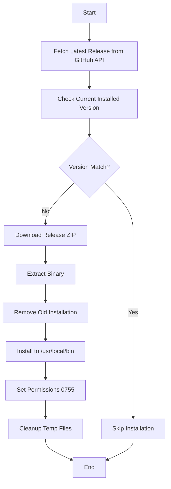

# 🛡️ kwctl - Kubewarden CLI

Ansible role for installing and managing [kwctl](https://github.com/kubewarden/kwctl), the command-line interface for Kubewarden policy management.

## Overview

kwctl is Kubewarden's primary CLI tool for managing WebAssembly-based Kubernetes admission policies. This role automatically downloads and installs the latest version of kwctl, with intelligent version detection to avoid unnecessary reinstalls.

## Supported Platforms

- ✅ Ubuntu/Debian (Linux x86_64)

## What Gets Installed

### Binary

- **kwctl** → `/usr/local/bin/kwctl`
  - Downloaded from the latest GitHub release
  - Automatically detects and upgrades to newer versions
  - Linux x86_64 binary

## Installation Flow



## Features

### Automatic Version Management

- Queries GitHub API for the latest release
- Compares with currently installed version
- Only downloads/installs when a newer version is available
- Idempotent - safe to run multiple times

### Clean Installation

- Removes old installations before upgrading
- Cleans up temporary download files via handlers
- Proper file ownership and executable permissions

### Debug Output

- Shows current installed version
- Displays latest available version
- Helpful for troubleshooting installation issues

## What kwctl Does

kwctl provides comprehensive policy lifecycle management:

**For Policy Authors:**
- Test policies against simulated Kubernetes requests
- Embed metadata into WebAssembly modules
- Publish policies to OCI registries
- Generate policy scaffolding

**For Cluster Administrators:**
- Inspect remote policies from registries
- Dry-run policies before deployment
- Create deployment manifests

**General Features:**
- Policy management (download, list, remove)
- Shell completion support (bash, fish, zsh)
- Binary verification using Sigstore
- SBOM and provenance tracking

## Usage

### Run the Role

```bash
# Install kwctl
dotfiles -t kwctl

# Or as part of full dotfiles setup
dotfiles
```

### Verify Installation

```bash
# Check version
kwctl --version

# View help
kwctl --help

# List installed policies
kwctl policies
```

## Dependencies

### Runtime Requirements

- curl/wget (for downloading releases)
- unzip (for extracting archives)
- sudo access (for installing to /usr/local/bin)

### Ansible Variables

- `host_user` - User for file ownership (from global vars)

## Technical Details

### Version Detection

The role uses a sophisticated version check:

```bash
kwctl --version | grep -oP 'version=\K[^,]+' | awk 'NR==1' | sed 's/^/v/'
```

This extracts the version string and formats it to match GitHub release tags (e.g., `v1.9.0`).

### Download Source

- **Repository**: [kubewarden/kwctl](https://github.com/kubewarden/kwctl)
- **API**: GitHub Releases API for version discovery
- **Binary**: Pre-built Linux x86_64 ZIP archives

### Installation Location

- Binary installed to `/usr/local/bin/kwctl`
- Requires sudo/root privileges
- Executable permissions: `0755`
- Owner: `{{ host_user }}`

## Handlers

The role includes cleanup handlers triggered after installation:

- `Cleanup kwctl downloaded tar` - Removes the downloaded ZIP file
- `Remove extracted kwctl directory` - Removes temporary extraction directory

## Links

- [Kubewarden Documentation](https://docs.kubewarden.io/)
- [kwctl GitHub Repository](https://github.com/kubewarden/kwctl)
- [Kubewarden Policy Hub](https://hub.kubewarden.io/)
- [Getting Started Guide](https://docs.kubewarden.io/quick-start)

## Notes

- Currently supports only Linux x86_64 architecture
- macOS support could be added by creating `tasks/MacOSX.yml`
- Version comparison prevents unnecessary downloads
- Requires internet access to GitHub API and releases
