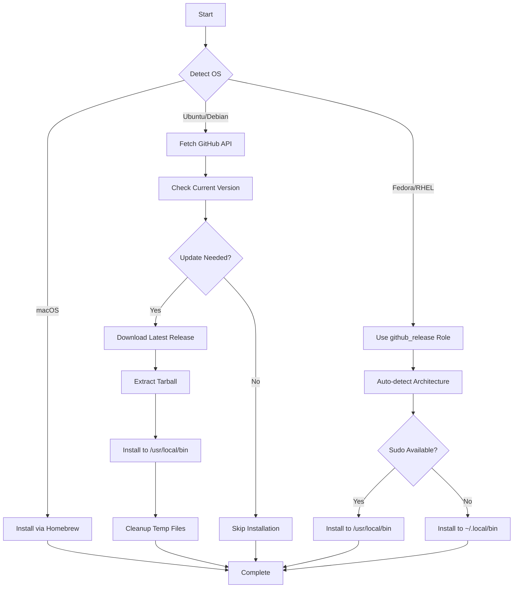

# Lazygit Role

> A simple terminal UI for git commands - cross-platform installation via Ansible

## Overview

This Ansible role installs [Lazygit](https://github.com/jesseduffield/lazygit), a feature-rich terminal UI for git operations. Lazygit provides an intuitive interface for staging, committing, branching, merging, rebasing, and managing repositories without leaving the terminal.

## Supported Platforms

| Platform | Installation Method | Binary Location |
|----------|-------------------|-----------------|
| macOS | Homebrew | Managed by Homebrew |
| Ubuntu/Debian | GitHub Releases | `/usr/local/bin/lazygit` |
| Fedora/RHEL | GitHub Releases (via `github_release` role) | `/usr/local/bin/lazygit` or `~/.local/bin/lazygit` |

## Features

- **Intelligent Version Management**: Automatically detects and updates to latest releases
- **Cross-Platform Support**: Consistent installation across macOS and Linux distributions
- **Sudo-Aware Installation**: Falls back to user directory when sudo is unavailable
- **Architecture Detection**: Automatic detection for x86_64 and ARM64 systems
- **Clean Installation**: Automatic cleanup of temporary files via Ansible handlers
- **Neovim Integration**: Seamlessly integrates with Neovim via plugins

## What Gets Installed

### Packages
- **lazygit**: The main terminal UI application

### Installation Paths
- **macOS**: Managed via Homebrew package manager
- **Linux (with sudo)**: `/usr/local/bin/lazygit`
- **Linux (without sudo)**: `~/.local/bin/lazygit`

## Configuration

This role follows a **minimal configuration approach**:
- No default configuration files are deployed
- Lazygit works excellently with defaults
- Users customize post-installation via `~/.config/lazygit/config.yml`
- Respects existing user configurations

## Installation Flow



## Neovim Integration

This role integrates seamlessly with the `neovim` role through two plugins:

### 1. Dedicated Lazygit Plugin
```lua
-- File: roles/neovim/files/lua/plugins/lazygit.lua
{
  "kdheepak/lazygit.nvim",
  dependencies = { "nvim-lua/plenary.nvim" }
}
```

### 2. ToggleTerm Integration
```lua
-- File: roles/neovim/files/lua/plugins/toggleterm.lua
local Terminal = require("toggleterm.terminal").Terminal
local lazygit = Terminal:new({ cmd = "lazygit", hidden = true })
```

**Keybinding**: `<leader>gg` opens Lazygit in a floating terminal within Neovim

## Usage

### Run with Dotfiles Command
```bash
# Install lazygit
dotfiles -t lazygit

# Test installation (dry run)
dotfiles -t lazygit --check

# Debug installation
dotfiles -t lazygit -vvv
```

### Verify Installation
```bash
# Check binary exists
which lazygit

# Check version
lazygit --version

# Launch in current repository
cd /path/to/git/repo
lazygit
```

### Uninstall
```bash
# Run uninstall script
./roles/lazygit/uninstall.sh

# Or use dotfiles command
dotfiles --uninstall lazygit
```

## Dependencies

### Role Dependencies
- **Fedora/RHEL**: Depends on `github_release` role for installation

### System Dependencies
- **Git**: Required for lazygit to function
- **Homebrew**: Required on macOS
- **sudo**: Optional on Linux (installs to user directory without it)

## Key Features Enabled

### Core Git Operations
- Interactive file staging and unstaging
- Commit with built-in message editor
- Visual branch management and switching
- Interactive merge conflict resolution
- Visual interactive rebase interface
- Stash management and application
- Push, pull, fetch with progress indicators

### Advanced Features
- Submodule navigation and management
- Worktree creation and switching
- Custom command extensibility
- External diff/merge tool integration
- Commit and file filtering
- Full-text search across commits

## Architecture Details

### Version Management (Ubuntu)
```yaml
# Fetches latest release from GitHub API
- Compares installed version with latest
- Downloads only if update needed
- Extracts tarball to /tmp
- Installs binary with proper permissions (0755)
- Cleans up temporary files via handlers
```

### Flexible Installation (Fedora)
```yaml
# Leverages github_release role
- Auto-detects system architecture
- Pattern-matches release assets
- Checks sudo availability
- Installs to system or user directory
- Provides detailed installation report
```

## Troubleshooting

### Installation Issues
```bash
# Check if binary is installed
which lazygit

# Verify version
lazygit --version

# Check installation logs
dotfiles -t lazygit -vvv
```

### Permission Problems
```bash
# On systems without sudo, binary installs to ~/.local/bin
# Ensure ~/.local/bin is in your PATH
echo $PATH | grep -q "$HOME/.local/bin" || echo 'export PATH="$HOME/.local/bin:$PATH"' >> ~/.zshrc
```

### GitHub Rate Limiting
```bash
# If hitting GitHub API rate limits, authenticate:
gh auth login

# Or set GITHUB_TOKEN environment variable
export GITHUB_TOKEN=your_token_here
```

## Resources

- [Official Lazygit Documentation](https://github.com/jesseduffield/lazygit)
- [Lazygit Configuration Guide](https://github.com/jesseduffield/lazygit/blob/master/docs/Config.md)
- [Keybindings Reference](https://github.com/jesseduffield/lazygit/blob/master/docs/keybindings/Keybindings_en.md)
- [Custom Commands Guide](https://github.com/jesseduffield/lazygit/wiki/Custom-Commands-Compendium)

## License

This role is part of the dotfiles repository. See main repository LICENSE for details.
