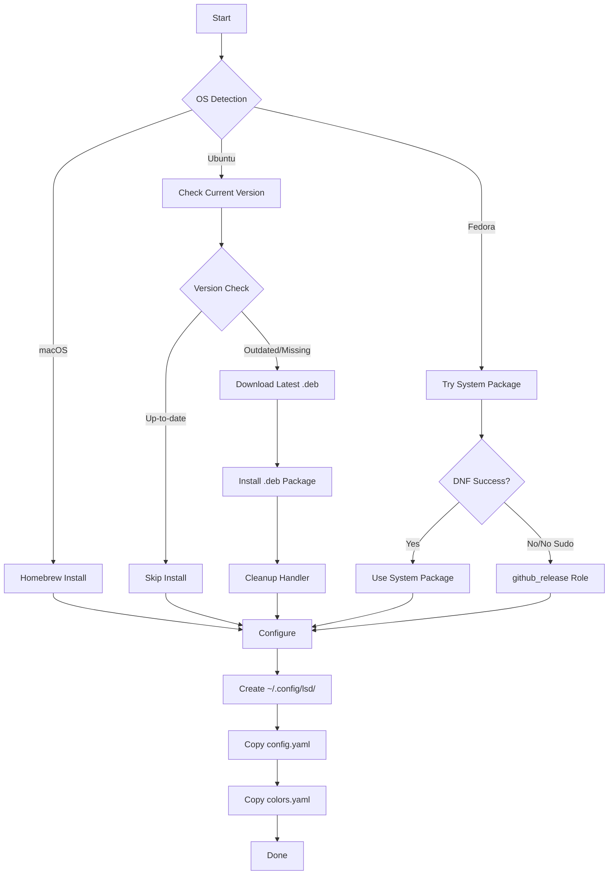

# 📁 LSD (LSDeluxe)

Modern replacement for `ls` with rich color support, icons, and git integration.

## Overview

This Ansible role installs and configures [LSD (LSDeluxe)](https://github.com/lsd-rs/lsd), a rewrite of GNU `ls` with lots of added features like colors, icons, tree-view, and more formatting options. LSD provides a modern, user-friendly directory listing experience with beautiful visual output.

## Supported Platforms

| Platform | Installation Method |
|----------|-------------------|
| macOS | Homebrew |
| Ubuntu/Debian | GitHub Release (`.deb` package) |
| Fedora/RHEL | DNF (system package) with GitHub Release fallback |

> **Note**: Arch Linux support exists in the uninstall script but no installation tasks are currently configured.

## Features

### Installation
- **macOS**: Installs via Homebrew
- **Ubuntu**: Downloads latest `.deb` from GitHub releases with automatic version detection
- **Fedora**: Attempts system package first, falls back to GitHub release using `github_release` role
- **Version checking**: Only installs/updates when a newer version is available

### Configuration
- **Custom color scheme**: Catppuccin-inspired theme with carefully selected colors
- **Automatic setup**: Creates `~/.config/lsd/` directory structure
- **Two configuration files**:
  - `config.yaml` - Main configuration (sets custom theme)
  - `colors.yaml` - Catppuccin color palette for file types, permissions, git status, etc.

### Color Scheme Highlights
- **Permissions**: Green (read), yellow (write), red (execute)
- **Git status**: Color-coded for modified, new, deleted, and conflicted files
- **File sizes**: Graduated colors from small (green) to large (orange)
- **Dates**: Time-aware colors for recent vs. older files

## Installation Flow



## What Gets Installed

### Packages
- **lsd** - The LSDeluxe binary

### Configuration Files
- `~/.config/lsd/config.yaml` - Main configuration file
- `~/.config/lsd/colors.yaml` - Custom color definitions

## Dependencies

- **Fedora only**: Requires `github_release` role as fallback installation method
- **Ubuntu**: No role dependencies (self-contained GitHub release logic)
- **macOS**: No role dependencies (uses Homebrew)

## Configuration Details

### config.yaml
```yaml
color:
  theme: custom
```

### colors.yaml
The role includes a comprehensive Catppuccin-inspired color scheme covering:
- User/group colors
- Permission indicators (read/write/exec)
- Date colors based on age
- Size-based colors
- Git status indicators
- Inode and link validation
- Tree structure styling

## Usage

After installation, `lsd` can be used as a drop-in replacement for `ls`:

```bash
# Basic listing
lsd

# Long format with details
lsd -l

# Tree view
lsd --tree

# Show hidden files
lsd -a

# All options combined
lsd -la --tree
```

Many dotfile setups alias `ls` to `lsd` for automatic usage.

## Uninstallation

The role includes a comprehensive uninstall script that:
- Detects the OS and package manager
- Removes the lsd package
- Cleans up configuration directory (`~/.config/lsd/`)

Run the uninstall script:
```bash
~/.dotfiles/roles/lsd/uninstall.sh
```

## Key Features

- **Automatic version management**: Only updates when new releases are available
- **Multiple installation strategies**: System packages preferred, GitHub releases as fallback
- **Sudo-less operation**: On Fedora, can install to `~/.local/bin` without sudo
- **Clean installation**: Handlers automatically clean up temporary files
- **Idempotent**: Safe to run multiple times
- **Visual feedback**: Installation status reporting on Fedora

## Links

- [Official GitHub Repository](https://github.com/lsd-rs/lsd)
- [LSD Documentation](https://github.com/lsd-rs/lsd#readme)
- [Catppuccin Theme](https://github.com/catppuccin/catppuccin)
