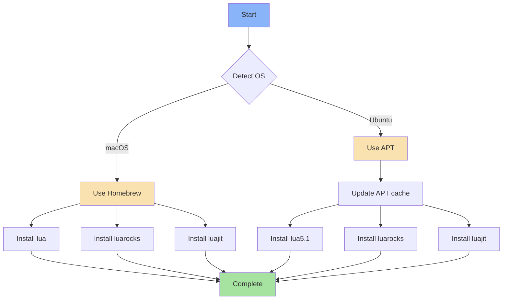

# 🌙 Lua

A streamlined Ansible role that installs Lua programming language, LuaJIT (Just-In-Time compiler), and LuaRocks (package manager) for multi-platform development environments.

## Overview

This role provides a consistent Lua development environment across macOS and Ubuntu systems, installing the core Lua runtime, the high-performance LuaJIT compiler, and the LuaRocks package manager for managing Lua modules and dependencies.

## Supported Platforms

| Platform | Status | Package Manager | Version |
|----------|--------|----------------|---------|
| macOS    | ✅     | Homebrew       | Latest  |
| Ubuntu   | ✅     | APT            | 5.1     |

## What Gets Installed

### macOS (Homebrew)
- **lua** - The Lua programming language
- **luarocks** - Package manager for Lua modules
- **luajit** - Just-In-Time compiler for Lua (high performance)

### Ubuntu (APT)
- **lua5.1** - Lua programming language (version 5.1)
- **luarocks** - Package manager for Lua modules
- **luajit** - Just-In-Time compiler for Lua

## Installation Flow



## Usage

### Install via dotfiles
```bash
# Install as part of full dotfiles setup
dotfiles

# Install only the lua role
dotfiles -t lua

# Test without applying changes
dotfiles -t lua --check
```

### Verify Installation
```bash
# Check Lua version
lua -v

# Check LuaJIT version
luajit -v

# List installed Lua rocks
luarocks list

# Install a Lua module (example)
luarocks install luasocket
```

## Key Features

- **Cross-platform compatibility** - Consistent installation across macOS and Ubuntu
- **JIT compilation** - Includes LuaJIT for high-performance execution
- **Package management** - LuaRocks for easy module installation
- **Idempotent** - Safe to run multiple times without side effects
- **Clean uninstall** - Includes removal script for complete cleanup

## Configuration

This role performs installation only with no custom configuration files. Lua rocks can be managed manually via `luarocks` or added to the Ubuntu task file if needed.

### Future Lua Modules

The Ubuntu task file includes a commented-out section for installing Lua modules automatically. To enable:

```yaml
- name: Lua | Install Lua modules
  ansible.builtin.command:
    cmd: luarocks install {{ item }} --local
  loop:
    - luabitop
  when: item not in rocks.stdout
```

## Dependencies

### System Requirements
- **macOS**: Homebrew must be installed
- **Ubuntu**: APT package manager (sudo access required)

### Related Roles
- **neovim** - Neovim uses Lua for configuration and plugins
- **awesome** - AwesomeWM window manager is configured in Lua

## Uninstallation

```bash
# Uninstall the role (keeps any manually installed rocks)
dotfiles --uninstall lua

# Completely remove (packages + config)
dotfiles --delete lua
```

The uninstall script will:
1. Remove Lua, LuaRocks, and LuaJIT packages
2. Clean up `~/.config/lua` if it exists
3. Leave manually installed rocks intact (managed separately)

## Troubleshooting

### LuaRocks Permission Issues
If you encounter permission errors when installing rocks, use the `--local` flag:
```bash
luarocks install <module> --local
```

### Version Conflicts
Ubuntu installs Lua 5.1 specifically for compatibility. If you need a different version:
```bash
# Install alternative version manually
sudo apt install lua5.3
```

### macOS Homebrew Path
Ensure Homebrew's bin directory is in your PATH:
```bash
export PATH="/opt/homebrew/bin:$PATH"  # Apple Silicon
export PATH="/usr/local/bin:$PATH"     # Intel
```

## Resources

- [Official Lua Documentation](https://www.lua.org/manual/5.1/)
- [LuaJIT Documentation](https://luajit.org/luajit.html)
- [LuaRocks Documentation](https://luarocks.org/)
- [Lua Users Wiki](http://lua-users.org/wiki/)
- [Learn Lua in Y Minutes](https://learnxinyminutes.com/docs/lua/)

## License

Part of the [dotfiles](../..) repository - see root LICENSE for details.
