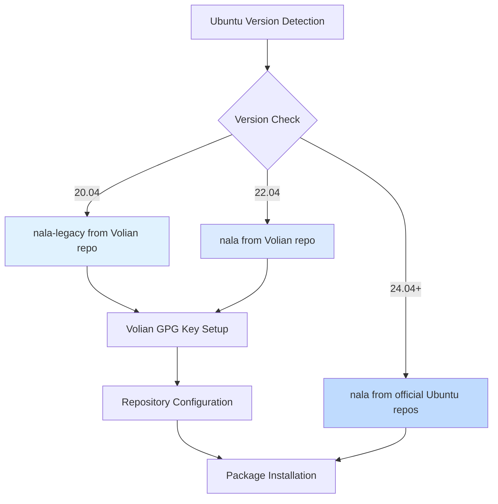

# 📦 Nala

Modern, beautiful frontend for the APT package manager on Ubuntu systems.

## Overview

This Ansible role installs [Nala](https://github.com/volitank/nala), a frontend for APT that provides:
- Parallel downloads for faster package installation
- Beautiful, colorized output with progress bars
- Transaction history with rollback capabilities
- Smart mirror selection for optimal download speeds
- Cleaner, more readable package listings

Nala wraps APT while maintaining full compatibility, making it a drop-in replacement for common apt commands.

## Supported Platforms

- ✅ **Ubuntu 20.04 LTS** (Focal) - via `nala-legacy`
- ✅ **Ubuntu 22.04 LTS** (Jammy) - via Volian repository or native repos
- ✅ **Ubuntu 24.04 LTS** (Noble) - native package support

## What Gets Installed

### Package Selection by Ubuntu Version



### Installation Details

| Ubuntu Version | Package | Source |
|----------------|---------|--------|
| 20.04 | `nala-legacy` | Volian repository (scar) |
| 22.04 | `nala` | Volian repository (scar) |
| 24.04+ | `nala` | Official Ubuntu repositories |

## Features

### Version-Aware Installation
- **Automatic detection** of installed nala to prevent reinstallation
- **Smart repository management** - only adds Volian repo for Ubuntu < 24
- **Legacy support** for Ubuntu 20.04 with nala-legacy variant
- **Native package** preference on Ubuntu 24.04+ (no third-party repos)

### Repository Management
For Ubuntu versions < 24, the role automatically:
1. Adds the Volian GPG key to trusted keyring
2. Configures the Volian scar repository
3. Supports multiple architectures (amd64, arm64, armhf)

### Idempotent Behavior
The role checks for existing nala installation before attempting to install, ensuring safe re-runs without unnecessary changes.

## Usage

### Install via Dotfiles

```bash
# Install only nala
dotfiles -t nala

# Install as part of full setup
dotfiles
```

### Manual Ansible

```bash
ansible-playbook main.yml --tags nala
```

## Post-Installation

After installation, you can use nala as a drop-in replacement for apt:

```bash
# Fetch fastest mirrors (recommended first step)
sudo nala fetch

# Install packages
sudo nala install <package>

# Update packages
sudo nala upgrade

# Search for packages
nala search <query>

# View transaction history
nala history

# Rollback a transaction
sudo nala history undo <id>
```

## Dependencies

- **Ubuntu-based distribution** (Debian derivatives may work but are untested)
- **sudo/root access** for package installation and repository configuration
- **Internet connection** for downloading packages and GPG keys

## Technical Notes

### Repository Details
- **Keyring Location**: `/etc/apt/trusted.gpg.d/volian-archive-scar-unstable.gpg`

### Detection Logic
The role uses `which nala` to detect existing installations, setting internal facts (`nala_is_installed`) to control installation flow.

### Version Handling
Ubuntu version detection uses `ansible_facts['distribution_major_version']` to determine the appropriate installation method and package variant.

## Why Nala?

Traditional APT output can be verbose and difficult to parse. Nala provides:

- **Visual Progress**: Real-time progress bars for downloads and installations
- **Parallel Downloads**: Multiple package downloads simultaneously
- **Better Mirror Selection**: Automatic testing to find fastest mirrors
- **History Tracking**: Easy rollback of package installations
- **Cleaner Interface**: Organized, colorized output that's easier to read

## Links

- [Official GitHub Repository](https://github.com/volitank/nala)
- [Volian Repository](https://deb.volian.org/volian/)
- [Nala Documentation](https://gitlab.com/volian/nala/-/wikis/home)

## License

This role follows the parent repository's license. Nala itself is licensed under GPL-3.0.
