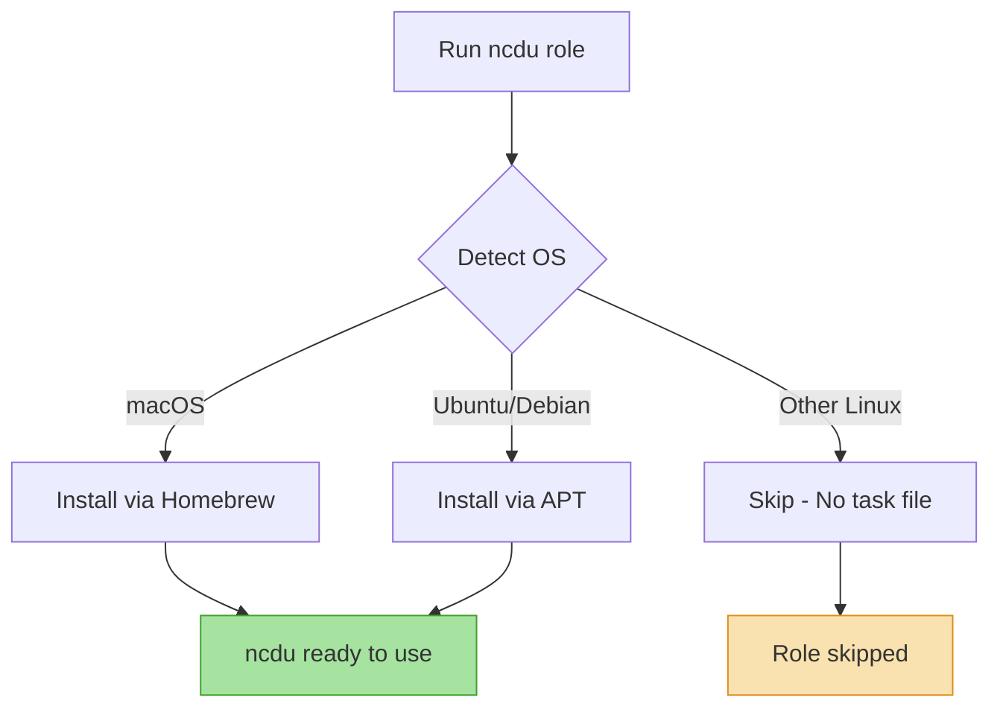

# 📊 NCurses Disk Usage (ncdu)

A lightweight Ansible role that installs [ncdu](https://dev.yorhel.nl/ncdu), a disk usage analyzer with an ncurses interface. This provides a fast, interactive way to identify what's taking up disk space on your system.

## Overview

NCdu (NCurses Disk Usage) is a disk usage analyzer that provides a convenient interface for navigating directory trees and identifying space hogs. Unlike traditional `du` commands, ncdu presents an interactive curses interface that makes it easy to drill down into directories and delete files directly.

## Supported Platforms

| Platform | Status | Package Manager |
|----------|--------|-----------------|
| macOS    | ✅     | Homebrew        |
| Ubuntu   | ✅     | APT             |
| Debian   | ✅     | APT             |
| Fedora   | ✅     | DNF             |
| Arch     | ✅     | Pacman          |

## What Gets Installed

### Packages
- **ncdu** - NCurses Disk Usage analyzer

### No Configuration Files
This role only handles package installation. NCdu is a command-line tool that doesn't require configuration files - it works out of the box with sensible defaults.

## Installation

The role is automatically included when running the dotfiles playbook:

```bash
# Install all dotfiles (includes ncdu)
dotfiles

# Install only ncdu
dotfiles -t ncdu

# Dry run to see what would be installed
dotfiles -t ncdu --check
```

## Usage

Once installed, you can use ncdu from the command line:

```bash
# Analyze current directory
ncdu

# Analyze specific directory
ncdu /path/to/directory

# Scan with extended information
ncdu -x /

# Export scan to file for later viewing
ncdu -o scan.json /
ncdu -f scan.json  # view the scan later
```

### Key Bindings

| Key | Action |
|-----|--------|
| `↑/↓` | Navigate directories |
| `→/Enter` | Open directory |
| `←` | Go to parent directory |
| `d` | Delete selected file/directory |
| `g` | Show percentage and graph |
| `n` | Sort by name |
| `s` | Sort by size |
| `q` | Quit |

## Role Structure

```
ncdu/
├── tasks/
│   ├── main.yml          # OS detection logic
│   ├── MacOSX.yml        # Homebrew installation
│   └── Ubuntu.yml        # APT installation
└── uninstall.sh          # Multi-platform removal script
```

## How It Works



## Dependencies

None - this is a standalone role with no dependencies on other roles.

## Uninstallation

To remove ncdu from your system:

```bash
# Using dotfiles wrapper
dotfiles --uninstall ncdu

# Or run the uninstall script directly
~/.dotfiles/roles/ncdu/uninstall.sh
```

The uninstall script will:
1. Remove the ncdu package using the appropriate package manager
2. Clean up any configuration files in `~/.config/ncdu` (if they exist)

## Why ncdu?

- **Fast**: Scans directories quickly and caches results
- **Interactive**: Navigate and delete files without leaving the interface
- **Portable**: Works the same across all Unix-like systems
- **Lightweight**: Minimal dependencies, small footprint
- **Export/Import**: Save scans to JSON and view them later

## Related Tools

If you're using this dotfiles repository, you might also be interested in:
- **dust** - A more modern alternative to du/ncdu written in Rust
- **duf** - Modern disk usage/free utility with a better interface than df
- **bat** - Enhanced cat with syntax highlighting
- **exa** - Modern replacement for ls

## Resources

- [Official ncdu website](https://dev.yorhel.nl/ncdu)
- [ncdu man page](https://dev.yorhel.nl/ncdu/man)
- [GitHub repository](https://g.blicky.net/ncdu.git/)

## Contributing

This role follows the standard patterns established in this dotfiles repository:

1. OS-specific tasks in separate files (`tasks/<Distribution>.yml`)
2. Consistent naming: `NCDU | <Distribution> | <Action>`
3. Idempotent operations that can be safely re-run
4. Cross-platform uninstall script with proper OS detection

To add support for additional platforms, create a new task file in `tasks/` following the naming convention and add the corresponding uninstall logic.
