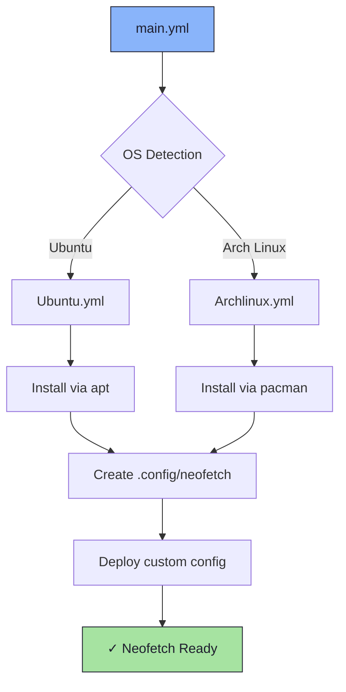

# 🖼️ Neofetch Role

A sleek Ansible role for installing and configuring [Neofetch](https://github.com/dylanaraps/neofetch) - the command-line system information tool that displays your system specs in a visually appealing format alongside your distro's ASCII logo.

## 📋 Overview

This role automates the installation of Neofetch and deploys a custom configuration featuring a beautifully formatted system information display with:
- Live weather information
- Organized sections for Software, Hardware, and Uptime
- Custom color schemes using box-drawing characters
- Optimized info display for developer workflows

## 🎯 Features

- **Cross-platform Support**: Automatic OS detection and installation
- **Custom Configuration**: Pre-configured with an enhanced layout
- **Weather Integration**: Real-time weather data from wttr.in
- **Clean Typography**: Box-drawing characters for visual hierarchy
- **Network Info**: Local IP address display
- **Comprehensive Stats**: CPU, GPU, memory, disk, and package information

## 🖥️ Supported Platforms

| Platform | Status | Package Manager |
|----------|--------|-----------------|
| Ubuntu   | ✅     | apt             |
| Arch Linux | ✅   | pacman          |

## 📦 What Gets Installed

### Packages
- `neofetch` - System information display tool

### Configuration Files
- `~/.config/neofetch/config` - Custom neofetch configuration with enhanced layout

## 🏗️ Role Architecture



## 🎨 Custom Configuration Highlights

The deployed configuration includes:

### Enhanced Layout
```
╭──────────── Software ────────────
│ OS: Ubuntu 22.04
│ Kernel: 5.15.0
│ Packages: 1842 (dpkg), 23 (snap)
│ Shell: zsh 5.8.1
├──────────── Hardware ────────────
│ Host: ThinkPad X1 Carbon
│ CPU: Intel i7-1165G7 (8) @ 4.7GHz
│ GPU: Intel TigerLake-LP GT2
│ Memory: 8192MiB / 16384MiB
├───────────── Uptime ─────────────
│ 3 days, 14 hours, 27 mins
╰──────────────────────────────────
```

### Live Weather
Displays current weather conditions for your location via `wttr.in` API integration.

### Information Display
- **Software Section**: OS, kernel, packages, shell, DE, terminal, local IP
- **Hardware Section**: Host model, CPU, GPU, memory, disk usage
- **Uptime Section**: System uptime tracking

## 🔧 Configuration Options

The role configures neofetch with these optimizations:

```bash
# Performance
kernel_shorthand="on"           # Short kernel version
distro_shorthand="on"           # Short distro name
shell_version="on"              # Show shell version

# Display
cpu_speed="on"                  # Show CPU frequency
cpu_cores="logical"             # Display logical cores
refresh_rate="on"               # Show monitor refresh rate
disk_percent="on"               # Show disk usage percentage

# Visual
colors=(distro)                 # Use distro color scheme
underline_char="¨"              # Custom underline character
separator="›"                   # Custom info separator
```

## 📚 Dependencies

No role dependencies - this is a standalone role.

**System Requirements**:
- `curl` (for weather information)
- Internet connection (for initial weather fetch)

## 🚀 Usage

### Install Neofetch
```bash
# Run the role
dotfiles -t neofetch

# Or via ansible-playbook
ansible-playbook main.yml -t neofetch
```

### Run Neofetch
```bash
# Display system information
neofetch

# Save output to file
neofetch > system-info.txt

# Custom configuration location
neofetch --config /path/to/custom/config
```

### Customize Configuration
Edit the deployed config:
```bash
vim ~/.config/neofetch/config
```

## 🎭 Example Output

The custom configuration produces output like this:

```
      ___     username@hostname
     (.. |    ¨¨¨¨¨¨¨¨¨¨¨¨¨¨¨¨¨¨
     (<> |    Weather › Lincoln: ☀️  +72°F
    / __  \   ╭──────────── Software ────────────
   ( /  \ /|  │ OS › Ubuntu 22.04.3 LTS x86_64
  _/\ __)/_)  │ Kernel › 5.15.0-82-generic
  \/-____\/   │ Packages › 1842 (dpkg), 23 (snap)
              │ Shell › zsh 5.8.1
              │ DE › GNOME 42.5
              │ Terminal › kitty
              │ Local IP › 192.168.1.100
              ├──────────── Hardware ────────────
              │ Host › ThinkPad X1 Carbon Gen 9
              │ CPU › Intel i7-1165G7 (8) @ 4.700GHz
              │ GPU › Intel TigerLake-LP GT2
              │ Memory › 8192MiB / 16384MiB
              │ Disk (/) › 245G / 512G (48%)
              ├───────────── Uptime ─────────────
              │ 3 days, 14 hours, 27 mins
              ╰──────────────────────────────────

              [Color blocks display]
```

## 🔗 Resources

- **Official Repository**: [dylanaraps/neofetch](https://github.com/dylanaraps/neofetch)
- **Customization Wiki**: [Neofetch Customization](https://github.com/dylanaraps/neofetch/wiki/Customizing-Info)
- **Theme Source**: [Chick2D/neofetch-themes](https://github.com/Chick2D/neofetch-themes)
- **Original Theme Author**: [tralph3](https://github.com/tralph3)
- **Weather API**: [wttr.in](https://wttr.in)

## 🎨 Theme Credits

The custom configuration is based on a community theme by [tralph3](https://github.com/tralph3) from the [neofetch-themes](https://github.com/Chick2D/neofetch-themes/) repository, modified for this dotfiles setup.

## 📝 Notes

- **Weather Location**: The config is set to display weather for Lincoln. Edit line 10 in the config to change location.
- **Color Coordination**: Colors are coordinated with `.zshrc` for a cohesive terminal experience.
- **Network Requirement**: Weather information requires an active internet connection.
- **ASCII Logo**: Automatically detects and displays your distribution's ASCII logo.

## 🛠️ Customization

Common customizations you might want to make:

```bash
# Change weather location (edit config line 10)
prin "Weather" "$(curl https://wttr.in/your-city?format=4)"

# Add more info fields
info "Resolution" resolution
info "WM" wm
info "Battery" battery

# Change color scheme
colors=(4 6 1 8 8 6)  # Custom color palette

# Modify separators and borders
separator=":"
underline_char="-"
```

## 🤝 Integration

Neofetch pairs well with:
- **Terminal emulators**: kitty, alacritty, wezterm
- **Shell configs**: zsh, bash with custom prompts
- **Window managers**: i3, awesome, sway
- **Login managers**: Display on shell startup via `.zshrc` or `.bashrc`

Add to your shell config for display on terminal launch:
```bash
# In .zshrc or .bashrc
neofetch
```
