# 🚀 Neovim Role

A comprehensive Ansible role that transforms Neovim into a modern, feature-rich IDE with AI integration, LSP support, and intelligent cross-platform installation.

## Overview

This role provides a battle-tested Neovim configuration optimized for software development across multiple languages and platforms. It features automatic plugin management via [lazy.nvim](https://github.com/folke/lazy.nvim), complete LSP integration with [Mason](https://github.com/williamboman/mason.nvim), and AI-powered assistance through GitHub Copilot and Claude Code integration.

**Key Highlights:**
- 🎯 **35+ curated plugins** for development productivity
- 🔧 **LSP integration** with 15+ pre-configured language servers
- 🤖 **AI assistance** via Copilot and Claude Code (Avante)
- 🎨 **Modern UI** with Telescope, Neo-tree, and custom statusline
- 📦 **Automatic fallback** installation when sudo is unavailable
- 🔄 **Idempotent** and fully reversible with clean uninstall

## Supported Platforms

| Platform | Installation Method | Notes |
|----------|-------------------|-------|
| **macOS** | Homebrew | Installs latest stable version |
| **Ubuntu/Debian** | APT (unstable PPA) | Falls back to AppImage without sudo |
| **Fedora/RHEL** | DNF | Falls back to AppImage without sudo |
| **Arch Linux** | AUR | Installs `neovim-git` (nightly) |

## What Gets Installed

### Core Components

**Neovim Binary:**
- System-wide installation when sudo is available
- User-local AppImage installation (`~/.local/bin/nvim`) when sudo is unavailable
- Automatic vim symlink for compatibility

**Dependencies:**
- `cmake`, `curl`, `pkg-config`, `libtool`, `unzip`
- `ripgrep` (essential for Telescope fuzzy finding)
- `ansible-lint` (for Ansible development)

**LSP Servers** (auto-installed via Mason):
```
gopls, ansiblels, bashls, dockerls, jsonls,
terraformls, lua_ls, yamlls, pylsp, and more
```

### Configuration Structure

The role symlinks `~/.config/nvim` to the role's `files/` directory:

```
~/.config/nvim/
├── init.lua                    # Entry point with lazy.nvim bootstrap
├── lazy-lock.json             # Plugin version lockfile
└── lua/
    ├── plugins/               # 35+ plugin configurations
    │   ├── lsp.lua           # LSP, Mason, and completion
    │   ├── telescope.lua     # Fuzzy finder
    │   ├── treesitter.lua    # Syntax highlighting
    │   ├── avante.lua        # Claude Code integration
    │   ├── copilot.lua       # GitHub Copilot
    │   ├── neo-tree.lua      # File explorer
    │   └── ...
    └── techdufus/            # Core configuration
        └── core/
            ├── options.lua   # Editor settings
            ├── keymaps.lua   # Key bindings
            ├── icons.lua     # UI icons
            └── utils.lua     # Helper functions
```

## Installation Flow

```mermaid
graph TD
    A[Start Installation] --> B{Check if nvim exists}
    B -->|Exists| C[Skip installation]
    B -->|Not found| D{Has sudo access?}

    D -->|Yes| E[System Installation]
    E --> E1[Install dependencies<br/>via package manager]
    E --> E2[Install neovim<br/>via package manager]
    E --> F[Configure]

    D -->|No| G[User-Local Installation]
    G --> G1[Create ~/.local directories]
    G --> G2[Fetch latest release<br/>from GitHub API]
    G --> G3[Download AppImage<br/>to ~/.local/bin/nvim]
    G --> G4[Install ripgrep<br/>to ~/.local/bin]
    G --> F

    F --> H[Backup existing config<br/>if not a symlink]
    H --> I[Create symlink<br/>~/.config/nvim → role/files]
    I --> J[Complete]

    C --> F
```



## Key Features

### 🔌 Plugin Management
- **lazy.nvim** for efficient lazy-loading
- Plugins load on-demand (events, commands, filetypes)
- Version locking with `lazy-lock.json`
- Automatic installation and updates

### 🧠 Language Server Protocol (LSP)
- **Mason** for automatic LSP server management
- Pre-configured servers for 15+ languages
- Consistent keybindings across all LSP servers:
  - `gd` - Go to definition
  - `gr` - Show references (Telescope)
  - `K` - Hover documentation
  - `<Leader>ca` - Code actions
  - `<Leader>rn` - Rename symbol
  - `<Leader>f` - Format document

### 🔍 Fuzzy Finding (Telescope)
- Project-wide file search
- Live grep with ripgrep
- LSP symbol search
- Git integration
- Buffer navigation

### 🤖 AI Integration
- **GitHub Copilot**: AI-powered code completion
- **Avante (Claude Code)**: Advanced AI pair programming with Claude
- Context-aware suggestions
- Multi-language support

### 🎨 Modern UI
- **Catppuccin** color scheme with transparency
- Custom statusline with Git integration
- **Neo-tree** file explorer with Git status
- **Oil.nvim** for directory editing
- **Noice** for enhanced UI elements

### 🔧 Developer Tools
- **LazyGit** integration (`<Leader>gg`)
- **Gitsigns** for inline Git blame and hunks
- **Git Worktree** support for multi-branch workflows
- **ToggleTerm** for integrated terminal
- **Harpoon** for quick file navigation
- **Treesitter** for advanced syntax highlighting

### ⚡ Performance
- Lazy loading for all plugins
- Disabled built-in plugins (netrw, gzip, etc.)
- Optimized startup time
- Profile with `:Lazy profile`

## Configuration Modes

The configuration supports two display modes via `ConfigMode` in `lua/techdufus/init.lua`:

**Rich Mode (Default):**
```lua
ConfigMode = "rich"  -- Nerd Fonts, true color, transparency
```

**Simple Mode:**
```lua
ConfigMode = "simple"  -- 8-color terminals, minimal UI
```

## Core Settings

### Editor Options
- **Indentation**: 2 spaces, smart indent
- **Line numbers**: Relative + absolute
- **Search**: Smart case-insensitive
- **Font**: Berkeley Mono Nerd Font
- **Column guide**: 90 characters
- **Clipboard**: System clipboard integration
- **Persistent undo**: Enabled

### Key Bindings
- **Leader key**: `<Space>`
- **Window navigation**: `<C-hjkl>` (Tmux-aware)
- **Buffer switching**: `<S-h>`, `<S-l>`
- **Quick files**: `<Leader>a` (add), `<Leader>e` (menu) via Harpoon
- **Fuzzy find**: `<Leader>fs` (files), `<Leader>gs` (grep)
- **Git**: `<Leader>gg` (LazyGit)

## Usage

### Install the role
```bash
# Install with all other roles
dotfiles

# Install only neovim role
dotfiles -t neovim

# Test without applying changes
dotfiles -t neovim --check
```

### First Launch
On first launch, Neovim will:
1. Auto-install lazy.nvim plugin manager
2. Download and install all 35+ plugins
3. Install LSP servers via Mason
4. Download Treesitter parsers

This may take 1-2 minutes. Subsequent launches are near-instant.

### Common Commands
```vim
:Lazy              " Plugin manager UI
:Mason             " LSP server manager
:checkhealth       " Verify installation
:LspInfo           " Check LSP server status
:Telescope         " Fuzzy finder menu
```

### Update Plugins
```vim
:Lazy sync         " Update all plugins
:Mason             " Update LSP servers
```

## Dependencies

### External Tools (Required)
- **ripgrep**: Essential for Telescope searching
- **fd**: Optional but recommended for faster file finding
- **git**: Required for plugin management

### Optional Dependencies
- **lazygit**: For visual Git workflows
- **nerd font**: For icon display (Berkeley Mono recommended)
- **true color terminal**: For best visual experience

## Troubleshooting

### Plugin Not Loading
1. Check status: `:Lazy`
2. Verify lazy loading config (event, cmd, ft)
3. Manually sync: `:Lazy sync`

### LSP Server Issues
1. Check installation: `:Mason`
2. Verify server status: `:LspInfo`
3. Reinstall server via `:Mason`

### Performance Issues
1. Profile startup: `:Lazy profile`
2. Check for synchronous loading
3. Review autocommands: `:autocmd`

### AppImage Installation (Linux)
If using user-local installation:
- Ensure `~/.local/bin` is in your `$PATH`
- Verify executable: `chmod +x ~/.local/bin/nvim`

## Uninstallation

The role includes a clean uninstall script:

```bash
~/.dotfiles/roles/neovim/uninstall.sh
```

This will:
1. Remove configuration symlink (with backup if modified)
2. Clean data directories (`~/.local/share/nvim`, `~/.cache/nvim`)
3. Optionally remove Neovim binary itself

## Customization

### Add a Plugin
Create a new file in `files/lua/plugins/<plugin-name>.lua`:

```lua
return {
  "author/plugin-name",
  event = "VeryLazy",  -- Lazy loading trigger
  config = function()
    require("plugin-name").setup({
      -- Configuration here
    })
  end,
}
```

### Add an LSP Server
Edit `files/lua/plugins/lsp.lua` and add to `ensure_installed`:

```lua
ensure_installed = {
  'new_server',  -- Add your server
  -- ...
}
```

### Modify Keybindings
Edit `files/lua/techdufus/core/keymaps.lua` for core mappings, or plugin-specific files for plugin keymaps.

### Change Color Scheme
Edit `files/lua/plugins/color_scheme.lua` to configure Catppuccin or add a new theme.

## Architecture Notes

### Symlink Strategy
The role symlinks the entire `~/.config/nvim` directory to `roles/neovim/files/`. This means:
- Configuration stays in version control
- Updates automatically sync
- Easy to modify and test changes
- Clean separation from user modifications

### Backup Strategy
Existing configurations are automatically backed up with timestamps:
```
~/.config/nvim.backup-<epoch>
```

### Platform Detection
The role uses Ansible's standard OS detection pattern:
1. Check for OS-specific task file
2. Execute OS-appropriate installation
3. Fall back gracefully when tools are unavailable

## Links

- [Neovim](https://neovim.io/)
- [lazy.nvim](https://github.com/folke/lazy.nvim)
- [Mason](https://github.com/williamboman/mason.nvim)
- [Telescope](https://github.com/nvim-telescope/telescope.nvim)
- [Catppuccin](https://github.com/catppuccin/nvim)
- [Avante (Claude Code)](https://github.com/yetone/avante.nvim)

---

**Part of the [dotfiles](../../) Ansible automation suite.**
