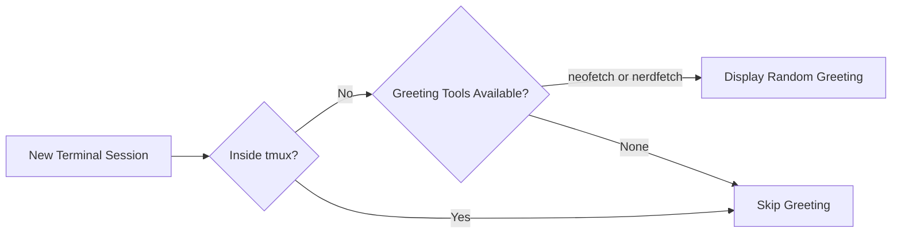

# 🎨 NerdFetch

A minimal, POSIX-compatible system information fetch tool that displays system details with beautiful Nerd Font icons.

## Overview

This Ansible role installs [NerdFetch](https://github.com/ThatOneCalculator/NerdFetch), a lightweight alternative to Neofetch that uses Nerd Fonts for eye-catching ASCII art and system information display. Perfect for adding visual flair to your terminal sessions.

## Supported Platforms

| Platform | Status |
|----------|--------|
| macOS    | ✅ Supported |
| Ubuntu   | ❌ Not configured |
| Fedora   | ❌ Not configured |
| Arch     | ❌ Not configured |

## What Gets Installed

### Package Installation

- **macOS**: Installs via Homebrew (`brew install nerdfetch`)

### Configuration

This role performs a minimal installation with no additional configuration files. NerdFetch works out-of-the-box with sensible defaults.

## Dependencies

### Required

- **Nerd Fonts**: For proper icon display, ensure you have a [Nerd Font](https://www.nerdfonts.com/) installed and configured in your terminal.

### Optional

- **bash role**: The bash role integrates NerdFetch as a greeting display option in new terminal sessions.

## Features

- **Minimal and Fast**: Lightweight script with minimal system overhead
- **Beautiful Output**: Uses Nerd Font icons for visually appealing system information
- **POSIX Compatible**: Works across different Unix-like systems
- **Distro Agnostic**: Designed to work regardless of your distribution
- **Neofetch Alternative**: Modern replacement for the discontinued Neofetch tool

## Integration

NerdFetch is automatically integrated with the bash role as a terminal greeting option. When opening a new terminal (outside tmux), the bash configuration will randomly display either `neofetch` or `nerdfetch`.



## Usage

After installation, simply run:

```bash
nerdfetch
```

This will display your system information with beautiful Nerd Font icons.

## Example Output

NerdFetch displays essential system information including:
- Operating System
- Kernel Version
- Uptime
- Shell
- Desktop Environment / Window Manager
- Terminal
- CPU
- Memory

All formatted with Nerd Font icons for a clean, minimal aesthetic.

## Resources

- [Official NerdFetch Repository](https://github.com/ThatOneCalculator/NerdFetch)
- [NerdFetch-rs (Rust rewrite)](https://github.com/minomy13/nerdfetch-rs)
- [Nerd Fonts Download](https://www.nerdfonts.com/)
- [Neofetch Alternatives Guide](https://itsfoss.com/neofetch-alternatives/)

## Notes

- **Requires Nerd Fonts**: For proper display, ensure your terminal uses a Nerd Font
- **macOS Only (Currently)**: This role only supports macOS via Homebrew. Linux support can be added by creating OS-specific task files.
- **Lightweight Alternative**: NerdFetch is significantly faster than feature-rich alternatives like Neofetch
