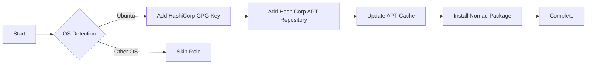

# 🚀 Nomad

> HashiCorp Nomad workload orchestrator installation role

This Ansible role installs [HashiCorp Nomad](https://www.nomadproject.io/), a flexible workload orchestrator for deploying and managing containers and non-containerized applications across on-prem and cloud environments at scale.

## 📋 Overview

Nomad is a simple and flexible scheduler and orchestrator to deploy and manage containers and non-containerized applications at scale. This role automates the installation of Nomad using the official HashiCorp APT repository.

## 🖥️ Supported Platforms

- ✅ **Ubuntu** (all releases)

## 📦 What Gets Installed

### Packages
- **nomad** - HashiCorp Nomad binary from official repository

### Repository Configuration
- HashiCorp GPG signing key
- Official HashiCorp APT repository for your Ubuntu release

## 🔧 Installation Flow



## 🎯 Features

- **Official Repository**: Installs from HashiCorp's official APT repository
- **Secure Installation**: Uses GPG-signed packages with keyring verification
- **Distribution Aware**: Automatically configures repository for your Ubuntu release
- **Idempotent**: Safe to run multiple times without side effects

## 🔗 Dependencies

None - this is a standalone role.

## 📚 Usage

### Install via dotfiles

```bash
# Install Nomad along with all other roles
dotfiles

# Install only Nomad
dotfiles -t nomad
```

### Verify Installation

```bash
# Check Nomad version
nomad version

# View Nomad help
nomad --help
```

## 📖 Official Documentation

- [Nomad Project Homepage](https://www.nomadproject.io/)
- [Nomad Documentation](https://www.nomadproject.io/docs)
- [Nomad Tutorials](https://learn.hashicorp.com/nomad)
- [Nomad GitHub Repository](https://github.com/hashicorp/nomad)

## 🔐 Security Note

This role uses the official HashiCorp GPG key and repository. The GPG key is stored in `/usr/share/keyrings/hashicorp-archive-keyring.gpg` for secure package verification.

## 📝 Notes

- This role requires `become: true` (sudo privileges) for system package installation
- After installation, you may want to configure Nomad agents (server/client) separately
- No default configuration files are deployed - Nomad must be configured post-installation
- The role only handles installation; service management and configuration are separate concerns

## 🛠️ Next Steps

After installation, refer to the [official Nomad documentation](https://www.nomadproject.io/docs) for:
- Configuring Nomad agents (server/client mode)
- Setting up clustering
- Deploying your first job
- Integrating with Consul and Vault
