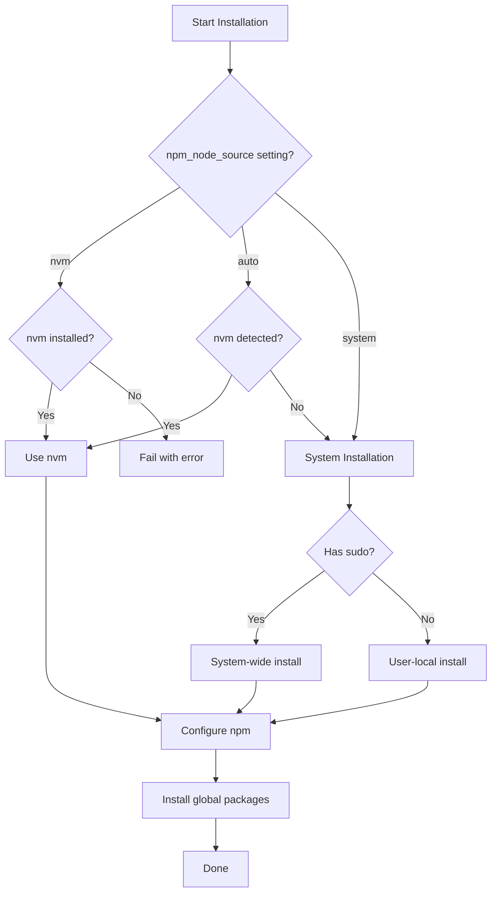

# NPM Package Manager

> Intelligent Node.js and npm installation with flexible deployment strategies across all platforms

## Overview

This role provides a sophisticated npm/Node.js installation system that adapts to your environment. It automatically detects available installation methods and chooses the optimal approach, supporting nvm-managed installations, system package managers, and user-local installations without sudo.

## Supported Platforms

| Platform | Installation Methods | Package Manager |
|----------|---------------------|----------------|
| macOS | nvm, Homebrew | `brew` |
| Ubuntu/Debian | nvm, system-wide, user-local | apt/nala |
| Fedora/RHEL | nvm, dnf, user-local | `dnf` |
| Arch Linux | nvm, pacman, user-local | `pacman` |

## Installation Methods

The role intelligently selects the installation method based on your environment:



## What Gets Installed

### Node.js & npm
- **Latest LTS Version** (when installing manually)
- **npm** updated to latest stable release
- **Architecture Support**: x64, arm64

### Global Packages
Default global packages installed for all systems:

- **yarn** - Alternative package manager
- **pnpm** - Fast, disk space efficient package manager
- **npm-check-updates** - Check for outdated dependencies
- **serve** - Static file server
- **npm** - Updated to latest version

You can extend this list in `group_vars/all.yml`:
```yaml
npm_extra_packages:
  - typescript
  - eslint
  - prettier
```

## What Gets Configured

### Configuration Files

#### `~/.npmrc`
Generated from template with intelligent defaults:
- User-local prefix (when not using sudo/nvm)
- Author name from git configuration
- Custom npm settings (init-license, save-exact)

Example configuration:
```ini
# NPM Configuration
prefix=/home/user/.npm-global  # Only for user-local installs
init-author-name=Your Name
init-license=MIT
save-exact=true
```

### Directory Structure

For user-local installations (no sudo):
```
~/.local/
├── bin/          # Node.js binaries
└── lib/          # Node.js libraries

~/.npm-global/    # Global npm packages
└── bin/          # Package binaries
```

## Configuration Variables

### defaults/main.yml

```yaml
# Global packages to install
npm_global_packages:
  - yarn
  - pnpm
  - npm-check-updates
  - serve
  - npm

# Update npm to latest version
npm_update_npm: true

# NPM configuration
npm_config:
  init-license: "MIT"
  save-exact: "true"

# Node.js source preference
npm_node_source: "auto"  # Options: auto, nvm, system
```

### Installation Strategy

The `npm_node_source` variable controls installation preference:

- **auto** (default): Use nvm if detected, otherwise system/user-local
- **nvm**: Require nvm (fail if not installed)
- **system**: Never use nvm, prefer system package manager

## Key Features

### Intelligent Installation Detection
- Automatically detects nvm installation
- Falls back to system package managers
- Supports user-local installation without sudo privileges
- Architecture-aware (x64, arm64)

### Version Management
- Always installs latest LTS Node.js version
- Updates npm to latest stable release
- Checks current vs. latest versions before installing

### Flexible Package Management
Supports three installation modes:
1. **nvm-managed**: Full control via nvm
2. **System-wide**: Using OS package managers (requires sudo)
3. **User-local**: Installs to `~/.local` without sudo

### Configuration Management
- Templated `.npmrc` for consistent settings
- Per-user customization support
- Git integration for author information

### Idempotent Operations
- Checks installed packages before installation
- Version comparison to avoid unnecessary updates
- Safe re-runs without side effects

## Dependencies

### Required
- `curl` (for downloading Node.js)
- `jq` (for JSON parsing)
- `tar` (for extracting archives)

### Optional
- **nvm** (for version management)
- **git role** (for author name in `.npmrc`)

## Usage Examples

### Basic Installation
```bash
# Install with default settings
dotfiles -t npm
```

### Install with nvm Required
```yaml
# In group_vars/all.yml
npm_node_source: "nvm"
```

### Add Custom Global Packages
```yaml
# In group_vars/all.yml
npm_extra_packages:
  - typescript
  - eslint
  - prettier
  - nodemon
```

### User-Local Installation Notes

When installed without sudo, you'll need to update your PATH:
```bash
# Add to ~/.zshrc or ~/.bashrc
export PATH="${HOME}/.local/bin:${HOME}/.npm-global/bin:${PATH}"
```

**Note**: This is automatically configured if using the `zsh` role from this dotfiles repository.

## Platform-Specific Behavior

### macOS
- Prefers nvm if available
- Falls back to Homebrew installation
- Installs via `brew install node`

### Ubuntu/Debian
- Supports nvm, system-wide, and user-local
- Downloads from official Node.js distribution
- Extracts to `/usr/local` (sudo) or `~/.local` (user)

### Fedora/RHEL
- Attempts `dnf install nodejs npm` first
- Falls back to manual installation if unavailable
- Supports user-local installation

### Arch Linux
- Uses `pacman` for system-wide installation
- Installs both `nodejs` and `npm` packages
- Supports user-local fallback

## Updating Packages

This role includes an update playbook for maintaining packages:

```bash
# Update npm and all global packages
ansible-playbook main.yml -t npm --tags update
```

The update process:
1. Updates npm itself to latest
2. Lists outdated global packages
3. Updates all global packages
4. Runs npm-check-updates to show major version updates

## Uninstallation

```bash
# Run the uninstall script
~/.dotfiles/roles/npm/uninstall.sh
```

The uninstall process:
- Prompts before removing global packages
- Removes `~/.npmrc` configuration
- Cleans npm cache (`~/.npm`)
- Preserves Node.js/npm binaries (may be nvm-managed)

## Troubleshooting

### Permission Errors

If you encounter permission errors when installing global packages:

**With sudo access:**
```bash
# Switch to system installation
npm_node_source: "system"
```

**Without sudo access:**
```bash
# Ensure PATH includes local bin directories
export PATH="${HOME}/.local/bin:${HOME}/.npm-global/bin:${PATH}"
```

### nvm Not Detected

If you have nvm but it's not being detected:

```bash
# Force nvm usage
npm_node_source: "nvm"
```

### Version Conflicts

If experiencing version conflicts between system and user installations:

```bash
# Check which node is being used
which node
node --version

# Check which npm is being used
which npm
npm --version
```

## Advanced Configuration

### Custom npm Registry
```yaml
# In group_vars/all.yml
npm_config:
  registry: "https://registry.custom.com/"
  init-license: "MIT"
  save-exact: "true"
```

### Per-Platform Package Lists
```yaml
# Platform-specific packages
npm_extra_packages_macos:
  - ios-deploy

npm_extra_packages_linux:
  - node-gyp
```

## Related Roles

- **nvm** - Node Version Manager (recommended for developers)
- **git** - Provides author information for `.npmrc`
- **zsh** - Automatically configures PATH for user-local installations

## Official Documentation

- [Node.js Official Site](https://nodejs.org/)
- [npm Documentation](https://docs.npmjs.com/)
- [nvm GitHub Repository](https://github.com/nvm-sh/nvm)
- [yarn Package Manager](https://yarnpkg.com/)
- [pnpm Package Manager](https://pnpm.io/)
