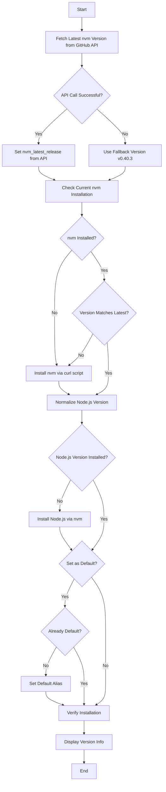

# 🟢 NVM (Node Version Manager)

An Ansible role that installs and configures [nvm](https://github.com/nvm-sh/nvm) - a version manager for Node.js that allows you to easily install, manage, and switch between multiple Node.js versions.

## Overview

This role automates the installation of nvm from the official repository, installs a specified Node.js version (defaulting to latest LTS), and optionally sets it as the default version. It features intelligent version detection, GitHub API integration for always fetching the latest nvm release, and comprehensive error handling with fallback mechanisms.

## Supported Platforms

- ✅ **macOS** (all versions)
- ✅ **Ubuntu** (all versions)
- ✅ **Fedora** (all versions)
- ✅ **Arch Linux** (all versions)
- ✅ **Any Linux distribution** with bash and curl

> **Note:** This role is platform-agnostic and does not use OS-specific task files, making it universally compatible with any Unix-like system.

## What Gets Installed

### Core Installation
- **nvm** (latest release from GitHub)
  - Installed to: `~/.nvm/`
  - Automatically fetches the latest version via GitHub API
  - Falls back to `v0.40.3` if API is unavailable

### Node.js Installation
- **Node.js** (configurable version, defaults to latest LTS)
  - Installed via nvm
  - Version options:
    - `lts/*` - Latest LTS version (default)
    - `node` - Latest stable version
    - Specific version (e.g., `20.11.0`, `18.19.0`)

- **npm** (bundled with Node.js)

## What Gets Configured

### Environment Setup
- nvm initialization scripts added to `~/.nvm/nvm.sh`
- Bash completion support via `~/.nvm/bash_completion`

### Default Node Version
- Sets specified Node.js version as the system default (configurable)
- Creates nvm alias `default` pointing to the installed version

## Configuration Variables

Variables can be customized in your playbook or `group_vars/all.yml`:

```yaml
# Fallback version to use when GitHub API is unavailable
nvm_fallback_version: "v0.40.3"

# Node.js version to install and set as default
# Options: "lts/*" for latest LTS, "node" for latest, or specific version
nvm_node_version: "lts/*"

# Whether to set the installed version as default
nvm_set_default: true
```

## Key Features

### 🔄 Intelligent Version Management
- Fetches latest nvm version automatically from GitHub API
- Compares current installation with latest release
- Only updates when newer version is available
- Handles API rate limiting gracefully with fallback version

### 🛡️ Robust Error Handling
- Checks for existing installations before proceeding
- Verifies API responses before using data
- Provides detailed error messages for troubleshooting
- Works in Ansible check mode with fallback mechanisms

### 📊 Version Normalization
- Automatically resolves `lts/*` to actual version numbers
- Prevents duplicate installations of the same version
- Validates Node.js installation before marking complete

### 🔍 Post-Installation Verification
- Confirms nvm, Node.js, and npm are properly installed
- Displays version information for all installed tools
- Reports whether any changes were made during execution

## Installation Flow



## Usage Examples

### Using in a Playbook

```yaml
- hosts: localhost
  roles:
    - nvm
```

### Installing Specific Node.js Version

```yaml
- hosts: localhost
  roles:
    - role: nvm
      vars:
        nvm_node_version: "20.11.0"
        nvm_set_default: true
```

### Installing Latest Stable (Not LTS)

```yaml
- hosts: localhost
  roles:
    - role: nvm
      vars:
        nvm_node_version: "node"
```

### Updating to Latest Versions

The role includes an update task file for upgrading both nvm and Node.js:

```bash
# Via dotfiles wrapper
dotfiles -t nvm

# Via ansible-playbook
ansible-playbook main.yml -t nvm
```

## Uninstallation

The role includes a comprehensive uninstall script:

```bash
# Run the uninstall script
~/.dotfiles/roles/nvm/uninstall.sh
```

The script performs:
- Unloads nvm from current shell session
- Removes `~/.nvm` directory and all installed Node versions
- Cleans up shell configuration files (`.bashrc`, `.zshrc`, `.profile`)
- Removes nvm initialization lines
- Provides feedback about removed components

## Dependencies

- **curl** - Required for downloading nvm installation script
- **bash** - Required for running nvm commands
- **git** - Required for nvm version management (installed by nvm)

> **Note:** This role does not depend on other Ansible roles in this dotfiles repository.

## Verification

After installation, verify the setup:

```bash
# Check nvm version
nvm --version

# Check Node.js version
node --version

# Check npm version
npm --version

# List installed Node.js versions
nvm ls

# List available remote versions
nvm ls-remote
```

## Common Use Cases

### Installing Multiple Node Versions

```bash
# Install Node 18 LTS
nvm install 18

# Install Node 20 LTS
nvm install 20

# Switch to Node 18
nvm use 18

# Switch to Node 20
nvm use 20

# Set Node 20 as default
nvm alias default 20
```

### Migrating npm Packages

```bash
# Install new version with packages from current version
nvm install 20 --reinstall-packages-from=18
```

## Idempotency

This role is fully idempotent:
- Skips installation if nvm is already at the latest version
- Avoids reinstalling Node.js if the version already exists
- Only sets default alias if it differs from current default
- Uses `creates:` parameter to prevent unnecessary operations

## Links

- [nvm Official Repository](https://github.com/nvm-sh/nvm)
- [nvm Documentation](https://github.com/nvm-sh/nvm#readme)
- [Node.js Official Website](https://nodejs.org/)
- [Node.js Release Schedule](https://nodejs.org/en/about/previous-releases)
