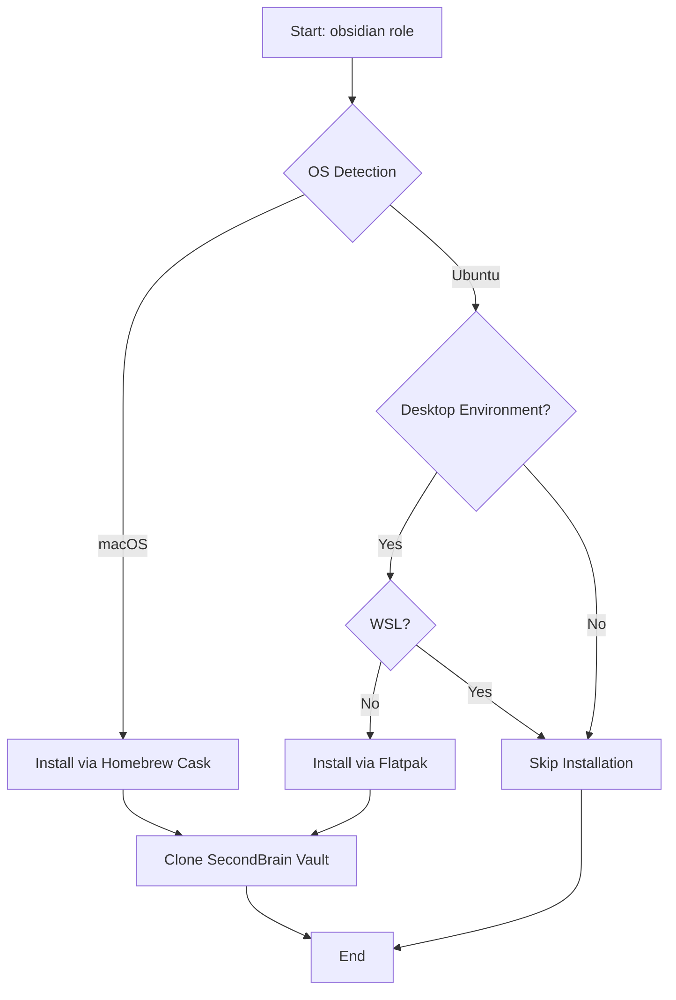

# 🧠 Obsidian

> Ansible role for installing and configuring Obsidian - the powerful knowledge base and note-taking application built on local Markdown files.

## Overview

This role automates the installation of [Obsidian](https://obsidian.md/) across multiple platforms and optionally clones a personal knowledge vault from a Git repository. Obsidian is a powerful, extensible markdown editor perfect for personal knowledge management (PKM), note-taking, and building a "second brain."

## Supported Platforms

| Platform | Installation Method | Desktop Required |
|----------|---------------------|------------------|
| macOS    | Homebrew Cask       | No               |
| Ubuntu   | Flatpak             | Yes              |

**Notes:**
- Ubuntu installation only runs when a desktop environment is detected (checks `XDG_CURRENT_DESKTOP`)
- Ubuntu installation is skipped on WSL environments
- Flatpak must be available on Linux systems (handled by the `flatpak` role)

## What Gets Installed

### macOS
- **Obsidian.app** via Homebrew Cask
  - Package: `obsidian`
  - Latest stable version from Homebrew

### Ubuntu/Linux
- **Obsidian** via Flatpak
  - Package: `md.obsidian.Obsidian`
  - Sandboxed application from Flathub
  - Only installed if desktop environment is present

## Key Features

### 📦 Automated Installation
Platform-specific installation using native package managers for seamless integration.

### 🗄️ Vault Management
Automatically clones a personal Obsidian vault from a private Git repository:
- **Repository:** `git@github.com:techdufus/SecondBrain.git`
- **Destination:** `~/SecondBrain`
- **SSH Authentication:** Uses SSH keys for secure access
- **Idempotent:** Gracefully handles existing repositories

> **Note:** The git clone operation uses `failed_when: false` since it only needs to run once. Subsequent runs are harmless.

### 🔄 Backup Automation (Optional)
The role includes commented-out cron job configuration for automatic git synchronization:
- Pulls latest changes every minute
- Auto-commits all changes
- Pushes to remote repository
- Includes hostname in commit messages

> **⚠️ Currently Disabled:** Uncomment lines 20-25 in `Ubuntu.yml` to enable automatic backups.

## Installation Flow



## Dependencies

### Required Roles
- **flatpak** (Ubuntu only) - Must be run before this role on Linux systems

### System Requirements
- **macOS:** Homebrew must be installed
- **Ubuntu/Linux:**
  - Flatpak installed and configured
  - Desktop environment (GUI)
  - Not running in WSL

### Git Requirements
- SSH keys configured for GitHub access
- Repository must be accessible with current user's SSH credentials
- Git must be installed (typically handled by `git` role)

## Usage

### Install Obsidian Only
```bash
dotfiles -t obsidian
```

### Include in Full Dotfiles Setup
The role is typically included in your main playbook and will run automatically based on your role configuration.

## Configuration Variables

This role does not expose any user-configurable variables. The vault repository and destination are hardcoded:

- **Vault Repository:** `git@github.com:techdufus/SecondBrain.git`
- **Vault Location:** `~/SecondBrain`

To customize these values, edit the task files directly or consider adding variables to `defaults/main.yml`.

## Post-Installation

After installation:

1. **Launch Obsidian** from your Applications folder (macOS) or application menu (Linux)
2. **Open Vault:** Navigate to `~/SecondBrain` when prompted
3. **Configure Sync:** Set up Obsidian Sync or Git-based sync if desired
4. **Install Plugins:** Browse community plugins for extended functionality

## Customization Tips

### Enable Automatic Git Backups

Edit `roles/obsidian/tasks/Ubuntu.yml` and uncomment lines 20-25:

```yaml
- name: "Obsidian | Create Cron Job to Pull, Commit, and Push to Git"
  ansible.builtin.cron:
    name: "Git Pull, Commit, and Push"
    minute: "*"
    job: "cd {{ ansible_facts['user_dir'] }}/SecondBrain && git pull && git add -A && git commit -m 'Auto backup from $HOSTNAME' && git push"
  become: true
```

### Change Vault Repository

Modify the repository URL in both `MacOSX.yml` and `Ubuntu.yml`:

```yaml
- name: "Obsidian | Clone Obsidian Git Repo"
  ansible.builtin.git:
    repo: "git@github.com:YOUR_USERNAME/YOUR_VAULT.git"
    dest: "{{ ansible_facts['user_dir'] }}/YOUR_VAULT_NAME"
```

## Known Issues

- **Ubuntu:** Requires desktop environment detection - may not work on all DE configurations
- **WSL:** Installation is intentionally skipped (no GUI support)
- **Git Clone:** Always shows as "ok" rather than "changed" due to `failed_when: false`
- **Flatpak Dependency:** Must have flatpak role run first on Linux systems

## Official Documentation

- [Obsidian Website](https://obsidian.md/)
- [Obsidian Help](https://help.obsidian.md/)
- [Community Plugins](https://obsidian.md/plugins)
- [Obsidian Forum](https://forum.obsidian.md/)

## Related Roles

- `flatpak` - Required for Linux installation
- `git` - Required for vault cloning and SSH key management

---

**Part of:** [TechDufus/dotfiles](https://github.com/TechDufus/dotfiles)
