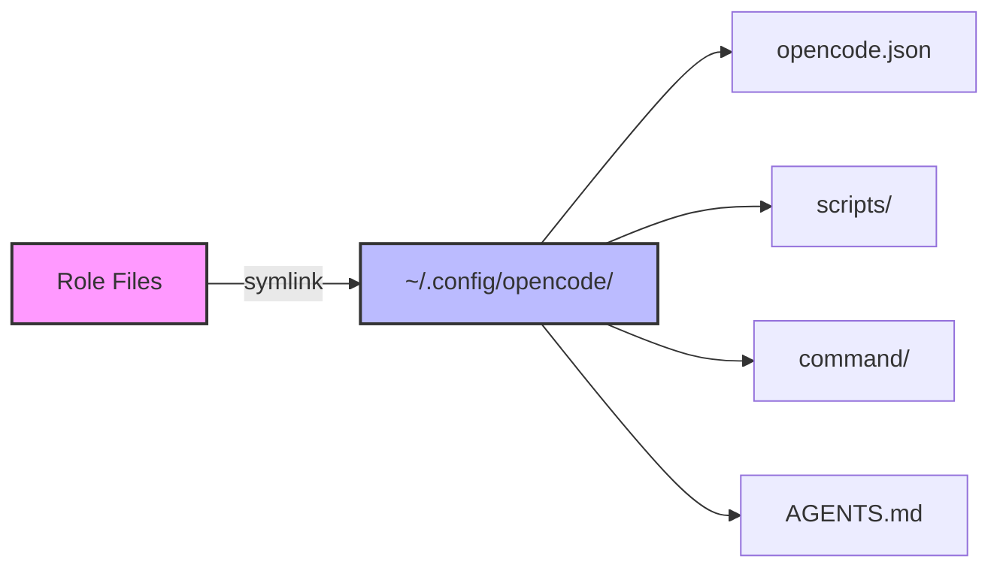
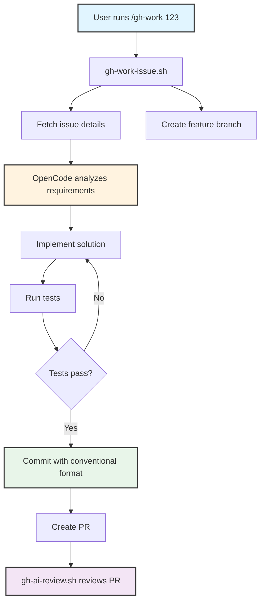

# 🤖 OpenCode Role

Ansible role for installing and configuring [OpenCode](https://opencode.ai) - an AI-powered terminal assistant that brings Claude to your command line with custom commands, scripts, and workflow automation.

## Overview

This role deploys OpenCode with a comprehensive configuration optimized for engineering workflows, including GitHub automation, conventional commits, and custom command templates for streamlined development processes.

## Supported Platforms

| Platform | Installation Method | Status |
|----------|-------------------|--------|
| macOS | Homebrew (`sst/tap/opencode`) | ✅ Supported |
| Ubuntu | npm / curl fallback | ✅ Supported |
| Fedora | - | ❌ Not supported |
| Arch | - | ❌ Not supported |

## What Gets Installed

### Packages
- **macOS**: `opencode` via Homebrew tap `sst/tap/opencode`
- **Ubuntu**: `opencode-ai` via npm (falls back to curl installer if npm unavailable)

### Configuration Files

The role creates symlinks from the repository to your home directory, maintaining version control over your configuration:



**Deployed Files:**
- `~/.config/opencode/opencode.json` - Main configuration with permissions, keybinds, and command templates
- `~/.config/opencode/scripts/` - GitHub workflow automation scripts
- `~/.config/opencode/command/` - Custom slash command markdown templates
- `~/.config/opencode/AGENTS.md` - Global agent behavior and engineering standards

## Key Features

### 🔒 Safety-First Permissions

The configuration includes granular bash permission controls:

```json
{
  "permission": {
    "bash": {
      "*": "allow",
      "sudo *": "ask",
      "git commit *": "ask",
      "git push *": "ask",
      "shutdown *": "deny",
      "rm -rf /": "deny"
    }
  }
}
```

### ⚡ GitHub Workflow Automation

Seven custom scripts for end-to-end GitHub issue management:

| Script | Purpose |
|--------|---------|
| `gh-work-issue.sh` | Start working on an issue (branch creation + setup) |
| `gh-create-issue.sh` | Create issues with optional parent linking |
| `gh-complete-fix.sh` | Complete fix workflow (commit + PR) |
| `gh-link-sub-issue.sh` | Link child issues to parent issues |
| `gh-ai-review.sh` | AI-powered PR code review |
| `gh-issue-hierarchy.sh` | Visualize issue hierarchies |
| `git-commit-helper.sh` | Conventional commit message validation |

### 📝 Custom Slash Commands

Built-in command templates accessible via `/command-name`:

- `/gh-work <issue#>` - Complete issue workflow (branch, implement, test, commit, PR)
- `/gh-issue <title>` - Create GitHub issue from context
- `/gh-review <pr>` - AI-powered code review with comprehensive analysis
- `/gh-link <parent> <child>` - Link related issues
- `/prp-init`, `/prp-build`, `/prp-execute` - Prompt-Response-Pattern workflow
- `/spec-init`, `/spec-implement` - SPARC methodology for specifications

### 🎯 Engineering Standards

The `AGENTS.md` file enforces:
- Staff-level technical discourse (no platitudes)
- Conventional commit format validation
- Clear communication standards (no fluff, active voice)
- Security-first mindset with pushback requirements

## Configuration Management

### Backup Strategy

Existing configurations are automatically backed up before symlink creation:

```yaml
# If opencode.json exists and is not a symlink
~/.config/opencode/opencode.json.backup  # Original preserved
~/.config/opencode/opencode.json        # Replaced with symlink
```

### Model Configuration

Default model set to Claude Sonnet 4.5:
```json
{
  "model": "anthropic/claude-sonnet-4-5",
  "autoupdate": true
}
```

### Keybindings

- `alt+enter` - Insert newline in input (multi-line prompts)

## Workflow Architecture



## Dependencies

### Required
- `gh` (GitHub CLI) - for GitHub integration scripts
- `git` - for version control operations

### Optional
- `npm` (Ubuntu) - preferred installation method, falls back to curl
- `jq` - for JSON parsing in scripts

## Installation

```bash
# Install via dotfiles playbook
dotfiles -t opencode

# Verify installation
opencode --version
```

## Usage Examples

### Working on an Issue

```bash
# Let OpenCode handle the entire workflow
/gh-work 42

# Specify custom branch name
/gh-work 15 feature/auth-system
```

### Creating Issues

```bash
# Create standalone issue from conversation context
/gh-issue Add dark mode support

# Create sub-issue linked to parent #10
/gh-issue 10 Implement toggle component
```

### Code Review

```bash
# Review a PR with AI assistance
/gh-review 123

# Review from different repo
/gh-review owner/repo#45
```

## File Structure

```
roles/opencode/
├── tasks/
│   ├── main.yml          # Symlink management, OS detection
│   ├── MacOSX.yml        # Homebrew installation
│   └── Ubuntu.yml        # npm/curl installation
├── files/
│   ├── opencode.json     # Main configuration
│   ├── AGENTS.md         # Engineering standards
│   ├── scripts/          # GitHub workflow scripts (7 files)
│   └── command/          # Slash command templates (16 files)
└── defaults/
    └── main.yml          # Role name variable
```

## Links

- [OpenCode Official Site](https://opencode.ai)
- [OpenCode GitHub](https://github.com/sst/opencode)
- [Claude API Documentation](https://docs.anthropic.com)
- [Conventional Commits](https://www.conventionalcommits.org)

## Notes

- Existing configs are preserved with `.backup` extension
- All symlinks are force-created to ensure version control
- Ubuntu installation prefers npm over curl for easier updates
- Scripts require GitHub CLI (`gh`) authentication
- Commit validation is enforced through git-commit-validator skill
