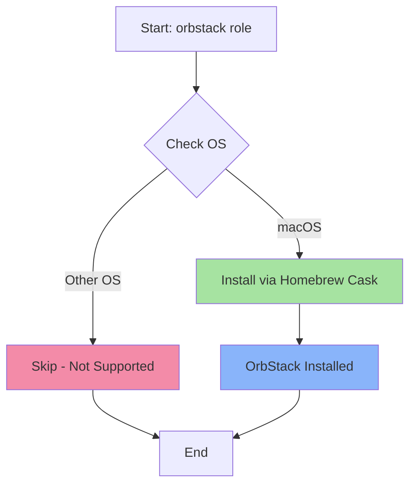

# 🚀 OrbStack

A lightweight, fast Docker Desktop alternative for macOS. OrbStack provides Docker containers and Linux machines with native macOS integration, using 50% less memory and starting 10x faster than traditional solutions.

## 📋 Overview

This Ansible role installs OrbStack on macOS systems via Homebrew Cask, providing a modern container and VM runtime optimized for Apple Silicon and Intel Macs.

## 🖥️ Supported Platforms

- ✅ **macOS** (Apple Silicon & Intel)

## 📦 What Gets Installed

### Packages
- **orbstack** - Installed via Homebrew Cask
  - Docker and Kubernetes runtime
  - Linux VM manager
  - Integrated CLI tools (`docker`, `docker-compose`, `kubectl`)

## ⚙️ Configuration

This role performs a minimal installation with no additional configuration:
- OrbStack is installed through Homebrew Cask
- No custom config files or symlinks
- Settings managed through OrbStack's native GUI/CLI

## 🔄 Role Workflow



## 🎯 Key Features

- **Minimal overhead**: Uses macOS native virtualization framework
- **Fast startup**: Containers and VMs boot in seconds
- **Rosetta support**: Run x86 containers on Apple Silicon
- **Native integration**: Seamless file sharing and networking
- **Drop-in replacement**: Compatible with Docker CLI and Docker Compose
- **Kubernetes included**: Built-in K8s cluster support

## 📚 Dependencies

### Required
- macOS operating system
- Homebrew package manager (auto-installed by dotfiles bootstrap)

### No role dependencies
This role operates independently and doesn't require other dotfiles roles.

## 🚀 Usage

### Install OrbStack
```bash
# Install only this role
dotfiles -t orbstack

# Or as part of full dotfiles setup
dotfiles
```

### Uninstall
```bash
# Remove OrbStack (uninstall script not yet implemented)
brew uninstall --cask orbstack
```

## 📖 Official Documentation

- [OrbStack Website](https://orbstack.dev/)
- [OrbStack Documentation](https://docs.orbstack.dev/)
- [OrbStack GitHub](https://github.com/orbstack)

## 💡 Why OrbStack?

OrbStack is an excellent alternative to Docker Desktop for macOS users:

| Feature | OrbStack | Docker Desktop |
|---------|----------|----------------|
| Memory Usage | ~500MB | ~2GB |
| Startup Time | 2 seconds | 20+ seconds |
| Native Integration | ✅ Excellent | ⚠️ Limited |
| Apple Silicon | ✅ Optimized | ✅ Supported |
| Free for Teams | ✅ Yes | ❌ No |

## 📝 Notes

- **Historical**: The role previously included CPU architecture detection logic (Apple Silicon vs Intel) to install different versions, but this is no longer necessary as Homebrew handles architecture automatically.
- **Commented Code**: The MacOSX.yml file contains commented-out CPU detection logic preserved for reference but no longer needed.
- **Optional Role**: OrbStack is commented out in `group_vars/all.yml.example`, indicating it's an opt-in tool rather than part of the default installation set.

---

*Part of the [dotfiles](https://github.com/TechDufus/.dotfiles) Ansible automation suite*
