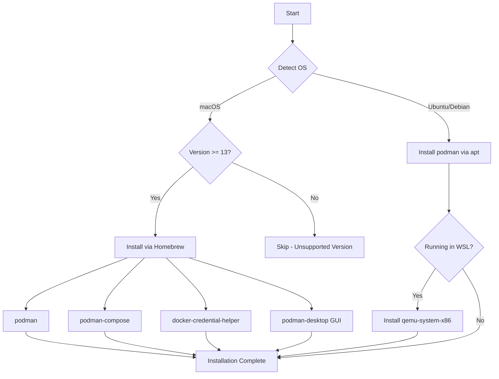

# 🐳 Podman

> Daemonless container engine for developing, managing, and running OCI Containers

This Ansible role installs and configures [Podman](https://podman.io/), a daemonless container engine that provides a Docker-compatible CLI without requiring a background daemon. Podman is designed to be a drop-in replacement for Docker, offering enhanced security through rootless containers.

## 📋 Overview

The role automatically detects your operating system and installs Podman with platform-specific optimizations:

- **macOS**: Installs Podman, Podman Compose, Docker credential helper, and Podman Desktop GUI
- **Ubuntu/Debian**: Installs Podman with WSL-specific dependencies when running in Windows Subsystem for Linux

## 🖥️ Supported Platforms

| Platform | Support | Notes |
|----------|---------|-------|
| macOS | ✅ | Requires macOS 13+ (Ventura or newer) |
| Ubuntu | ✅ | Includes WSL2 support with QEMU dependencies |
| Debian | ✅ | Via apt package manager |

## 📦 What Gets Installed

### macOS (via Homebrew)
- `podman` - Core container engine
- `podman-compose` - Docker Compose compatibility for Podman
- `docker-credential-helper` - Required for Helm integration
- `podman-desktop` - GUI desktop application for managing containers

### Ubuntu/Debian (via apt)
- `podman` - Core container engine
- `qemu-system-x86` - Additional dependency for WSL environments

## 🔧 Installation Flow



## 🎯 Key Features

- **Daemonless Architecture**: No background process required, improving security and resource usage
- **Rootless Containers**: Run containers as non-root users by default
- **Docker Compatibility**: Drop-in replacement for Docker CLI commands
- **Compose Support**: Includes `podman-compose` for Docker Compose file compatibility
- **GUI Option**: Podman Desktop provides visual container management on macOS
- **WSL-Ready**: Automatic detection and configuration for Windows Subsystem for Linux
- **Helm Integration**: Includes Docker credential helper for Kubernetes workflows

## 🗑️ Uninstallation

The role includes a comprehensive uninstall script that:

1. Stops running Podman machines (macOS)
2. Removes Podman machines (macOS)
3. Uninstalls packages via the appropriate package manager
4. Removes Podman Desktop (macOS)
5. Cleans up configuration directories:
   - `~/.config/containers`
   - `~/.local/share/containers`

Run the uninstall script:
```bash
~/.dotfiles/roles/podman/uninstall.sh
```

## 🔗 Official Documentation

- [Podman Official Website](https://podman.io/)
- [Podman Documentation](https://docs.podman.io/)
- [Podman Desktop](https://podman-desktop.io/)
- [Podman GitHub Repository](https://github.com/containers/podman)

## 💡 Usage Examples

After installation, Podman is available as a Docker-compatible CLI:

```bash
# Run a container
podman run -it ubuntu bash

# List running containers
podman ps

# Build an image
podman build -t myapp .

# Use Podman Compose
podman-compose up -d

# Start Podman machine (macOS)
podman machine start

# Open Podman Desktop (macOS)
open /Applications/Podman\ Desktop.app
```

## 🏗️ Role Structure

```
podman/
├── tasks/
│   ├── main.yml       # OS detection and task routing
│   ├── MacOSX.yml     # macOS-specific installation
│   └── Ubuntu.yml     # Ubuntu/Debian installation with WSL support
└── uninstall.sh       # Comprehensive removal script
```

## 🔐 Security Advantages

Podman offers several security improvements over traditional Docker:

- **Rootless by default**: Containers run as non-root users
- **No daemon**: Eliminates daemon attack surface
- **Fork/exec model**: Each container runs as a child process
- **SELinux integration**: Better support for security-enhanced Linux
- **User namespaces**: Improved container isolation

---

*Part of the [dotfiles](https://github.com/TechDufus/dotfiles) automated development environment setup*
